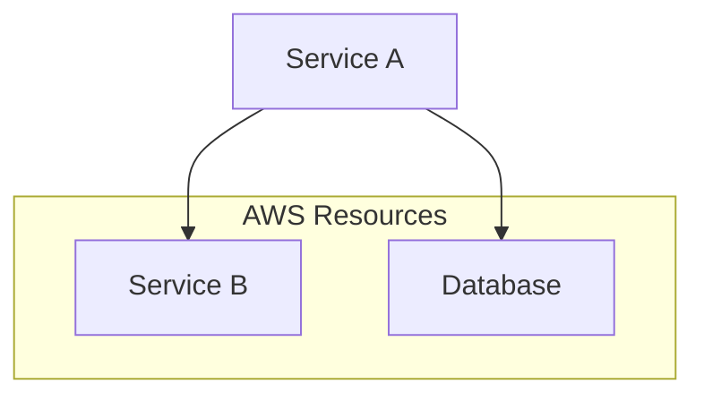
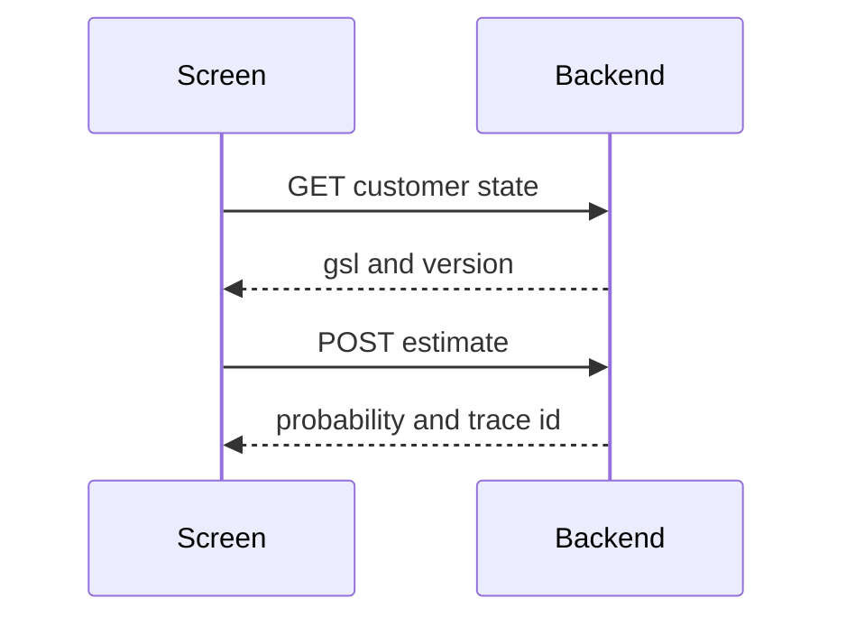
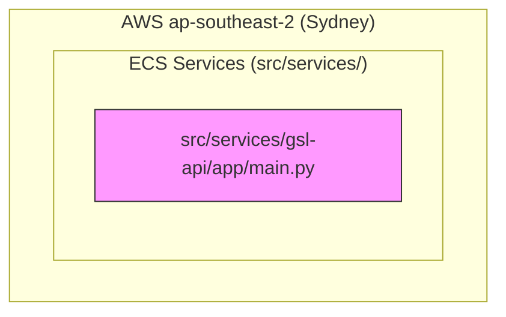
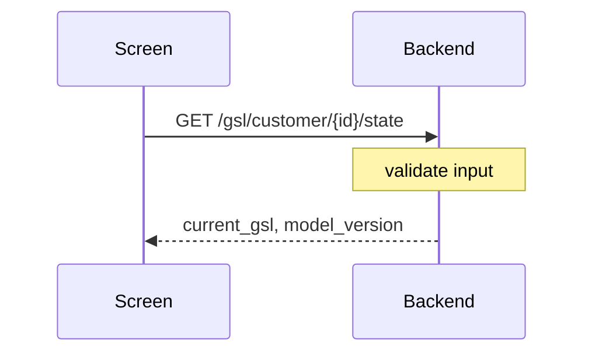

# Mermaid Diagram Standards

## Rendering Compatibility

When writing Mermaid diagrams in markdown files (design docs, specs, READMEs), follow these rules to ensure diagrams render correctly across VS Code preview, GitHub, and Kiro.

## Rules

### Subgraph Labels

- Use simple alphanumeric IDs without special characters
- Do NOT use nested subgraphs more than one level deep
- Do NOT quote subgraph labels with special characters like `/`, `()`, or `.`
- Prefer: `subgraph SRC [Source Code]`
- Avoid: `subgraph "src/packages/ (domain)"`

### Node Labels

- Keep node labels short and alphanumeric
- Use bracket syntax for labels: `NODE_ID[Display Label]`
- Avoid special characters inside brackets (no `/`, no backticks, no `${}`)
- Do NOT use colons `:` in node bracket labels — they conflict with Mermaid syntax
- Do NOT use ` ` in node labels — use short single-line labels instead
- Do NOT use double-parentheses `(( ))` for circle nodes — they fail in many renderers
- Prefer: `GSL_API[GSL API 8001]`
- Avoid: `GSL_API["GSL API :8001"]`
- Avoid: `START((Start))`

### Edge Labels

- Keep edge labels short (1-3 words max)
- Use only letters and spaces in edge labels — no special characters at all
- Do NOT use slashes `/`, commas `,`, underscores `_`, or hyphens `-` in edge labels
- Do NOT use long variable names or paths in edge labels
- Prefer: `A -->|customer state| B`
- Avoid: `A -->|GET /gsl/customer/{id}/state| B`
- Avoid: `A -->|decision-outcome| B` (use `A -->|decision outcome| B`)
- Avoid: `A -->|read/write| B` (use `A -->|read write| B`)

### Style Declarations

- Do NOT use `style` statements with hex colors (`fill:#f9f`)
- These fail in many Mermaid renderers (VS Code, some GitHub views)
- Use `classDef` with named classes if styling is essential, or omit styling entirely

### Sequence Diagram Messages

- Use ONLY simple words and spaces in messages — no special characters
- Do NOT use curly braces `{}` — Mermaid treats them as special
- Do NOT use parentheses `()` — they break parsing
- Do NOT use commas `,` — they split into unexpected tokens
- Do NOT use underscores `_` — use spaces or camelCase instead
- Do NOT use hyphens `-` in message text — use spaces instead
- Do NOT use slashes `/` or URL paths
- Do NOT use `Note over` — it breaks some renderers
- Do NOT put blank lines between messages in a sequence diagram
- Prefer: `A->>B: POST score shot`
- Avoid: `A->>B: POST /gsl/score-shot`
- Avoid: `A->>B: doSomething(arg1, arg2)`
- Avoid: `A->>B: current_gsl and model_version`

### State Diagrams

- Do NOT use `stateDiagram-v2` — it fails in VS Code preview and many GitHub renderers
- Use `graph TD` with descriptive edge labels instead of state diagrams
- Prefer: `HOME -->|Cold tap| GAME_SELECT[GameSelect]`
- Avoid: `[*] --> Home` (stateDiagram syntax)
- Avoid: `START((Start)) --> HOME` (double-parens fail)

### Dotted Arrows

- Dotted arrows (`-.->`) work but do NOT add edge labels to them
- Many renderers drop the label or break the diagram
- Prefer: `GSL -.-> MGSL` (no label)
- Avoid: `GSL -.->|mock mode| MGSL`
- If you need to label a dotted relationship, use a comment or a separate legend

### General

- Always test diagrams render before committing
- Prefer `graph TD` or `graph LR` over `flowchart` when compatibility matters
- Do NOT use `stateDiagram-v2` — use `graph TD` with edge labels instead
- Use `direction TB` inside subgraphs only when needed
- Avoid mixing `graph` and `flowchart` syntax in the same diagram
- Keep diagrams under 30 nodes for readability
- No blank lines inside diagram code blocks between related statements

## Quick Reference — Safe Characters

| Location | Safe | Unsafe |
|---|---|---|
| Node labels | letters, numbers, spaces | `:` `/` `()` `{}` ` ` backticks |
| Edge labels | letters, spaces | `-` `_` `/` `,` `()` `{}` |
| Sequence messages | letters, spaces | `()` `{}` `,` `_` `-` `/` `Note over` |
| Subgraph labels | letters, numbers, spaces | quotes with special chars, nested subgraphs |

## Examples

### Good

### Good Sequence Diagram

### Bad

### Bad Sequence Diagram

