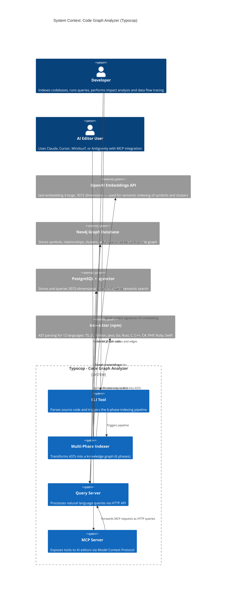
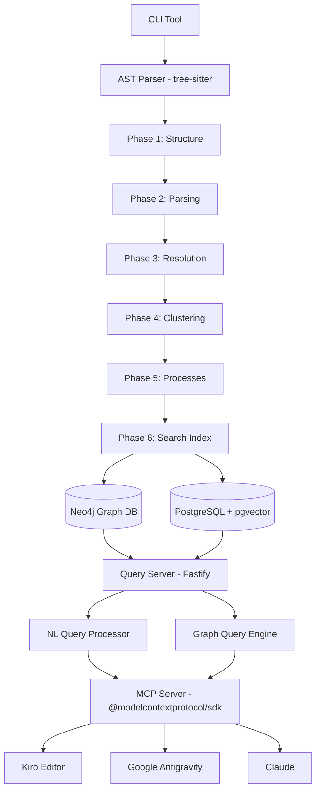
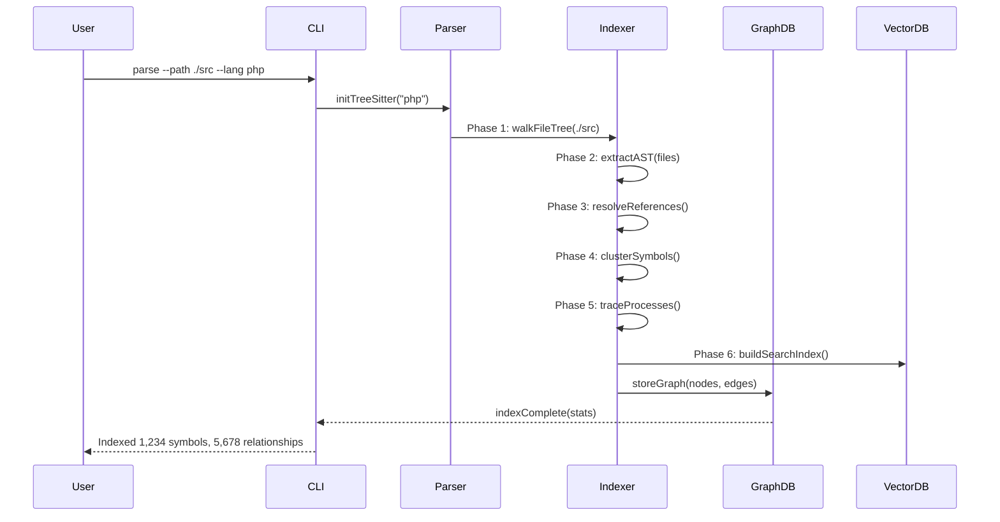
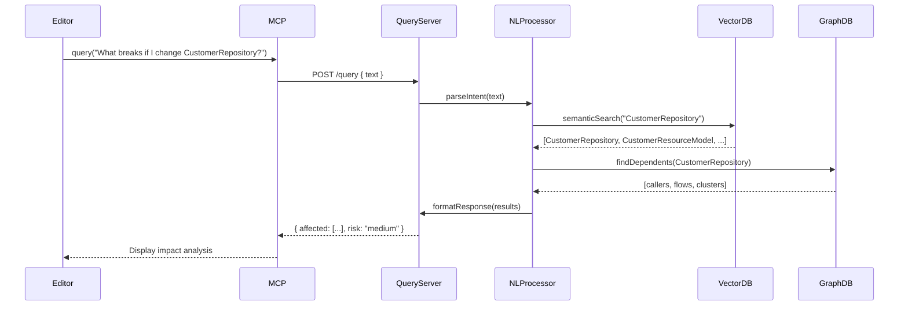
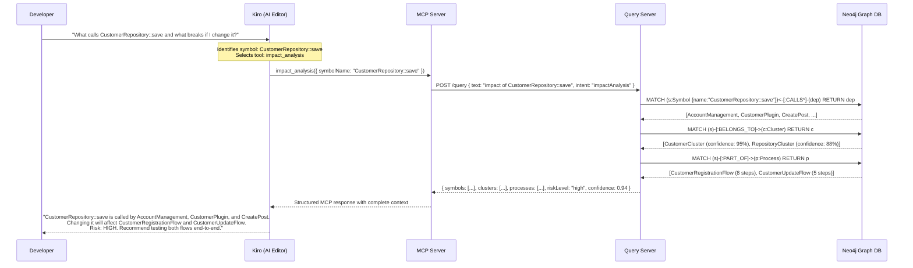

# Design Document: Code Graph Analyzer

## Overview

The Code Graph Analyzer is a precomputed relational intelligence system that transforms source code into a queryable knowledge graph. Unlike traditional AI agents that rely on iterative text searches (grep/find) and multiple slow query chains, this system precomputes the entire code structure—clustering, tracing, and scoring—delivering complete and precise context in a single call with 90%+ confidence.

Traditional agents waste tokens on 10-query chains to understand one function, often missing context and hitting token limits. Typocop's approach provides:
- **Reliability**: LLM can't miss context, it's already in the tool response
- **Token Efficiency**: No iterative searches, complete answers in one query
- **Model Democratization**: Smaller LLMs work because tools do the heavy lifting

The architecture follows a pipeline design: CLI tool for code ingestion → Multi-phase indexer (6 phases) → Graph database storage → Query server with semantic search → MCP server for editor integration. This enables use cases like impact analysis, smart search, 360° context, pre-commit checks, and data flow tracing across frameworks like Magento 2, NestJS, Laravel, Express, and Fastify.

**Related design documents:**
- [Components & Interfaces](./design-components.md)
- [Data Models & Algorithms](./design-data-models.md)
- [Use Cases & Correctness Properties](./design-correctness.md)

## System Context Diagram

## Architecture

## Core Innovation: Precomputed Relational Intelligence

### Traditional AI Agents vs Typocop

**Traditional Agent Workflow**:
1. LLM triggers CLI to search files (grep/find)
2. Read files to find callers — missing context, search again
3. Read more files, hit token limits
4. Answer after 10+ slow iterations

**Typocop Workflow**:
1. Query: "Impact of UserService upstream?"
2. Pre-structured response: 8 callers, 3 clusters, 90%+ confidence
3. Complete and accurate answer in 1 query

### Key Benefits

- **Reliability**: LLM can't miss context—it's already in the tool response
- **Token Efficiency**: No 10-query chains to understand one function
- **Model Democratization**: Smaller LLMs work because tools do the heavy lifting
- **Confidence Scoring**: 90%+ confidence on production queries eliminates guesswork
- **Risk Assessment**: Automatic blast radius analysis (LOW/MEDIUM/HIGH/CRITICAL)

### Six-Phase Indexing Pipeline

1. **Structure**: Walk file tree, map folder/file relationships
2. **Parsing**: Extract functions, classes, methods, interfaces via Tree-sitter ASTs
3. **Resolution**: Resolve imports, calls, inheritance across files
4. **Clustering**: Group related symbols into functional communities (90%+ confidence)
5. **Processes**: Trace execution flows from entry points through call chains
6. **Search**: Build hybrid indexes (vector + keyword) for fast retrieval

## Sequence Diagrams

### Code Indexing Flow

### Natural Language Query Flow

### MCP Integration Flow

