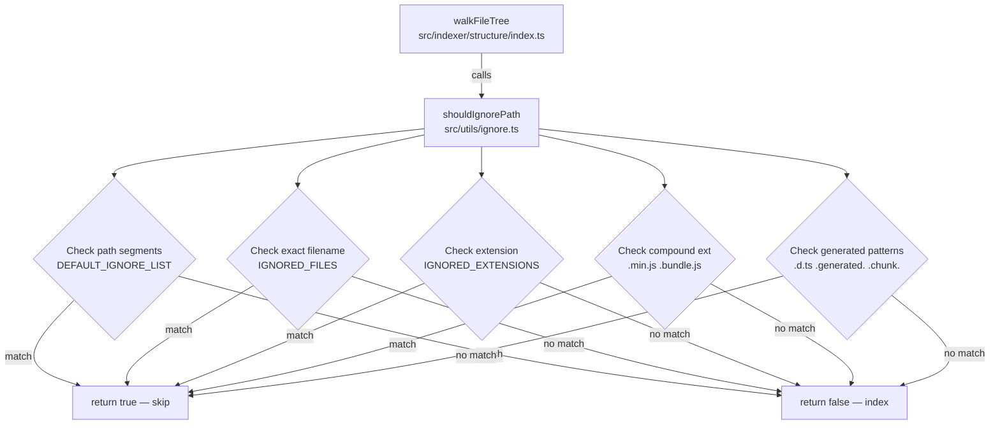
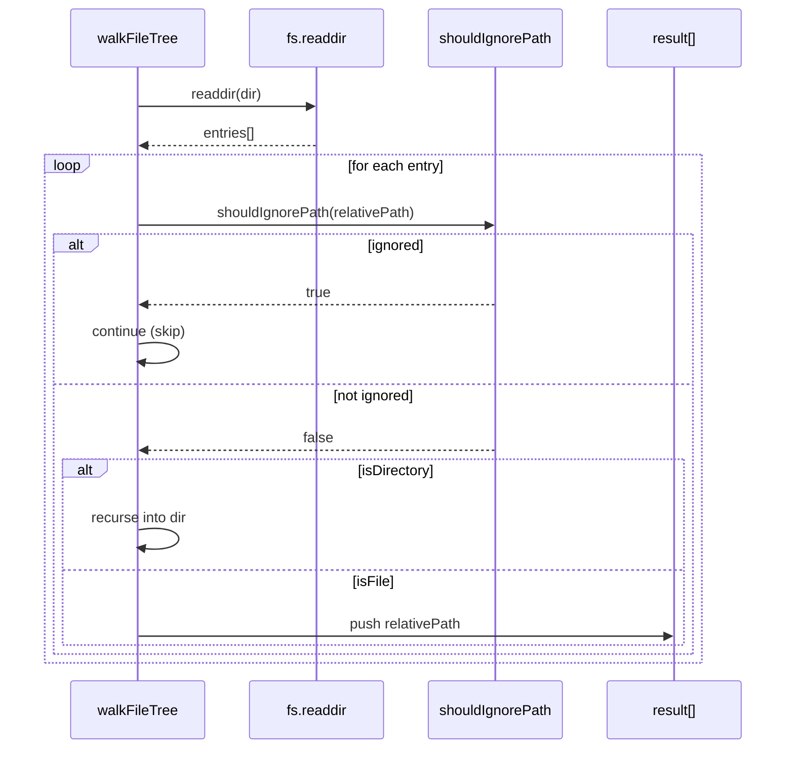

# Design Document: Comprehensive File Ignore Rules

**Related documents:**
- [Data Models & Algorithms](./design-data-models.md)
- [Correctness Properties](./design-correctness.md)

## Overview

The `src/utils/ignore.ts` module provides the single source of truth for which files and directories the Phase 1 walker should skip during indexing. Without comprehensive ignore rules, the indexer wastes parse time on lock files, images, `.d.ts` declaration files, and minified bundles, and pollutes the graph with noise.

This feature ports the full ignore rule set from `legacy-parser/parser/ignore-service.ts` into `src/utils/ignore.ts` and ensures the Phase 1 walker (`src/indexer/structure/index.ts`) calls `shouldIgnorePath` correctly on every entry.

The current implementation already has a near-complete port. This spec validates correctness, closes remaining gaps (`.env` in `DEFAULT_IGNORE_LIST` vs `IGNORED_FILES` conflict, `__tests__` missing from directory list, `public/build` multi-segment path), and adds a full test suite.

## Architecture



## Sequence: Phase 1 Walk with Ignore Filtering



## Components and Interfaces

### shouldIgnorePath

**Purpose**: Determine whether a given file path should be excluded from indexing.

**Interface**:
```typescript
export function shouldIgnorePath(filePath: string): boolean
```

**Responsibilities**:
- Normalize path separators (`\` → `/`) for cross-platform consistency
- Check each path segment against `DEFAULT_IGNORE_LIST` (directory-level ignores)
- Check the filename against `IGNORED_FILES` (exact-match ignores)
- Check the file extension against `IGNORED_EXTENSIONS` (single extension)
- Check compound extensions (`.min.js`, `.bundle.js`, `.chunk.js`, `.min.css`)
- Check generated file patterns (`.d.ts`, `.generated.`, `.bundle.`, `.chunk.`)

### Exported Constants

**Purpose**: Allow consumers to inspect or extend the ignore lists.

**Interface**:
```typescript
export const DEFAULT_IGNORE_LIST: ReadonlySet<string>
export const IGNORED_EXTENSIONS: ReadonlySet<string>
export const IGNORED_FILES: ReadonlySet<string>
```

Exporting as `ReadonlySet` prevents accidental mutation by callers.

## Data Models

See [Data Models & Algorithms](./design-data-models.md) for the full list contents and the `shouldIgnorePath` algorithm with formal specifications.

## Error Handling

`shouldIgnorePath` is a pure function — it performs no I/O and throws no errors. All inputs are strings; `null`/`undefined` inputs are not expected (the walker always passes `string` values from `path.relative`).

The walker (`walkFileTree`) already wraps `fs.readdir` in a try/catch and logs a warning on failure — no changes needed there.

## Testing Strategy

### Unit Testing Approach

Co-located test file: `src/utils/ignore.test.ts`

Cover each check path independently:
- Directory segment matching (e.g. `node_modules/foo.ts` → ignored)
- Exact filename matching (e.g. `package-lock.json` → ignored)
- Single extension matching (e.g. `image.png` → ignored)
- Compound extension matching (e.g. `app.min.js` → ignored)
- Generated pattern matching (e.g. `types.d.ts` → ignored)
- Allowed files (e.g. `src/index.ts` → not ignored)
- Windows path normalization (e.g. `node_modules\foo.ts` → ignored)

### Property-Based Testing Approach

**Property Test Library**: `fast-check`

See [Correctness Properties](./design-correctness.md) for the full property list.

Key properties:
- Any path containing a `DEFAULT_IGNORE_LIST` segment is always ignored
- Any path whose filename is in `IGNORED_FILES` is always ignored
- Any path whose extension is in `IGNORED_EXTENSIONS` is always ignored
- `shouldIgnorePath` is pure: same input always returns same output
- `src/index.ts` and similar source files are never ignored

### Integration Testing Approach

The existing `walkFileTree` integration path exercises `shouldIgnorePath` implicitly. A fixture directory with known ignored/non-ignored files can validate end-to-end filtering.

## Dependencies

- No new dependencies required
- `fast-check` already in devDependencies (used by existing tests)
- `vitest` already in devDependencies
