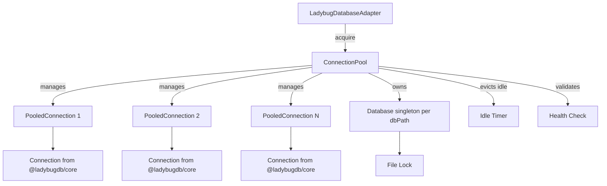
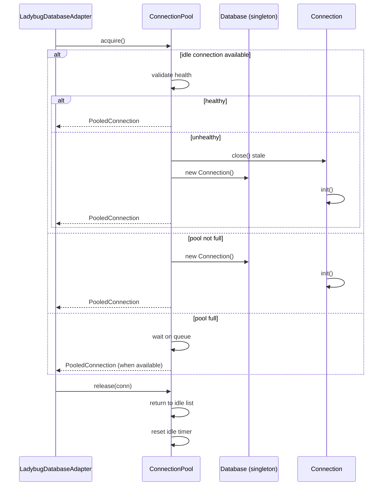

# Design Document: Connection Pool for LadybugDB

**Related documents:**
- [Components & Interfaces](./design-components.md)
- [Formal Specifications](./design-algorithms.md)
- [Algorithm Pseudocode](./design-pseudocode.md)
- [Correctness Properties](./design-correctness.md)
- [Consumer Migration](./design-migration.md)

## Overview

The current `createLadybugConnection` uses a singleton cache with reference counting — one `Database` instance per `dbPath`, shared across callers. This works for sequential access but doesn't manage concurrent connection lifecycle, health checking, or bounded resource usage.

This feature introduces a connection pool that sits on top of the existing singleton `Database` cache. Kùzu supports multiple `Connection` objects per `Database` — each `Connection` is a lightweight query handle. The pool manages a bounded set of these `Connection` handles for a single shared `Database` instance per `dbPath`, providing acquire/release semantics, idle timeout eviction, health validation, and configurable pool sizing. The `Database` singleton (one per `dbPath`) and file-lock mechanism for cross-process safety remain unchanged.

## Architecture

## Dependencies

- `@ladybugdb/core` — `Database`, `Connection` classes
- `proper-lockfile` — OS-level file locking (existing)
- No new external dependencies required

## Error Handling

| Scenario | Response | Recovery |
|----------|----------|----------|
| Pool exhausted, acquire timeout | Throw `PoolExhaustedError` | Caller retries or fails gracefully |
| Connection health check fails | Discard connection, create new one | Transparent to caller |
| Database creation fails (all retries) | Throw `DatabaseConnectionError` | Existing retry logic preserved |
| Release of already-released connection | Log warning, no-op | Idempotent |
| Pool drain during active connections | Wait for all active to release, then close | Graceful shutdown |

## Security Considerations

- Connection pool does not change the security boundary — all connections are in-process
- File locks continue to prevent cross-process concurrent access
- No credentials are stored in the pool (LadybugDB is embedded, no auth)

## Performance Considerations

- Pool eliminates repeated `Connection` creation overhead for high-throughput scenarios
- Idle timeout prevents resource leaks from long-lived unused connections
- Bounded pool size prevents unbounded memory growth
- Health checks add minimal overhead (simple query validation)
