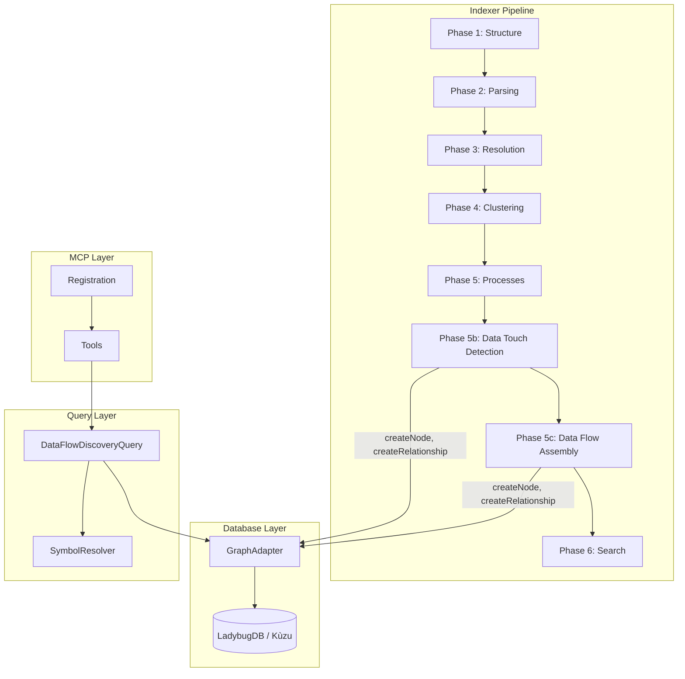
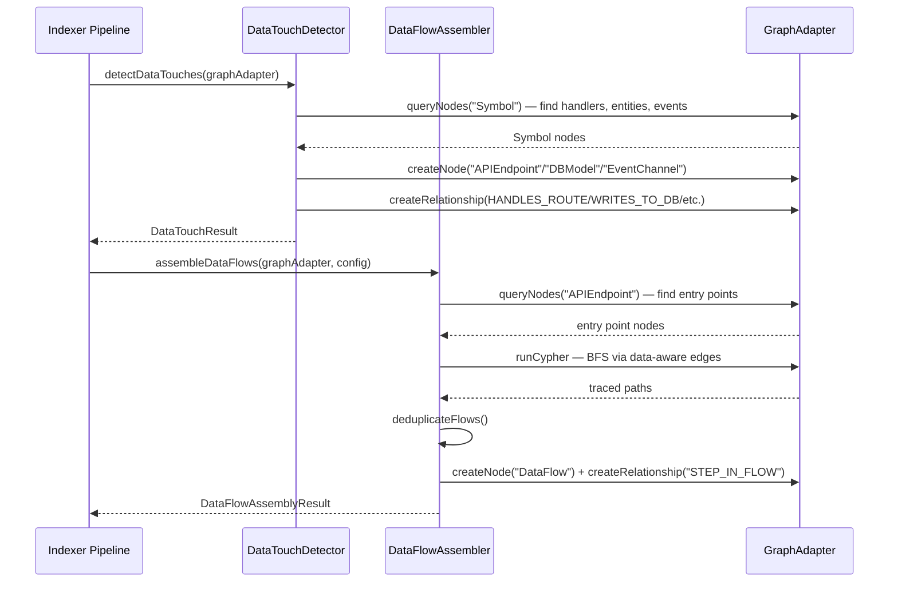
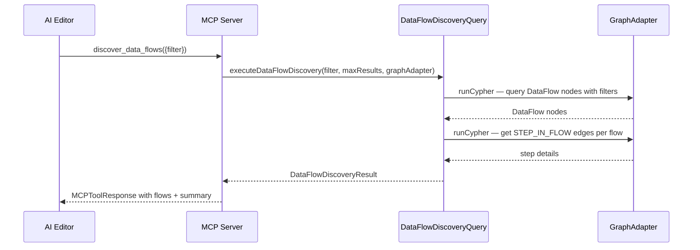

# Design Document: Data Flow Discovery Tool

**Related documents:**
- [Components & Interfaces](./design-components.md)
- [Data Models & Algorithms](./design-data-models.md)
- [Correctness Properties & Testing](./design-correctness.md)

## Overview

The Data Flow Discovery tool adds comprehensive data flow analysis to Typocop by introducing a new indexer phase that detects data touch points (API endpoints, DB models, event channels), assembles end-to-end DataFlow nodes via BFS tracing, and exposes a new `discover_data_flows` MCP tool for querying and filtering discovered flows. This replaces the limited `trace_data_flow` tool which only follows CALLS edges and uses regex-based classification.

The system operates at two levels: (1) an indexer phase that runs during the indexing pipeline to detect data-aware relationships (HANDLES_ROUTE, WRITES_TO_DB, READS_FROM_DB, PUBLISHES_EVENT, SUBSCRIBES_TO) and assemble DataFlow nodes with rich metadata, and (2) a query-time MCP tool that discovers, filters, and returns structured flow information including HTTP method/path, DB tables touched, event channels, and step traces.

The design draws from the legacy `data-touch-detector.ts` and `data-flow-processor.ts` implementations, adapted to work with the current Typocop architecture (GraphAdapter/Cypher, 6-phase pipeline, MCP tool registration pattern).

## Architecture

## Sequence Diagrams

### Indexing: Data Touch Detection & Flow Assembly

### Query: Discover Data Flows (MCP Tool)

## Dependencies

- `src/db/types.ts` — `GraphAdapter`, `GraphNode`, `GraphRelationship`
- `src/types/index.ts` — `Symbol`, `RiskLevel`, `MCPToolResponse`
- `src/query/symbol-resolver.ts` — `resolveSymbol` for entry point resolution
- `src/query/graph-helpers.ts` — `rowToNode`, `graphNodeToSymbol`
- `src/query/framework-layers.ts` — `detectFramework` for framework-aware detection
- `src/utils/limits.ts` — `MAX_TRAVERSAL_DEPTH` and resource limits
- `src/mcp/registration.ts` — MCP tool registration pattern
- `src/mcp/tools.ts` — `executeTool` dispatcher and `formatMCPResponse`
- `@modelcontextprotocol/sdk` — MCP server SDK
- `fast-check` — property-based testing (dev dependency)
