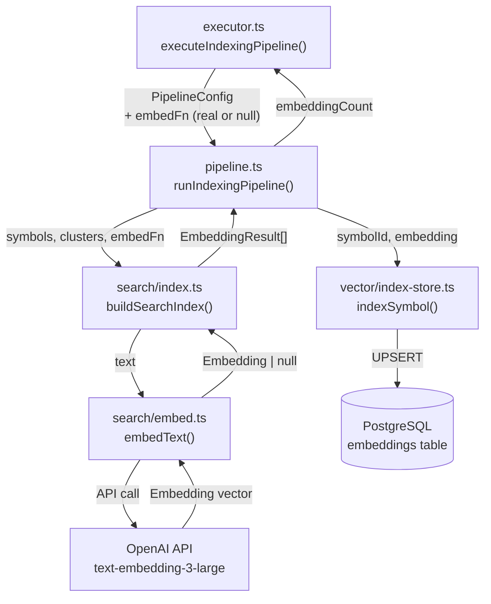
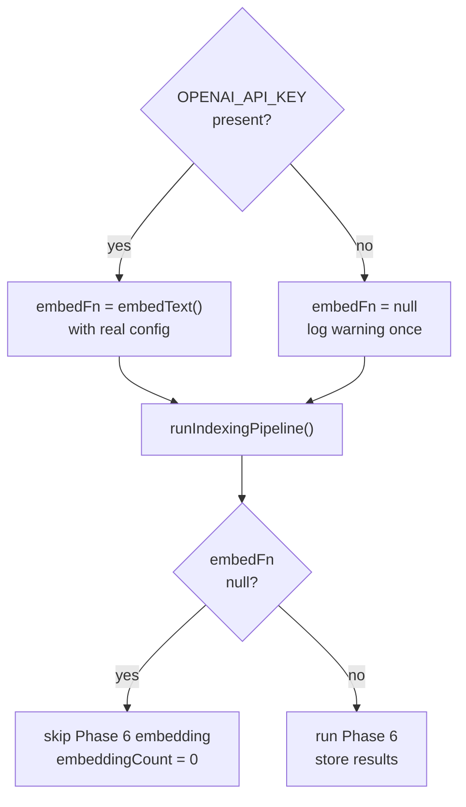

# Design Document: Embeddings Pipeline

**Related documents:**
- [Requirements](./requirements.md)
- [Correctness Properties](./design-correctness.md)

## Overview

The embeddings pipeline is currently broken: a stub `embedFn` always returns `null`, `indexSymbol` is imported but never called, and `OPENAI_API_KEY` is never read. This feature wires up the real OpenAI embedding function, persists embeddings to pgvector via `indexSymbol`, degrades gracefully when the API key is absent, and surfaces an `Embeddings` count in the CLI statistics output.

The change touches four files: `pipeline.ts` (replace stub, call `indexSymbol`), `executor.ts` (read `OPENAI_API_KEY`, surface count), `search/index.ts` (return embeddings from `buildSearchIndex`), and the `IndexingStats` / `PipelineResult` types.

---

## Architecture



### Graceful Degradation Path



---

## Components and Interfaces

### 1. `buildSearchIndex` — updated return type

`search/index.ts` currently discards the embedding results. It needs to return them so `pipeline.ts` can persist them.

```typescript
export interface EmbeddingResult {
  readonly symbolId: string;
  readonly embedding: Embedding;
}

export interface SearchIndex {
  readonly keywords: Map<string, string[]>;
  readonly symbolCount: number;
  readonly embeddings: EmbeddingResult[];  // NEW — was discarded before
}
```

**Responsibilities**:
- Build keyword index (unchanged)
- For each cluster, format text and call `embedFn`
- Collect non-null results paired with a representative symbol ID
- Return all results in `SearchIndex.embeddings`

### 2. `runIndexingPipeline` — updated config and result

```typescript
// PipelineConfig — no change to public shape; embedFn constructed internally
export interface PipelineResult {
  readonly symbols: Symbol[];
  readonly relationships: Relationship[];
  readonly clusters: Cluster[];
  readonly processes: Process[];
  readonly skippedFiles: number;
  readonly embeddingCount: number;  // NEW
}
```

**Responsibilities**:
- Read `OPENAI_API_KEY` from `process.env` (or accept via config — see below)
- Construct real `embedFn` when key is present; log warning and use `null` stub when absent
- Pass `embedFn` to `buildSearchIndex`
- Iterate `SearchIndex.embeddings` and call `indexSymbol(vectorPool, ...)` for each
- Return `embeddingCount` in result

### 3. `executeIndexingPipeline` in `executor.ts` — surface count

```typescript
export interface IndexingStats {
  symbolCount: number;
  relationshipCount: number;
  clusterCount: number;
  processCount: number;
  skippedFiles: number;
  embeddingCount: number;  // NEW
}
```

Print `Embeddings: N` in the statistics block (only when `embeddingCount > 0`, or always — see acceptance criteria).

---

## Data Models

### `EmbeddingResult` (new, local to `search/index.ts`)

```typescript
interface EmbeddingResult {
  readonly symbolId: string;   // ID of the cluster's representative symbol
  readonly embedding: Embedding;  // vector[1536], dimensions: 1536
}
```

### `EmbeddingConfig` (already exists in `embed.ts`)

```typescript
interface EmbeddingConfig {
  readonly apiKey: string;
  readonly model: string;       // "text-embedding-3-large"
  readonly dimensions: number;  // 1536
}
```

No changes needed here.

---

## Key Functions with Formal Specifications

### `buildSearchIndex` (updated)

```typescript
export async function buildSearchIndex(
  symbols: Symbol[],
  clusters: Cluster[],
  embedFn: ((text: string) => Promise<Embedding | null>) | null,
): Promise<SearchIndex>
```

**Preconditions:**
- `symbols` is a non-empty array of valid Symbol objects
- `clusters` is an array (may be empty)
- `embedFn` is either a callable or `null`

**Postconditions:**
- `result.keywords` contains keyword index for all symbols
- `result.symbolCount === symbols.length`
- If `embedFn === null`: `result.embeddings` is empty array
- If `embedFn` is callable: `result.embeddings` contains one entry per cluster where `embedFn` returned non-null
- Each `EmbeddingResult.symbolId` is the ID of the first symbol in that cluster
- No entry in `result.embeddings` has a null embedding

**Loop Invariant (cluster loop):**
- All previously processed clusters have been attempted; successful ones are in `collected`

### `runIndexingPipeline` (updated Phase 6 section)

```typescript
export async function runIndexingPipeline(config: PipelineConfig): Promise<PipelineResult>
```

**Preconditions (Phase 6 additions):**
- `config.vectorPool` is a live PostgreSQL pool with pgvector initialized
- `process.env.OPENAI_API_KEY` is either a non-empty string or absent

**Postconditions (Phase 6 additions):**
- If `OPENAI_API_KEY` absent: `result.embeddingCount === 0`, warning logged once
- If `OPENAI_API_KEY` present: `result.embeddingCount` equals the number of embeddings successfully stored in pgvector
- All stored embeddings satisfy `vector.length === 1536`
- `indexSymbol` is called exactly once per successful embedding

---

## Algorithmic Pseudocode

### Phase 6: Embedding Generation and Storage

```pascal
ALGORITHM runPhase6(symbols, clusters, vectorPool)
INPUT:  symbols: Symbol[], clusters: Cluster[], vectorPool: Pool
OUTPUT: embeddingCount: number

BEGIN
  apiKey ← process.env.OPENAI_API_KEY

  IF apiKey IS NULL OR apiKey IS EMPTY THEN
    LOG WARN "[pipeline] OPENAI_API_KEY not set — skipping embedding generation"
    RETURN 0
  END IF

  config ← { apiKey, model: "text-embedding-3-large", dimensions: 1536 }
  embedFn ← (text) => embedText(text, config)

  searchIndex ← AWAIT buildSearchIndex(symbols, clusters, embedFn)

  embeddingCount ← 0
  FOR EACH result IN searchIndex.embeddings DO
    AWAIT indexSymbol(vectorPool, result.symbolId, result.embedding, {})
    embeddingCount ← embeddingCount + 1
  END FOR

  RETURN embeddingCount
END
```

### Updated `buildSearchIndex` inner loop

```pascal
ALGORITHM buildSearchIndex(symbols, clusters, embedFn)
INPUT:  symbols: Symbol[], clusters: Cluster[],
        embedFn: ((text) => Promise<Embedding | null>) | null
OUTPUT: SearchIndex

BEGIN
  keywords ← buildKeywordIndex(symbols)
  symbolMap ← Map(symbols, s => [s.id, s])
  collected ← []

  IF embedFn IS NOT NULL THEN
    FOR EACH cluster IN clusters DO
      clusterSymbols ← cluster.symbols
                          .map(id => symbolMap.get(id))
                          .filter(s => s IS NOT UNDEFINED)

      text ← formatClusterForEmbedding(cluster, clusterSymbols)
      embedding ← AWAIT embedFn(text)

      IF embedding IS NOT NULL THEN
        representativeId ← cluster.symbols[0]   // first symbol in cluster
        collected.push({ symbolId: representativeId, embedding })
      END IF
    END FOR
  END IF

  RETURN { keywords, symbolCount: symbols.length, embeddings: collected }
END
```

---

## Error Handling

| Scenario | Behaviour |
|---|---|
| `OPENAI_API_KEY` absent | Log `[pipeline] OPENAI_API_KEY not set — skipping embedding generation` once; `embeddingCount = 0`; pipeline continues |
| OpenAI API call fails (network, rate limit, auth) | `embedText` already catches and returns `null` with a `console.warn`; that cluster is skipped; pipeline continues |
| `indexSymbol` throws (DB error) | Propagate — a DB write failure is a hard error; pipeline halts with the existing error-halt behaviour |
| Embedding has wrong dimensions | `embedText` already guards this and returns `null`; cluster skipped |
| `clusters` is empty | `buildSearchIndex` returns `embeddings: []`; `embeddingCount = 0`; no DB writes |

---

---

## Security Considerations

- `OPENAI_API_KEY` is read from `process.env` only — never hardcoded or logged
- Only cluster metadata text (names, categories, symbol signatures) is sent to OpenAI — never full source code (enforced by `formatClusterForEmbedding` + `verifyEmbeddingText` already in place)
- `indexSymbol` uses parameterized queries — no SQL injection risk

---

## Dependencies

No new dependencies. All required modules already exist:
- `embedText`, `formatClusterForEmbedding` — `src/indexer/search/embed.ts`
- `indexSymbol` — `src/vector/index-store.ts`
- `EmbeddingConfig` — `src/indexer/search/embed.ts`
- `Embedding` — `src/types/index.ts`
