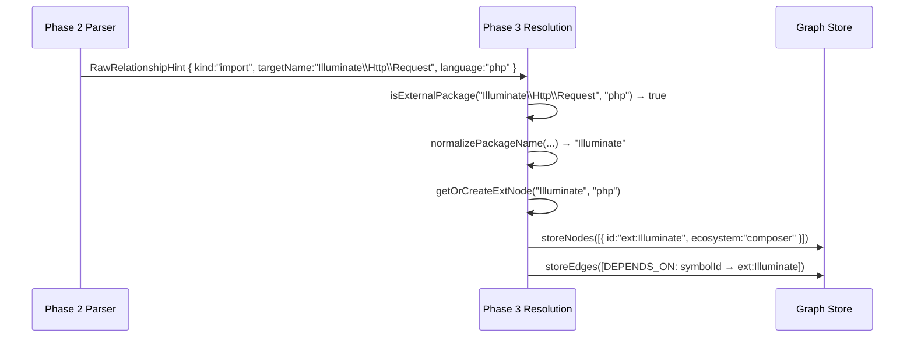

# Design Document: External Dependency Indexing

## Overview

Currently `impact_analysis("neo4j-driver")` returns 0 results because external packages are not indexed as graph nodes — only internal code symbols are. This feature indexes external packages as first-class `ExternalDependency` nodes during Phase 3 (Resolution) across all 12 supported languages, creates `DEPENDS_ON` edges from internal symbols to those nodes, and extends impact analysis to traverse those edges. Fuzzy/alias matching lets `"Neo4j"` resolve to `"neo4j-driver"`, `"Illuminate"` to the Composer vendor, etc.

**Related documents:**
- [Data Models & Algorithms](./design-data-models.md)
- [Correctness Properties](./design-correctness.md)

## Architecture

Change is confined to three layers: Phase 3 (Resolution), the graph store, and the query engine.

```mermaid
graph TD
    P2[Phase 2: Parsing<br/>emits import hints + language] --> P3[Phase 3: Resolution]
    P3 --> ExtDetect[isExternalPackage&#40;path, language&#41;]
    ExtDetect -->|external| Norm[normalizePackageName&#40;path, language&#41;]
    Norm --> ExtNode[ExternalDependency node<br/>id: ext:neo4j-driver]
    ExtDetect -->|internal| InternalRel[Existing IMPORTS edge]
    ExtNode --> DEPENDS_ON[DEPENDS_ON edge]
    ExtNode --> DB[(Neo4j)]
    DEPENDS_ON --> DB
    QE[Query Engine] --> Lookup[findExternalDependencyByAlias]
    Lookup --> Traverse[MATCH n-DEPENDS_ON->ext RETURN n]
    Traverse --> DB
```

## Language Coverage

| Language | Import syntax | Normalization strategy | Ecosystem |
|---|---|---|---|
| TypeScript/JS | `"neo4j-driver/lib/x"` | first `/`-segment | `npm` |
| TypeScript/JS | `"@neo4j/driver/lib"` | first 2 `/`-segments | `npm` |
| Python | `requests`, `from flask import` | first `/`-segment | `pip` |
| PHP | `Illuminate\Http\Request` | first `\`-segment | `composer` |
| Java | `com.neo4j.driver.Driver` | first 2 `.`-segments | `maven` |
| C# | `System.Collections.Generic` | first 2 `.`-segments | `unknown` |
| Go | `github.com/neo4j/neo4j-go-driver/v5` | first 3 `/`-segments | `go_modules` |
| Rust | `serde::Serialize` | first `::`-segment | `cargo` |
| C/C++ | `openssl/ssl.h` (third-party only) | first `/`-segment, strip `.h` | `unknown` |
| Swift | `Foundation` | bare name | `unknown` |
| Ruby | `require 'rails'` (new query) | bare name | `unknown` |

C/C++ system headers (`stdio.h`, `string`, `vector`, etc.) are excluded via `C_SYSTEM_HEADERS` constant — treated like `node:` built-ins.

## Sequence: Indexing External Imports

## Components Changed

### Phase 2: Parsing (`src/parser/`)

- `RawRelationshipHint` gains `language: Language` field — populated from the file's detected language during extraction
- `RUBY_QUERIES` gains `require`/`require_relative` call captures to emit import hints for Ruby gems

### Phase 3: Resolution (`src/indexer/resolution/`)

New file: `external-packages.ts`
- `isExternalPackage(importPath, language)` — language-aware external detection
- `normalizePackageName(importPath, language)` — language-aware normalization
- `buildAliases(packageName)` — fuzzy alias generation
- `detectEcosystem(language)` — maps language to package ecosystem
- `getOrCreateExtNode(packageName, language, extNodes)` — deduplicating node factory

Modified: `index.ts` (`resolveHints`) — intercepts external imports before existing resolution logic; returns `extNodes` map alongside relationships.

### Graph Store (`src/graph/`)

New file: `external-dependency.ts`
- `storeExternalDependencies(session, nodes)` — MERGE on `ExternalDependency` label
- `findExternalDependencyByAlias(session, query)` — case-insensitive regex on `name` + `aliases`

### Query Engine (`src/query/`)

Modified: `impact-analysis.ts` — checks `findExternalDependencyByAlias` before `findDependents`; falls through on no match (zero regression risk).

### Pipeline (`src/indexer/pipeline.ts`)

Modified: `storeInDatabases` — accepts and stores `ExternalDependencyNode[]` from Phase 3.

## Error Handling

- `storeExternalDependencies` failure: log warning, continue — best-effort enrichment
- `findExternalDependencyByAlias` returning null: fall back to `findDependents` — no regression
- Unknown language in `isExternalPackage`: default to `true` (safe over-classification)
