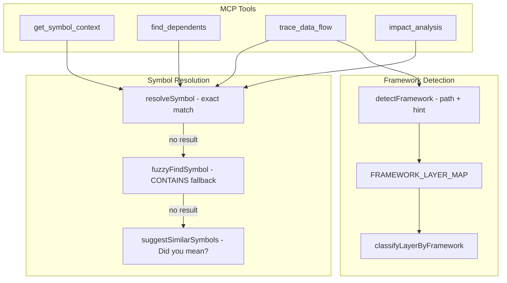
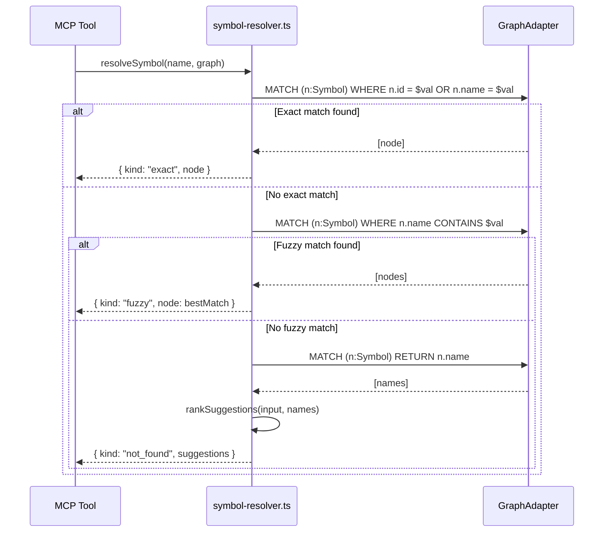
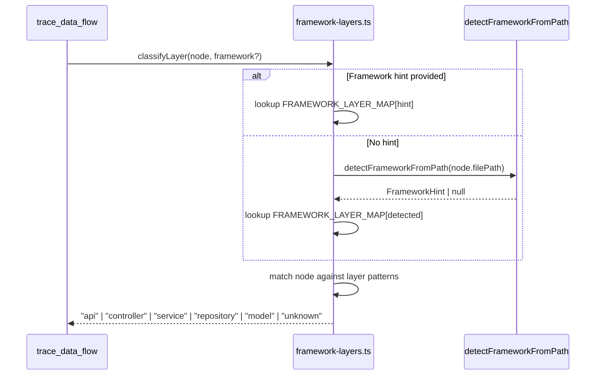

# Design Document: Fuzzy Symbol Resolution

## Overview

The current MCP tools (`get_symbol_context`, `find_dependents`, `trace_data_flow`, `impact_analysis`) resolve symbols using exact name matching (`n.id = $val OR n.name = $val`). When a user provides a slightly wrong name — a typo, a partial name, or a different casing — the tools return empty results with 0.5 confidence and no guidance. This feature introduces three improvements: (1) a two-step resolution strategy that falls back to fuzzy/CONTAINS matching when exact match fails, (2) "Did you mean?" suggestions when no symbol is found even after fuzzy matching, and (3) framework-aware layer classification for `trace_data_flow` that replaces hardcoded regex patterns with framework-detected layer mappings.

All three solutions share a common goal: make the MCP tools more resilient to imprecise input and more useful across diverse codebases. The fuzzy resolution and suggestion logic is extracted into a shared module so all four symbol-resolving tools benefit from a single implementation. The framework-aware layer classification leverages the existing `detectFrameworkFromPath` logic from the legacy parser to auto-detect frameworks and map symbols to trace layers.

## Architecture



## Sequence Diagrams

### Two-Step Symbol Resolution (Exact → Fuzzy → Suggestions)



### Framework-Aware Layer Classification



## Components and Interfaces

### Component 1: Symbol Resolver (`src/query/symbol-resolver.ts`)

**Purpose**: Centralized symbol resolution with exact → fuzzy fallback and "Did you mean?" suggestions. Replaces the duplicated `findNode` functions across `context-retrieval.ts`, `impact-analysis.ts`, and `data-flow-trace.ts`.

**Interface**:
```typescript
/** Discriminated union for resolution outcomes */
type SymbolResolution =
  | { readonly kind: "exact"; readonly node: GraphNode }
  | { readonly kind: "fuzzy"; readonly node: GraphNode; readonly matchedName: string }
  | { readonly kind: "not_found"; readonly suggestions: readonly string[] };

/** Resolve a symbol by name with exact → fuzzy fallback */
function resolveSymbol(
  nameOrId: string,
  graph: GraphAdapter,
): Promise<SymbolResolution>;

/** Find similar symbol names for "Did you mean?" suggestions */
function suggestSimilarSymbols(
  input: string,
  graph: GraphAdapter,
  limit?: number,
): Promise<readonly string[]>;
```

**Responsibilities**:
- Try exact match first (current `n.id = $val OR n.name = $val` behavior)
- Fall back to case-insensitive CONTAINS matching on `n.name`
- When multiple fuzzy matches exist, pick the shortest name (closest match)
- When no match at all, query all symbol names and rank by edit distance
- Return a discriminated union so callers can distinguish exact vs fuzzy vs not-found

### Component 2: Framework Layer Classifier (`src/query/framework-layers.ts`)

**Purpose**: Maps detected frameworks to the 5 trace layers (api, controller, service, repository, model) using framework-specific path and name patterns. Replaces the hardcoded `LAYER_PATTERNS` in `data-flow-trace.ts`.

**Interface**:
```typescript
type TraceLayer = "api" | "controller" | "service" | "repository" | "model" | "unknown";

/** Layer pattern configuration for a specific framework */
interface FrameworkLayerConfig {
  readonly framework: string;
  readonly layers: Readonly<Record<TraceLayer, readonly RegExp[]>>;
}

/** Classify a graph node into a trace layer using framework-aware patterns */
function classifyLayer(
  node: GraphNode,
  frameworkHint?: string,
): TraceLayer;

/** Detect framework from a file path, returning the framework name or null */
function detectFramework(filePath: string): string | null;
```

**Responsibilities**:
- Maintain a `FRAMEWORK_LAYER_MAP` mapping framework names to layer-specific regex patterns
- Support framework auto-detection from file paths using logic derived from `detectFrameworkFromPath`
- Accept an optional `framework` parameter hint (the currently unused param in `trace_data_flow`)
- Fall back to generic patterns (current behavior) when no framework is detected
- Keep the generic patterns as the default so existing behavior is preserved

### Component 3: Updated MCP Tools (`src/mcp/tools.ts`)

**Purpose**: Updated tool implementations that use the new symbol resolver and pass framework hints.

**Which tools get which enhancements**:

| Enhancement | get_symbol_context | find_dependents | trace_data_flow | impact_analysis |
|---|---|---|---|---|
| Fuzzy resolution (exact → CONTAINS) | ✅ | ✅ | ✅ | ✅ |
| "Did you mean?" suggestions | ✅ | ✅ | ✅ | ✅ |
| Framework-aware layer classification | ❌ | ❌ | ✅ (only tool that classifies layers) | ❌ |

**Responsibilities**:
- Replace direct `findNode` calls with `resolveSymbol` in all four tools
- Append "Did you mean?" suggestions to the `summary` field when resolution returns `not_found`
- Append "(fuzzy match)" indicator to summary when resolution returns `fuzzy`
- Pass `framework` parameter from `trace_data_flow` params to the trace function (only `trace_data_flow` does layer classification)

## Data Models

### SymbolResolution (Discriminated Union)

```typescript
type SymbolResolution =
  | { readonly kind: "exact"; readonly node: GraphNode }
  | { readonly kind: "fuzzy"; readonly node: GraphNode; readonly matchedName: string }
  | { readonly kind: "not_found"; readonly suggestions: readonly string[] };
```

**Validation Rules**:
- `kind` is always one of the three literal values
- When `kind === "exact"`, `node` is a valid GraphNode with non-empty `id`
- When `kind === "fuzzy"`, `matchedName` is the actual name that matched via CONTAINS
- When `kind === "not_found"`, `suggestions` contains 0–5 similar symbol names, ordered by relevance

### FrameworkLayerConfig

```typescript
interface FrameworkLayerConfig {
  readonly framework: string;
  readonly layers: Readonly<Record<TraceLayer, readonly RegExp[]>>;
}
```

**Validation Rules**:
- `framework` is a non-empty string matching a known framework identifier
- `layers` must have entries for all 5 trace layers (some may have empty pattern arrays)
- Patterns are tested against a combined string of `name + filePath + signature`


## Algorithmic Pseudocode

### Algorithm 1: resolveSymbol

```typescript
async function resolveSymbol(
  nameOrId: string,
  graph: GraphAdapter,
): Promise<SymbolResolution> {
  // Step 1: Exact match (current behavior)
  const exactRows = await graph.runCypher<CypherNodeRow>(
    `MATCH (n:Symbol) WHERE n.id = $val OR n.name = $val RETURN n LIMIT 1`,
    { val: nameOrId },
  );

  if (exactRows.length > 0) {
    return { kind: "exact", node: rowToNode(exactRows[0]) };
  }

  // Step 2: Fuzzy fallback — case-insensitive CONTAINS on name
  const fuzzyRows = await graph.runCypher<CypherNodeRow>(
    `MATCH (n:Symbol) WHERE n.name CONTAINS $val RETURN n`,
    { val: nameOrId },
  );

  if (fuzzyRows.length > 0) {
    // Pick the shortest name (closest to input) to avoid overly broad matches
    const nodes = fuzzyRows.map(rowToNode);
    const best = nodes.reduce((a, b) =>
      prop(a, "name").length <= prop(b, "name").length ? a : b
    );
    return { kind: "fuzzy", node: best, matchedName: prop(best, "name") };
  }

  // Step 3: No match — gather suggestions
  const suggestions = await suggestSimilarSymbols(nameOrId, graph, 5);
  return { kind: "not_found", suggestions };
}
```

**Preconditions:**
- `nameOrId` is a non-empty string
- `graph` is a connected GraphAdapter instance

**Postconditions:**
- Returns exactly one of the three `SymbolResolution` variants
- If `kind === "exact"`, the node's `id` or `name` matches `nameOrId` exactly
- If `kind === "fuzzy"`, the node's `name` contains `nameOrId` as a substring
- If `kind === "not_found"`, `suggestions.length <= 5`

### Algorithm 2: suggestSimilarSymbols

```typescript
async function suggestSimilarSymbols(
  input: string,
  graph: GraphAdapter,
  limit: number = 5,
): Promise<readonly string[]> {
  // Query distinct symbol names from the graph
  const rows = await graph.runCypher<{ name: string }>(
    `MATCH (n:Symbol) RETURN DISTINCT n.name AS name`,
    {},
  );

  const names = rows.map((r) => r.name).filter(Boolean);
  const inputLower = input.toLowerCase();

  // Score each name by edit distance (Levenshtein)
  const scored = names.map((name) => ({
    name,
    distance: levenshteinDistance(inputLower, name.toLowerCase()),
  }));

  // Sort by distance ascending, take top N
  scored.sort((a, b) => a.distance - b.distance);
  return scored.slice(0, limit).map((s) => s.name);
}
```

**Preconditions:**
- `input` is a non-empty string
- `limit` is a positive integer

**Postconditions:**
- Returns an array of length `<= limit`
- Names are ordered by ascending edit distance from `input`
- All returned names exist as Symbol nodes in the graph

### Algorithm 3: levenshteinDistance

```typescript
function levenshteinDistance(a: string, b: string): number {
  const m = a.length;
  const n = b.length;
  // Use single-row DP for O(min(m,n)) space
  let prev = Array.from({ length: n + 1 }, (_, i) => i);
  let curr = new Array<number>(n + 1);

  for (let i = 1; i <= m; i++) {
    curr[0] = i;
    for (let j = 1; j <= n; j++) {
      const cost = a[i - 1] === b[j - 1] ? 0 : 1;
      curr[j] = Math.min(
        prev[j] + 1,       // deletion
        curr[j - 1] + 1,   // insertion
        prev[j - 1] + cost, // substitution
      );
    }
    [prev, curr] = [curr, prev];
  }
  return prev[n];
}
```

**Preconditions:**
- `a` and `b` are strings (may be empty)

**Postconditions:**
- Returns a non-negative integer
- `levenshteinDistance(x, x) === 0` for all strings x
- `levenshteinDistance(a, b) === levenshteinDistance(b, a)` (symmetric)
- Result represents the minimum number of single-character edits

**Loop Invariants:**
- After processing row `i`: `prev[j]` = edit distance between `a[0..i]` and `b[0..j]`

### Algorithm 4: classifyLayer (Framework-Aware)

```typescript
function classifyLayer(
  node: GraphNode,
  frameworkHint?: string,
): TraceLayer {
  const name = prop(node, "name").toLowerCase();
  const filePath = prop(node, "filePath").toLowerCase();
  const signature = (node.properties["signature"] as string ?? "").toLowerCase();
  const combined = `${name} ${filePath} ${signature}`;

  // Step 1: Determine framework
  let framework = frameworkHint?.toLowerCase() ?? null;
  if (!framework) {
    framework = detectFramework(filePath);
  }

  // Step 2: Get layer patterns for framework (or generic fallback)
  const config = framework
    ? FRAMEWORK_LAYER_MAP.get(framework) ?? GENERIC_LAYER_CONFIG
    : GENERIC_LAYER_CONFIG;

  // Step 3: Test combined string against each layer's patterns
  for (const layer of LAYER_ORDER) {
    const patterns = config.layers[layer];
    if (patterns.some((p) => p.test(combined))) {
      return layer;
    }
  }

  return "unknown";
}
```

**Preconditions:**
- `node` is a valid GraphNode with at least `name` and `filePath` properties
- `frameworkHint` is optional; if provided, must be a recognized framework name

**Postconditions:**
- Returns one of the 6 TraceLayer values
- If `frameworkHint` is provided and recognized, uses framework-specific patterns
- If no hint, auto-detects from `filePath`
- Falls back to generic patterns (current behavior) when framework is unknown

### Algorithm 5: detectFramework

```typescript
function detectFramework(filePath: string): string | null {
  let p = filePath.toLowerCase().replace(/\\/g, "/");
  if (!p.startsWith("/")) p = "/" + p;

  // NestJS detection
  if (p.includes("/controllers/") && (p.endsWith(".ts") || p.endsWith(".js"))) {
    return "nestjs";
  }

  // Spring detection
  if ((p.includes("/controller/") || p.includes("/controllers/")) && p.endsWith(".java")) {
    return "spring";
  }
  if (p.endsWith("controller.java") || p.endsWith("controller.kt")) {
    return "spring";
  }

  // Laravel detection
  if (p.includes("/http/controllers/") && p.endsWith(".php")) {
    return "laravel";
  }
  if (p.endsWith("controller.php")) {
    return "laravel";
  }

  // Express detection
  if (p.includes("/routes/") && (p.endsWith(".ts") || p.endsWith(".js"))) {
    return "express";
  }

  // Django detection
  if (p.endsWith("views.py") || p.endsWith("urls.py")) {
    return "django";
  }

  // FastAPI detection
  if ((p.includes("/routers/") || p.includes("/endpoints/")) && p.endsWith(".py")) {
    return "fastapi";
  }

  // Next.js detection
  if (p.includes("/pages/") || (p.includes("/app/") && p.endsWith("page.tsx"))) {
    return "nextjs";
  }

  // ASP.NET detection
  if (p.includes("/controllers/") && p.endsWith(".cs")) {
    return "aspnet";
  }

  // Go HTTP detection
  if ((p.includes("/handlers/") || p.includes("/routes/")) && p.endsWith(".go")) {
    return "go-http";
  }

  return null;
}
```

**Preconditions:**
- `filePath` is a non-empty string

**Postconditions:**
- Returns a recognized framework name string, or `null` if no framework detected
- Detection is based on directory structure and file extension patterns
- Derived from the existing `detectFrameworkFromPath` in the legacy parser

## Key Functions with Formal Specifications

### resolveSymbol()

```typescript
function resolveSymbol(nameOrId: string, graph: GraphAdapter): Promise<SymbolResolution>
```

**Preconditions:**
- `nameOrId.length > 0`
- `graph` is initialized and connected

**Postconditions:**
- Always returns a valid `SymbolResolution` (never throws for missing symbols)
- `kind === "exact"` ⟹ `node.id === nameOrId ∨ node.name === nameOrId`
- `kind === "fuzzy"` ⟹ `node.name.includes(nameOrId)` (case-insensitive)
- `kind === "not_found"` ⟹ `suggestions.length ∈ [0, 5]`

### suggestSimilarSymbols()

```typescript
function suggestSimilarSymbols(input: string, graph: GraphAdapter, limit?: number): Promise<readonly string[]>
```

**Preconditions:**
- `input.length > 0`
- `limit > 0` (defaults to 5)

**Postconditions:**
- `result.length <= limit`
- Results ordered by ascending Levenshtein distance
- All returned names exist in the graph

### classifyLayer()

```typescript
function classifyLayer(node: GraphNode, frameworkHint?: string): TraceLayer
```

**Preconditions:**
- `node` has `name` and `filePath` properties

**Postconditions:**
- Returns a valid `TraceLayer` value
- Framework-specific patterns take precedence over generic patterns
- Returns `"unknown"` when no pattern matches

### detectFramework()

```typescript
function detectFramework(filePath: string): string | null
```

**Preconditions:**
- `filePath` is a non-empty string

**Postconditions:**
- Returns a framework identifier or `null`
- Detection is deterministic for the same input

## Example Usage

### Using resolveSymbol in a tool

```typescript
// In get_symbol_context tool handler
const resolution = await resolveSymbol(symbolName, graphAdapter);

switch (resolution.kind) {
  case "exact":
    // Proceed with full context retrieval using resolution.node
    const result = await executeContextRetrieval(resolution.node.id, maxResults, graphAdapter);
    return formatMCPResponse(result, `Found symbol '${symbolName}' ...`);

  case "fuzzy":
    // Proceed but note the fuzzy match in summary
    const result2 = await executeContextRetrieval(resolution.node.id, maxResults, graphAdapter);
    return formatMCPResponse(result2,
      `Fuzzy matched '${symbolName}' → '${resolution.matchedName}'. ` +
      `Found ${result2.symbols.length} related symbols.`
    );

  case "not_found":
    // Return empty result with suggestions in summary
    const suggestions = resolution.suggestions.length > 0
      ? `Did you mean: ${resolution.suggestions.join(", ")}?`
      : "No similar symbols found.";
    return formatMCPResponse(emptyResult, `Symbol '${symbolName}' not found. ${suggestions}`);
}
```

### Using framework-aware trace

```typescript
// In trace_data_flow tool handler
const entryPoint = params.entryPoint as string;
const framework = params.framework as string | undefined;

const result = await executeDataFlowTrace(entryPoint, maxResults, graphAdapter, framework);
```

## Correctness Properties

1. **Exact match precedence**: For all symbol names `s` that exist in the graph with exact match, `resolveSymbol(s, graph)` returns `{ kind: "exact" }`.

2. **Fuzzy fallback only on exact miss**: `resolveSymbol` returns `{ kind: "fuzzy" }` only when no exact match exists for the input.

3. **Suggestion limit**: For all inputs, `suggestSimilarSymbols(input, graph, limit)` returns at most `limit` results.

4. **Suggestion ordering**: Suggestions are ordered by ascending Levenshtein distance — `distance(suggestions[i]) <= distance(suggestions[i+1])`.

5. **Levenshtein symmetry**: `levenshteinDistance(a, b) === levenshteinDistance(b, a)` for all strings.

6. **Levenshtein identity**: `levenshteinDistance(x, x) === 0` for all strings.

7. **Levenshtein non-negativity**: `levenshteinDistance(a, b) >= 0` for all strings.

8. **Framework detection determinism**: `detectFramework(path)` returns the same result for the same input.

9. **Generic fallback preservation**: When no framework is detected, `classifyLayer` produces the same results as the current hardcoded `LAYER_PATTERNS`.

10. **Resolution exhaustiveness**: `resolveSymbol` always returns one of exactly three variants — it never throws for a missing symbol.

## Error Handling

### Scenario 1: Database Connection Failure During Resolution

**Condition**: `graph.runCypher()` throws during any resolution step
**Response**: Let the error propagate to the MCP tool handler, which returns a structured error response
**Recovery**: The MCP tool's existing error handling catches and formats the error for the AI editor

### Scenario 2: Extremely Large Symbol Table for Suggestions

**Condition**: The graph contains hundreds of thousands of symbols, making `suggestSimilarSymbols` slow
**Response**: Limit the initial name query with a LIMIT clause (e.g., 1000 names) and accept approximate suggestions
**Recovery**: The suggestion quality degrades gracefully — fewer candidates means less accurate suggestions, but the tool still responds within timeout

### Scenario 3: Ambiguous Fuzzy Match

**Condition**: Multiple symbols contain the input string (e.g., input "User" matches "UserService", "UserController", "UserModel")
**Response**: Pick the shortest name as the best match (closest to what the user likely meant)
**Recovery**: The summary indicates it was a fuzzy match, so the user can refine their query

## Testing Strategy

### Unit Testing Approach

- Test `resolveSymbol` with exact matches, fuzzy matches, and not-found cases using mocked `GraphAdapter`
- Test `suggestSimilarSymbols` with known symbol sets and verify ordering
- Test `levenshteinDistance` with known string pairs
- Test `classifyLayer` with nodes from different frameworks
- Test `detectFramework` with file paths from all supported frameworks

### Property-Based Testing Approach

**Property Test Library**: fast-check

- **Levenshtein properties**: symmetry, identity, non-negativity, triangle inequality
- **Resolution exhaustiveness**: for any input string, `resolveSymbol` returns a valid `SymbolResolution` variant
- **Suggestion ordering**: for any input and symbol set, suggestions are sorted by ascending distance
- **Suggestion limit**: result length never exceeds the specified limit

### Integration Testing Approach

- End-to-end test: call MCP tool with a misspelled symbol name, verify fuzzy match in response
- End-to-end test: call MCP tool with a completely wrong name, verify suggestions in summary
- End-to-end test: call `trace_data_flow` with framework hint, verify layer classification differs from generic

## Performance Considerations

- **Exact match**: No performance change — same single Cypher query as before
- **Fuzzy CONTAINS**: Slightly slower than exact match but still O(n) scan; acceptable for symbol tables under 500K nodes (the existing `MAX_GRAPH_SIZE_NODES` limit)
- **Suggestion generation**: The Levenshtein computation over all symbol names is O(n × m) where n = number of symbols and m = average name length. For 500K symbols this could be slow, so we limit the candidate set with a LIMIT clause on the Cypher query (1000 names max)
- **Framework detection**: Pure string matching on file paths — negligible overhead
- **Layer classification**: Same regex-based approach as current code, just with framework-specific pattern sets

## Security Considerations

- The `nameOrId` parameter is passed directly to Cypher as a parameterized value (`$val`), so there is no injection risk from fuzzy matching
- The CONTAINS query also uses parameterized values, maintaining the same security posture as exact matching
- Framework detection operates on file paths already stored in the graph — no user-supplied paths are used for file system access

## Dependencies

- **Existing**: `GraphAdapter` from `src/db/types.ts`, `GraphNode` and `prop` helper
- **Existing**: `detectFrameworkFromPath` from `legacy-parser/parser/ingestion/framework-detection.ts` (used as reference for `detectFramework` — not imported directly to avoid coupling to legacy code)
- **Existing**: `MAX_TRAVERSAL_DEPTH` from `src/utils/limits.ts`
- **New**: No new external dependencies required — Levenshtein distance is implemented inline
- **Testing**: `vitest` + `fast-check` (already in project)
