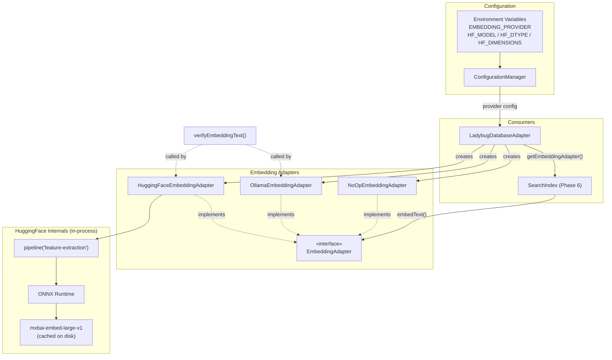
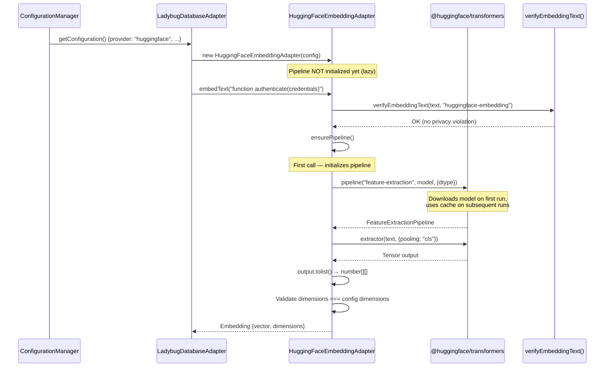
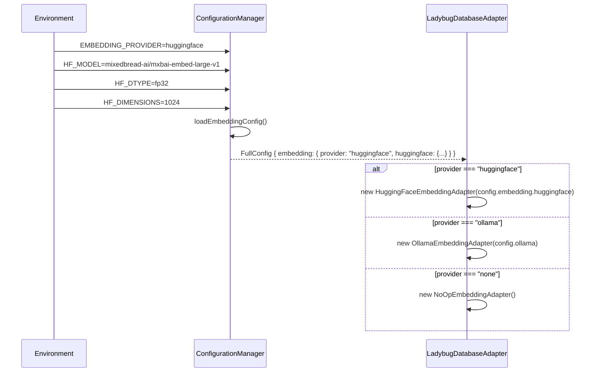

# Design Document: HuggingFace Transformers.js Embedding Support

## Overview

This feature adds a new `HuggingFaceEmbeddingAdapter` that implements the existing `EmbeddingAdapter` interface using the `@huggingface/transformers` package with the `mixedbread-ai/mxbai-embed-large-v1` model. Unlike the Ollama adapter which calls an external HTTP API, this adapter runs the model entirely in-process via ONNX Runtime, eliminating the need for a separate server.

The design introduces a provider-based configuration model (`EMBEDDING_PROVIDER=huggingface|ollama|none`) that replaces the current `OLLAMA_ENABLED` boolean, enabling clean selection between embedding backends. The `pipeline()` lifecycle (model download, caching, warm-up) is managed internally by the adapter with lazy initialization on first `embedText()` call. The adapter produces 1024-dimensional embeddings using CLS pooling, matching the existing Ollama configuration for `mxbai-embed-large`.

Privacy guarantees are strengthened: since the model runs in-process, no data leaves the machine at all — the existing `verifyEmbeddingText()` check still applies as a defense-in-depth measure.

## Architecture



## Sequence Diagrams

### Adapter Initialization & First Embedding



### Provider Selection During Initialization



## Components and Interfaces

### Component 1: HuggingFaceEmbeddingAdapter

**Purpose**: Generates embeddings in-process using `@huggingface/transformers` with the `mxbai-embed-large-v1` model. Implements the existing `EmbeddingAdapter` interface.

**Interface**:
```typescript
import type { EmbeddingAdapter } from "./types.js";
import type { Embedding } from "../types/index.js";

interface HuggingFaceConfig {
  readonly model: string;       // e.g. "mixedbread-ai/mxbai-embed-large-v1"
  readonly dtype: "fp32" | "fp16" | "q8";
  readonly dimensions: number;  // e.g. 1024
  readonly pooling: "cls" | "mean";
}

class HuggingFaceEmbeddingAdapter implements EmbeddingAdapter {
  isEnabled(): boolean;
  embedText(text: string): Promise<Embedding | null>;
  getDimensions(): number;
  dispose(): Promise<void>;
}
```

**Responsibilities**:
- Lazy-initialize the `pipeline()` on first `embedText()` call
- Run `verifyEmbeddingText()` privacy check before every embedding
- Convert pipeline output tensor to `Embedding` type
- Validate output dimensions match configured dimensions
- Return `null` on any error (never throw) — consistent with `OllamaEmbeddingAdapter`
- Provide `dispose()` for cleanup of the pipeline/ONNX session

### Component 2: EmbeddingConfig (Configuration Extension)

**Purpose**: Extends the configuration system to support provider selection and HuggingFace-specific settings.

**Interface**:
```typescript
type EmbeddingProvider = "huggingface" | "ollama" | "none";

interface HuggingFaceConfig {
  readonly model: string;
  readonly dtype: "fp32" | "fp16" | "q8";
  readonly dimensions: number;
  readonly pooling: "cls" | "mean";
}

interface EmbeddingConfig {
  readonly provider: EmbeddingProvider;
  readonly huggingface: HuggingFaceConfig;
}
```

**Responsibilities**:
- Parse `EMBEDDING_PROVIDER` env var (default: derive from existing `OLLAMA_ENABLED` for backward compatibility)
- Parse `HF_MODEL`, `HF_DTYPE`, `HF_DIMENSIONS`, `HF_POOLING` env vars
- Validate dtype is one of the allowed values
- Validate dimensions is a positive integer

### Component 3: Updated LadybugDatabaseAdapter (Factory Logic)

**Purpose**: Select the correct `EmbeddingAdapter` implementation based on the configured provider.

**Responsibilities**:
- Replace the binary `ollama.enabled ? Ollama : NoOp` logic with a provider switch
- Instantiate `HuggingFaceEmbeddingAdapter` when provider is `"huggingface"`
- Maintain backward compatibility: if `EMBEDDING_PROVIDER` is not set but `OLLAMA_ENABLED=true`, default to `"ollama"`; otherwise default to `"huggingface"`

### Component 4: Privacy Module Update

**Purpose**: Register `"huggingface-embeddings"` as a recognized service in the privacy policy.

**Responsibilities**:
- Add a new `ExternalDataPolicy` entry for `"huggingface-embeddings"` (even though data stays in-process, the policy documents what data types are processed)
- Update the `ExternalDataPolicy.service` union type to include `"huggingface-embeddings"`

## Data Models

### HuggingFaceConfig

```typescript
interface HuggingFaceConfig {
  /** Model identifier on HuggingFace Hub. Default: "mixedbread-ai/mxbai-embed-large-v1" */
  readonly model: string;
  /** Quantization/precision. Default: "fp32". Affects memory and speed. */
  readonly dtype: "fp32" | "fp16" | "q8";
  /** Expected embedding dimensions. Default: 1024. */
  readonly dimensions: number;
  /** Pooling strategy. Default: "cls". */
  readonly pooling: "cls" | "mean";
}
```

**Validation Rules**:
- `model` must be a non-empty string
- `dtype` must be one of `"fp32"`, `"fp16"`, `"q8"`
- `dimensions` must be a positive integer
- `pooling` must be one of `"cls"`, `"mean"`

### EmbeddingProvider (Discriminated Union)

```typescript
type EmbeddingProvider = "huggingface" | "ollama" | "none";
```

### Updated FullConfig

```typescript
interface FullConfig {
  readonly prefix: string;
  readonly ollama: OllamaConfig;
  readonly embedding: EmbeddingConfig;
  readonly ladybugdb: LadybugDBConfig;
  readonly loadedAt: Date;
  readonly source: "environment" | "env-file" | "default";
}
```

### Updated ExternalDataPolicy Service Type

```typescript
type EmbeddingService = "ollama-embeddings" | "huggingface-embeddings" | "ai-enrichment";
```

## Algorithmic Pseudocode

### Pipeline Initialization Algorithm

```typescript
// Lazy singleton pattern for pipeline lifecycle
class HuggingFaceEmbeddingAdapter implements EmbeddingAdapter {
  private pipeline: FeatureExtractionPipeline | null = null;
  private initPromise: Promise<FeatureExtractionPipeline> | null = null;

  /**
   * ALGORITHM ensurePipeline
   * INPUT: none (reads from this.config)
   * OUTPUT: initialized FeatureExtractionPipeline
   *
   * Preconditions:
   *   - this.config.model is a valid HuggingFace model identifier
   *   - this.config.dtype is one of "fp32" | "fp16" | "q8"
   *
   * Postconditions:
   *   - this.pipeline is non-null and ready for inference
   *   - Concurrent calls share the same initialization promise (no duplicate downloads)
   *
   * Loop Invariants: N/A (no loops)
   */
  private async ensurePipeline(): Promise<FeatureExtractionPipeline> {
    if (this.pipeline) return this.pipeline;

    // Prevent concurrent initialization — share the same promise
    if (!this.initPromise) {
      this.initPromise = pipeline(
        "feature-extraction",
        this.config.model,
        { dtype: this.config.dtype },
      ).then((p) => {
        this.pipeline = p as FeatureExtractionPipeline;
        return this.pipeline;
      }).catch((err) => {
        this.initPromise = null; // Allow retry on failure
        throw err;
      });
    }

    return this.initPromise;
  }
}
```

### Embedding Generation Algorithm

```typescript
/**
 * ALGORITHM embedText
 * INPUT: text: string — symbol signature or cluster description
 * OUTPUT: Embedding | null
 *
 * Preconditions:
 *   - text passes verifyEmbeddingText() privacy check
 *   - text is non-empty
 *
 * Postconditions:
 *   - If successful: result.vector.length === this.config.dimensions
 *   - If successful: result.dimensions === this.config.dimensions
 *   - If any error: returns null (never throws)
 *   - Privacy check runs before any model inference
 *
 * Loop Invariants: N/A
 */
async embedText(text: string): Promise<Embedding | null> {
  // Step 1: Privacy check (defense-in-depth, even though data stays local)
  verifyEmbeddingText(text, "huggingface-embedding");

  try {
    // Step 2: Ensure pipeline is initialized
    const extractor = await this.ensurePipeline();

    // Step 3: Run inference with configured pooling
    const output = await extractor(text, { pooling: this.config.pooling });

    // Step 4: Extract vector from tensor output
    const vectors: number[][] = output.tolist();
    const vector: number[] = vectors[0];

    // Step 5: Validate dimensions
    if (vector.length !== this.config.dimensions) {
      return null;
    }

    // Step 6: Return Embedding
    return { vector, dimensions: vector.length };
  } catch {
    // Consistent with OllamaEmbeddingAdapter — return null on error
    return null;
  }
}
```

### Provider Selection Algorithm

```typescript
/**
 * ALGORITHM createEmbeddingAdapter
 * INPUT: config: FullConfig
 * OUTPUT: EmbeddingAdapter
 *
 * Preconditions:
 *   - config.embedding.provider is one of "huggingface" | "ollama" | "none"
 *   - If provider is "huggingface": config.embedding.huggingface is valid
 *   - If provider is "ollama": config.ollama is valid
 *
 * Postconditions:
 *   - Returns an EmbeddingAdapter matching the configured provider
 *   - Exactly one adapter type is instantiated
 *
 * Loop Invariants: N/A
 */
function createEmbeddingAdapter(config: FullConfig): EmbeddingAdapter {
  switch (config.embedding.provider) {
    case "huggingface":
      return new HuggingFaceEmbeddingAdapter(config.embedding.huggingface);
    case "ollama":
      return new OllamaEmbeddingAdapter(config.ollama);
    case "none":
      return new NoOpEmbeddingAdapter();
  }
}
```

### Configuration Loading Algorithm

```typescript
/**
 * ALGORITHM loadEmbeddingConfig
 * INPUT: process.env
 * OUTPUT: EmbeddingConfig
 *
 * Preconditions:
 *   - Environment variables are accessible
 *
 * Postconditions:
 *   - provider is a valid EmbeddingProvider
 *   - If provider is "huggingface": huggingface config has valid model, dtype, dimensions, pooling
 *   - Backward compatible: OLLAMA_ENABLED=true without EMBEDDING_PROVIDER → provider="ollama", otherwise → provider="huggingface"
 *
 * Loop Invariants: N/A
 */
function loadEmbeddingConfig(): EmbeddingConfig {
  // Step 1: Determine provider (with backward compatibility)
  const providerRaw = process.env["EMBEDDING_PROVIDER"];
  let provider: EmbeddingProvider;

  if (providerRaw) {
    provider = validateProvider(providerRaw); // throws on invalid
  } else {
    // Backward compat: infer from OLLAMA_ENABLED
    const ollamaEnabled = process.env["OLLAMA_ENABLED"]?.toLowerCase() === "true";
    provider = ollamaEnabled ? "ollama" : "huggingface";
  }

  // Step 2: Load HuggingFace config (always loaded, used only when provider === "huggingface")
  const huggingface: HuggingFaceConfig = {
    model: process.env["HF_MODEL"] || "mixedbread-ai/mxbai-embed-large-v1",
    dtype: validateDtype(process.env["HF_DTYPE"] || "fp32"),
    dimensions: parseDimensions(process.env["HF_DIMENSIONS"] || "1024"),
    pooling: validatePooling(process.env["HF_POOLING"] || "cls"),
  };

  return { provider, huggingface };
}
```

## Key Functions with Formal Specifications

### Function 1: `ensurePipeline()`

```typescript
private async ensurePipeline(): Promise<FeatureExtractionPipeline>
```

**Preconditions:**
- `this.config.model` is a non-empty string identifying a valid HuggingFace model
- `this.config.dtype` is one of `"fp32"`, `"fp16"`, `"q8"`

**Postconditions:**
- Returns a ready-to-use `FeatureExtractionPipeline` instance
- `this.pipeline` is set to the returned instance
- Concurrent calls return the same promise (no duplicate model downloads)
- On failure, `this.initPromise` is reset to `null` to allow retry

**Loop Invariants:** N/A

### Function 2: `embedText(text: string)`

```typescript
async embedText(text: string): Promise<Embedding | null>
```

**Preconditions:**
- `text` is a non-empty string
- `text` does not contain source code (enforced by `verifyEmbeddingText`)

**Postconditions:**
- If successful: `result.vector.length === this.config.dimensions`
- If successful: `result.dimensions === this.config.dimensions`
- If `verifyEmbeddingText` throws: exception propagates (privacy violation)
- If any other error: returns `null`
- No side effects on input text

**Loop Invariants:** N/A

### Function 3: `dispose()`

```typescript
async dispose(): Promise<void>
```

**Preconditions:**
- None (safe to call even if pipeline was never initialized)

**Postconditions:**
- `this.pipeline` is `null`
- `this.initPromise` is `null`
- Any ONNX session resources are released

**Loop Invariants:** N/A

### Function 4: `loadEmbeddingConfig()`

```typescript
function loadEmbeddingConfig(): EmbeddingConfig
```

**Preconditions:**
- `process.env` is accessible

**Postconditions:**
- `result.provider` is one of `"huggingface"`, `"ollama"`, `"none"`
- If `EMBEDDING_PROVIDER` is set: uses that value (throws on invalid)
- If `EMBEDDING_PROVIDER` is not set and `OLLAMA_ENABLED=true`: provider is `"ollama"`
- If neither is set: provider is `"huggingface"` (default)
- `result.huggingface.dtype` is one of `"fp32"`, `"fp16"`, `"q8"`
- `result.huggingface.dimensions` is a positive integer

**Loop Invariants:** N/A

## Example Usage

```typescript
// Example 1: Basic HuggingFace adapter usage
import { HuggingFaceEmbeddingAdapter } from "./huggingface-embedding-adapter.js";

const adapter = new HuggingFaceEmbeddingAdapter({
  model: "mixedbread-ai/mxbai-embed-large-v1",
  dtype: "fp32",
  dimensions: 1024,
  pooling: "cls",
});

const embedding = await adapter.embedText("function authenticate(credentials: Credentials): AuthResult");
// embedding = { vector: [0.012, -0.034, ...], dimensions: 1024 }

// Example 2: Provider selection in database adapter
import type { FullConfig } from "../config/types.js";

// config.embedding.provider === "huggingface"
const embeddingAdapter = createEmbeddingAdapter(config);
const isActive = embeddingAdapter.isEnabled(); // true
const dims = embeddingAdapter.getDimensions(); // 1024

// Example 3: Integration with search index (unchanged)
import { buildSearchIndex } from "../indexer/search/index.js";

const embedFn = embeddingAdapter.isEnabled()
  ? (text: string) => embeddingAdapter.embedText(text)
  : null;

const searchIndex = await buildSearchIndex(symbols, clusters, embedFn);

// Example 4: Environment configuration
// .env-typocop
// EMBEDDING_PROVIDER=huggingface
// HF_MODEL=mixedbread-ai/mxbai-embed-large-v1
// HF_DTYPE=fp32
// HF_DIMENSIONS=1024

// Example 5: Backward compatibility (no EMBEDDING_PROVIDER set)
// OLLAMA_ENABLED=true → provider defaults to "ollama"
// OLLAMA_ENABLED=false or unset → provider defaults to "huggingface"

// Example 6: Cleanup
await adapter.dispose();
```

## Correctness Properties

*A property is a characteristic or behavior that should hold true across all valid executions of a system — essentially, a formal statement about what the system should do. Properties serve as the bridge between human-readable specifications and machine-verifiable correctness guarantees.*

### Property 1: Dimension Consistency

*For any* valid `HuggingFaceConfig` and *for any* text where `embedText(text)` returns a non-null `Embedding`, `result.vector.length === result.dimensions === config.dimensions`, and `getDimensions()` returns `config.dimensions`.

**Validates: Requirements 1.3, 1.4**

### Property 2: Null Safety

*For any* pipeline error (network failure, ONNX crash, invalid output) or dimension mismatch between pipeline output and `config.dimensions`, `embedText()` SHALL return `null` without throwing an exception.

**Validates: Requirements 1.5, 1.6**

### Property 3: Concurrent Initialization Safety

*For any* number of concurrent `embedText()` calls on a freshly constructed adapter, the pipeline factory function SHALL be invoked exactly once, and all calls SHALL share the same initialization promise.

**Validates: Requirement 2.3**

### Property 4: Privacy Invariant

*For any* text input, `embedText()` SHALL invoke `verifyEmbeddingText()` before any pipeline inference. *For any* text that triggers a privacy violation, the exception SHALL propagate to the caller (not be caught).

**Validates: Requirements 3.1, 3.2**

### Property 5: Configuration Validation

*For any* string that is not one of `"huggingface"`, `"ollama"`, `"none"` as `EMBEDDING_PROVIDER`, or not one of `"fp32"`, `"fp16"`, `"q8"` as `HF_DTYPE`, or not a positive integer as `HF_DIMENSIONS`, `loadEmbeddingConfig()` SHALL throw a configuration error.

**Validates: Requirements 4.2, 4.4, 4.5**

### Property 6: Explicit Provider Override

*For any* valid `EMBEDDING_PROVIDER` value and *for any* value of `OLLAMA_ENABLED`, when `EMBEDDING_PROVIDER` is explicitly set, `loadEmbeddingConfig()` SHALL use the explicit provider value.

**Validates: Requirement 5.3**

### Property 7: Provider Exclusivity

*For any* valid `EmbeddingProvider` value, the factory SHALL instantiate exactly one of `HuggingFaceEmbeddingAdapter`, `OllamaEmbeddingAdapter`, or `NoOpEmbeddingAdapter` — never zero, never more than one.

**Validates: Requirements 6.1, 6.2, 6.3, 6.4**

## Error Handling

### Error Scenario 1: Model Download Failure

**Condition**: First `embedText()` call when the model has not been cached and network is unavailable.
**Response**: `ensurePipeline()` throws, caught by `embedText()`, returns `null`. `initPromise` is reset to allow retry on next call.
**Recovery**: Subsequent calls will retry pipeline initialization. Once network is available, the model downloads and caches automatically.

### Error Scenario 2: Dimension Mismatch

**Condition**: Model produces vectors with a different dimension than `config.dimensions`.
**Response**: `embedText()` detects `vector.length !== config.dimensions` and returns `null`.
**Recovery**: User must update `HF_DIMENSIONS` to match the actual model output, or switch to a model that produces the expected dimensions.

### Error Scenario 3: Invalid dtype Configuration

**Condition**: `HF_DTYPE` is set to an unsupported value (e.g., `"bf16"`).
**Response**: `loadEmbeddingConfig()` throws a configuration error during `ConfigurationManager.initialize()`.
**Recovery**: User corrects the `HF_DTYPE` value to one of `"fp32"`, `"fp16"`, `"q8"`.

### Error Scenario 4: Privacy Violation

**Condition**: Caller passes source code to `embedText()`.
**Response**: `verifyEmbeddingText()` throws an error. This is NOT caught — it propagates to the caller as a hard failure.
**Recovery**: Caller must ensure only symbol signatures are passed (this is a programming error, not a runtime condition).

### Error Scenario 5: Out of Memory (Large Model + fp32)

**Condition**: System does not have enough memory for the model at the requested precision.
**Response**: Pipeline initialization fails, `embedText()` returns `null`.
**Recovery**: User switches to a lower precision (`HF_DTYPE=q8` or `HF_DTYPE=fp16`) to reduce memory usage.

## Testing Strategy

### Unit Testing Approach

- Mock `@huggingface/transformers` `pipeline()` function to avoid real model downloads in tests
- Test `embedText()` returns correct `Embedding` shape from mocked pipeline output
- Test `embedText()` returns `null` when pipeline throws
- Test `embedText()` calls `verifyEmbeddingText()` before inference
- Test `ensurePipeline()` concurrent call deduplication
- Test `dispose()` cleans up pipeline state
- Test `isEnabled()` returns `true`, `getDimensions()` returns configured value
- Test configuration loading with various env var combinations
- Test backward compatibility when `EMBEDDING_PROVIDER` is not set

### Property-Based Testing Approach

**Property Test Library**: fast-check

- **P1: Dimension Consistency** — For any non-null embedding result, `vector.length === dimensions === config.dimensions`
- **P2: Null Safety** — For any string input (including empty, very long, unicode), `embedText()` either returns a valid `Embedding` or `null` (never throws, except privacy violations)
- **P3: Provider Exclusivity** — For any valid `EmbeddingProvider` value, exactly one adapter type is created
- **P4: Config Validation** — For any string input to dtype/dimensions/pooling validators, either a valid config is produced or an error is thrown (no silent invalid states)

### Integration Testing Approach

- Integration test with real `@huggingface/transformers` pipeline (marked as slow, skipped in CI by default)
- Verify end-to-end: config → adapter creation → embedding generation → vector storage
- Verify the adapter works with `buildSearchIndex()` as the `embedFn`

## Performance Considerations

- **First-call latency**: Pipeline initialization downloads and loads the model (~500MB for fp32). This is a one-time cost per process lifetime. Consider logging a warning about expected delay.
- **Inference latency**: In-process ONNX inference is typically faster than Ollama HTTP round-trip for single texts.
- **Memory usage**: fp32 uses ~1.3GB RAM, fp16 ~650MB, q8 ~350MB. The `dtype` option lets users trade precision for memory.
- **Batch potential**: The `@huggingface/transformers` pipeline supports batch input (array of strings). Future optimization could batch multiple `embedText()` calls, but the current `EmbeddingAdapter` interface is single-text. This is a future enhancement, not part of this feature.

## Security Considerations

- **Data locality**: All inference runs in-process. No network calls after model download. This is strictly more private than Ollama (which uses localhost HTTP).
- **Model provenance**: The model is downloaded from HuggingFace Hub. The `@huggingface/transformers` package handles model integrity verification.
- **Privacy check**: `verifyEmbeddingText()` is called before every inference as defense-in-depth, even though data never leaves the process.
- **No secrets**: No API keys or tokens required for the default model (it's publicly available on HuggingFace Hub).

## Dependencies

| Package | Purpose | Version |
|---------|---------|---------|
| `@huggingface/transformers` | In-process ML inference via ONNX Runtime | `^3.x` |

No other new dependencies are required. The package includes ONNX Runtime bindings for Node.js.
