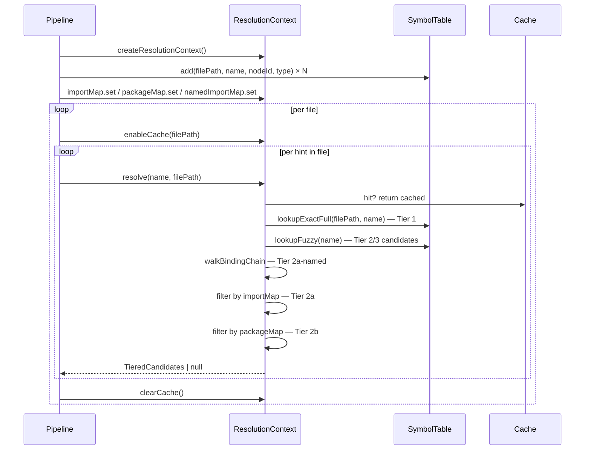

# Design Document: Resolution Context

**Related documents:**
- [Components & Interfaces](./design-components.md)
- [Data Models & Algorithms](./design-data-models.md)
- [Correctness Properties](./design-correctness.md)

## Overview

`ResolutionContext` is the single authoritative name-resolution service for Phase 3 of the indexing pipeline. It replaces the ad-hoc `symbolMap` + `symbolTable` lookups currently scattered across `src/indexer/resolution/index.ts` with a unified 4-tier strategy that attaches explicit confidence scores to every resolved candidate set.

The context owns the `SymbolTable`, the three import maps (`importMap`, `packageMap`, `namedImportMap`), and a per-file LRU-style cache. Consumers call `resolve(name, fromFile)` and receive a `TieredCandidates` object — they never touch the underlying maps directly.

**MCP-confirmed callers**: `resolveReferences` is called by `runIndexingPipeline` (`src/indexer/pipeline.ts:111`) and `executeIndexingPipeline` (`src/cli/executor.ts:48`). Both callers depend on the existing public API signature — it must not change.

## Architecture

```mermaid
graph TD
    P2[Phase 2 — Parsing] -->|RawRelationshipHints| P3[Phase 3 — Resolution]
    P3 --> RC[ResolutionContext]
    RC --> ST[SymbolTable]
    RC --> IM[ImportMap]
    RC --> PM[PackageMap]
    RC --> NIM[NamedImportMap]
    RC --> Cache[Per-file Cache]
    ST --> FI[fileIndex\nMap&lt;path, Map&lt;name, Def&gt;&gt;]
    ST --> GI[globalIndex\nMap&lt;name, Def[]&gt;]
    P3 -->|Relationship[]| P4[Phase 4 — Clustering]
```

## Phase 3 Pipeline Integration



## Resolution Tier Summary

| Tier | Strategy | Confidence | Notes |
|------|----------|------------|-------|
| 1 | Same-file `lookupExactFull` | 0.95 | Authoritative — single candidate |
| 2a-named | Named binding chain via `namedImportMap` | 0.90 | Handles aliased imports |
| 2a | Import-scoped: `lookupFuzzy` ∩ `importMap[fromFile]` | 0.90 | Direct file imports |
| 2b | Package-scoped: `lookupFuzzy` ∩ `packageMap[fromFile]` | 0.90 | Package-dir imports |
| 3 | Global fallback: all `lookupFuzzy` candidates | 0.50 | Consumers must check count |

Tiers 2a-named, 2a, and 2b all map to `ResolutionTier = 'import-scoped'` in the output — the distinction is internal to the resolution algorithm.

## File Layout

```
src/indexer/resolution/
  symbol-table.ts              ← already implemented (createSymbolTable, buildSymbolTable,
  |                               lookupExact, lookupExactFull, lookupFuzzy — confirmed by MCP)
  symbol-table.test.ts         ← existing
  named-binding.ts             ← NEW (task 1)
  named-binding.test.ts        ← NEW (task 2)
  resolution-context.ts        ← NEW (task 3)
  resolution-context.test.ts   ← NEW (task 4)
  index.ts                     ← updated to wire RC into resolveHints (task 5)
  index.test.ts                ← existing — all tests must continue to pass
```

`resolution-context.ts` must stay under 250 lines. `walkBindingChain` is extracted to `named-binding.ts` to keep both files within the limit.

## Security Considerations

- `resolve()` accepts arbitrary string names from AST extraction — no external input reaches it directly, so injection risk is low. No sanitization needed at this layer.
- File paths passed to `enableCache` and `lookupExactFull` come from the trusted file-walker output; no traversal validation needed here (validated upstream in Phase 1).

## Dependencies

- `src/indexer/resolution/symbol-table.ts` — `SymbolTable`, `SymbolDefinition`, `createSymbolTable`
- `src/types/index.ts` — no direct dependency; `SymbolDefinition.nodeId` references `Symbol.id`
- `fast-check` — property-based tests
- `vitest` — unit tests
