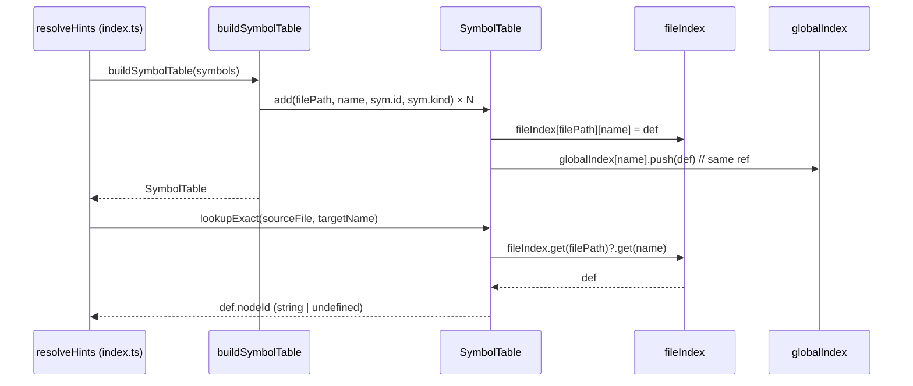

# Design Document: Symbol Table

## Overview

Bring `src/indexer/resolution/symbol-table.ts` to full parity with the legacy design so Phase 3 resolution context can use it correctly. The key additions are the `SymbolDefinition` type (carrying resolution metadata), a richer `add` signature, and a `lookupExactFull` method that returns the full definition rather than just the node ID.

## Architecture

The symbol table uses a two-index design for O(1) lookups. Both indexes store the **same `SymbolDefinition` object reference** — no extra memory is allocated.

```mermaid
graph TD
    A[Symbol[]] -->|buildSymbolTable| B[SymbolTable]
    B --> C[fileIndex\nMap<filePath, Map<name, SymbolDefinition>>]
    B --> D[globalIndex\nMap<name, SymbolDefinition[]>]
    C -->|lookupExact| E[nodeId: string]
    C -->|lookupExactFull| F[SymbolDefinition]
    D -->|lookupFuzzy| G[SymbolDefinition[]]
    F -.->|same object ref| G
```

## Components and Interfaces

### SymbolDefinition

```typescript
export interface SymbolDefinition {
  /** References Symbol.id from src/types/index.ts */
  readonly nodeId: string;
  readonly filePath: string;
  /** SymbolKind string — 'function', 'class', 'method', etc. */
  readonly type: string;
  readonly parameterCount?: number;
  /** Raw return type text extracted from AST (e.g. 'User', 'Promise<User>') */
  readonly returnType?: string;
  /** Links Method/Constructor to owning Class/Struct nodeId */
  readonly ownerId?: string;
}
```

### SymbolTable interface

```typescript
export interface SymbolTable {
  add(
    filePath: string,
    name: string,
    nodeId: string,
    type: string,
    metadata?: { parameterCount?: number; returnType?: string; ownerId?: string }
  ): void;

  /** O(1) exact lookup — returns nodeId only. Confidence 0.95. */
  lookupExact(filePath: string, name: string): string | undefined;

  /** O(1) exact lookup — returns full definition. Confidence 0.95. */
  lookupExactFull(filePath: string, name: string): SymbolDefinition | undefined;

  /** Global lookup — returns all definitions with this name. Confidence 0.50. */
  lookupFuzzy(name: string): SymbolDefinition[];

  getStats(): { fileCount: number; globalSymbolCount: number };
  clear(): void;
}
```

### buildSymbolTable helper

```typescript
export function buildSymbolTable(symbols: Symbol[]): SymbolTable {
  const table = createSymbolTable();
  for (const sym of symbols) {
    table.add(sym.location.filePath, sym.name, sym.id, sym.kind);
  }
  return table;
}
```

## Data Models

### Internal indexes

```typescript
// File-specific index: filePath → (name → SymbolDefinition)
const fileIndex = new Map<string, Map<string, SymbolDefinition>>();

// Global reverse index: name → SymbolDefinition[]
// Stores the SAME object references as fileIndex — zero extra memory
const globalIndex = new Map<string, SymbolDefinition[]>();
```

### add implementation

```typescript
const add = (
  filePath: string,
  name: string,
  nodeId: string,
  type: string,
  metadata?: { parameterCount?: number; returnType?: string; ownerId?: string }
): void => {
  const def: SymbolDefinition = { nodeId, filePath, type, ...metadata };

  if (!fileIndex.has(filePath)) fileIndex.set(filePath, new Map());
  fileIndex.get(filePath)!.set(name, def);

  const existing = globalIndex.get(name);
  if (existing) existing.push(def);
  else globalIndex.set(name, [def]);
};
```

## Sequence Diagram — Resolution Context Usage



## Error Handling

- `lookupExact` and `lookupExactFull` return `undefined` for unknown file/name combinations — callers must handle the undefined case.
- `lookupFuzzy` returns `[]` for unknown names — never throws.
- `add` is idempotent per (filePath, name) pair: a second `add` for the same key overwrites the fileIndex entry and appends to globalIndex. Callers should not add the same symbol twice.

## Testing Strategy

### Unit tests (AAA pattern) — `src/indexer/resolution/symbol-table.test.ts`

```
describe("createSymbolTable")
  ✓ add + lookupExact returns nodeId for registered symbol
  ✓ add + lookupExactFull returns full SymbolDefinition
  ✓ lookupExact returns undefined for unknown name
  ✓ lookupExactFull returns undefined for unknown name
  ✓ lookupFuzzy returns all definitions across files
  ✓ lookupFuzzy returns empty array for unknown name
  ✓ add with metadata stores parameterCount, returnType, ownerId
  ✓ add without metadata leaves optional fields undefined
  ✓ two symbols with same name in different files — lookupExact is file-scoped
  ✓ two symbols with same name in different files — lookupFuzzy returns both
  ✓ lookupExactFull and lookupFuzzy return same object reference
  ✓ clear empties both indexes
  ✓ getStats reflects correct fileCount and globalSymbolCount

describe("buildSymbolTable")
  ✓ builds table from Symbol[] using Symbol.id as nodeId
  ✓ returns empty table for empty array
```

### Property-based test (fast-check)

```
Property: lookupFuzzy result nodeIds are all from the input symbol set
  fc.assert(fc.property(
    fc.array(symbolArbitrary(), { minLength: 0, maxLength: 30 }),
    (symbols) => {
      const table = buildSymbolTable(symbols);
      const knownIds = new Set(symbols.map(s => s.id));
      for (const sym of symbols) {
        const results = table.lookupFuzzy(sym.name);
        expect(results.length).toBeGreaterThan(0);
        for (const def of results) {
          if (!knownIds.has(def.nodeId)) return false;
        }
      }
      return true;
    }
  ))
```

## Correctness Properties

1. For all `(filePath, name, nodeId, type)` passed to `add`: `lookupExact(filePath, name) === nodeId`
2. For all `(filePath, name, nodeId, type)` passed to `add`: `lookupExactFull(filePath, name)?.nodeId === nodeId`
3. For any symbol set S built via `buildSymbolTable(S)`: `∀ s ∈ S, lookupFuzzy(s.name)` contains an entry with `nodeId === s.id`
4. For any symbol set S: all `nodeId` values returned by `lookupFuzzy` belong to `{ s.id | s ∈ S }`
5. `lookupExactFull(f, n)` and the matching entry in `lookupFuzzy(n)` are the same object reference (`Object.is`)
6. After `clear()`: `lookupExact(f, n) === undefined` and `lookupFuzzy(n).length === 0` for all previously added `(f, n)`
7. `getStats().fileCount` equals the number of distinct `filePath` values added
8. `getStats().globalSymbolCount` equals the number of distinct `name` values added

## Dependencies

- `src/types/index.ts` — `Symbol` type (read-only, no changes)
- `src/indexer/resolution/index.ts` — caller of `buildSymbolTable`; no changes needed after wrapper is updated
- `fast-check` — property-based testing
- `vitest` — unit testing
