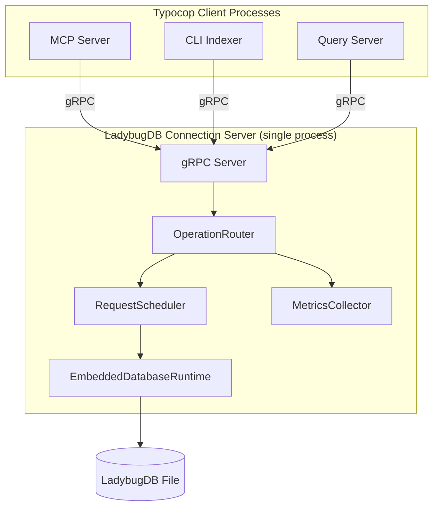
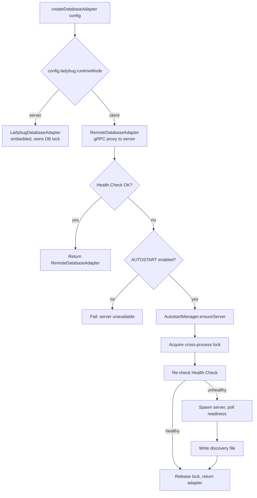
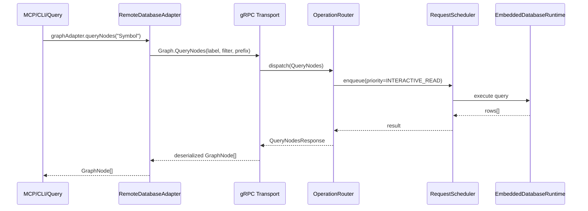
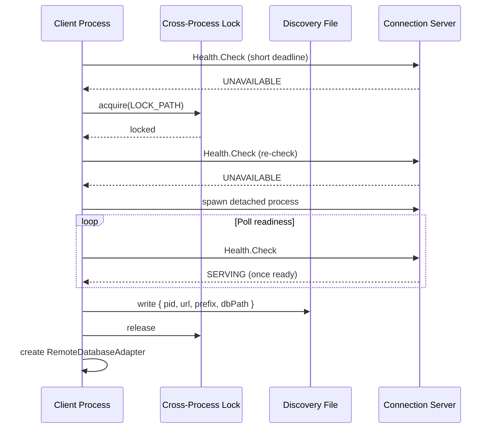
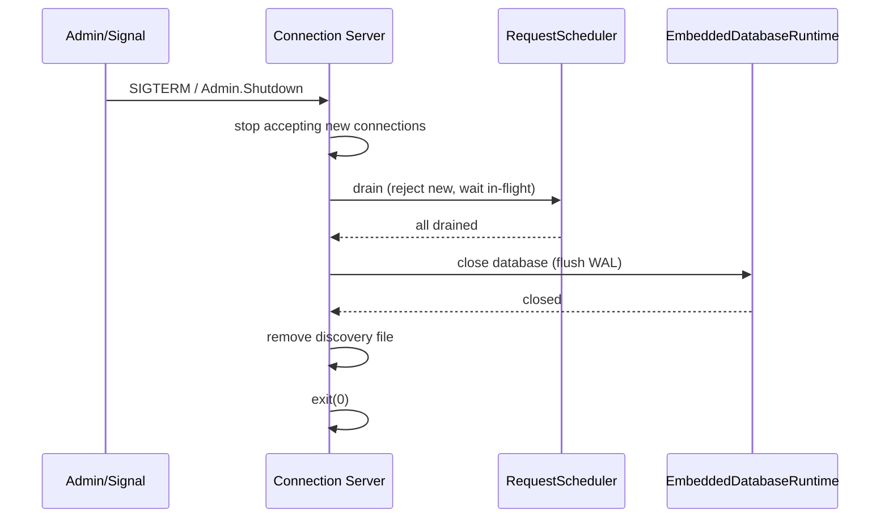

# Design Document: LadybugDB Connection Server

**Related documents:**
- [Components & Interfaces](./design-components.md)
- [Data Models & Algorithms](./design-data-models.md)
- [Algorithmic Pseudocode](./design-algorithms.md)
- [Correctness Properties](./design-properties.md)
- [Error Handling & Testing](./design-correctness.md)

## Overview

Typocop currently treats LadybugDB as an embedded, per-process resource. The CLI, MCP server, and query server each create their own `DatabaseAdapter`, which acquires a local LadybugDB connection and relies on careful shutdown to flush WAL state and release the file lock. This works inside a single process but produces WAL corruption and lock contention when multiple processes access the same database concurrently.

This design introduces a standalone **LadybugDB Connection Server** — a single process that owns the only embedded LadybugDB instance for a given `dbPath` and exposes a local gRPC API. All other Typocop processes (MCP server, CLI indexer, query server) become thin clients via a `RemoteDatabaseAdapter` that implements the existing `DatabaseAdapter` interface.

The architecture uses on-demand autostart with cross-process locking and a discovery file so that any client process can transparently start the server if it is not already running. Multi-tenancy is preserved through `TYPOCOP_PREFIX`, with each prefix getting its own server instance, database file, lock, and discovery path by default.

## Architecture

### System Topology

### Adapter Selection Flow

### Client Request Lifecycle

### Autostart Sequence

### Graceful Shutdown Sequence

