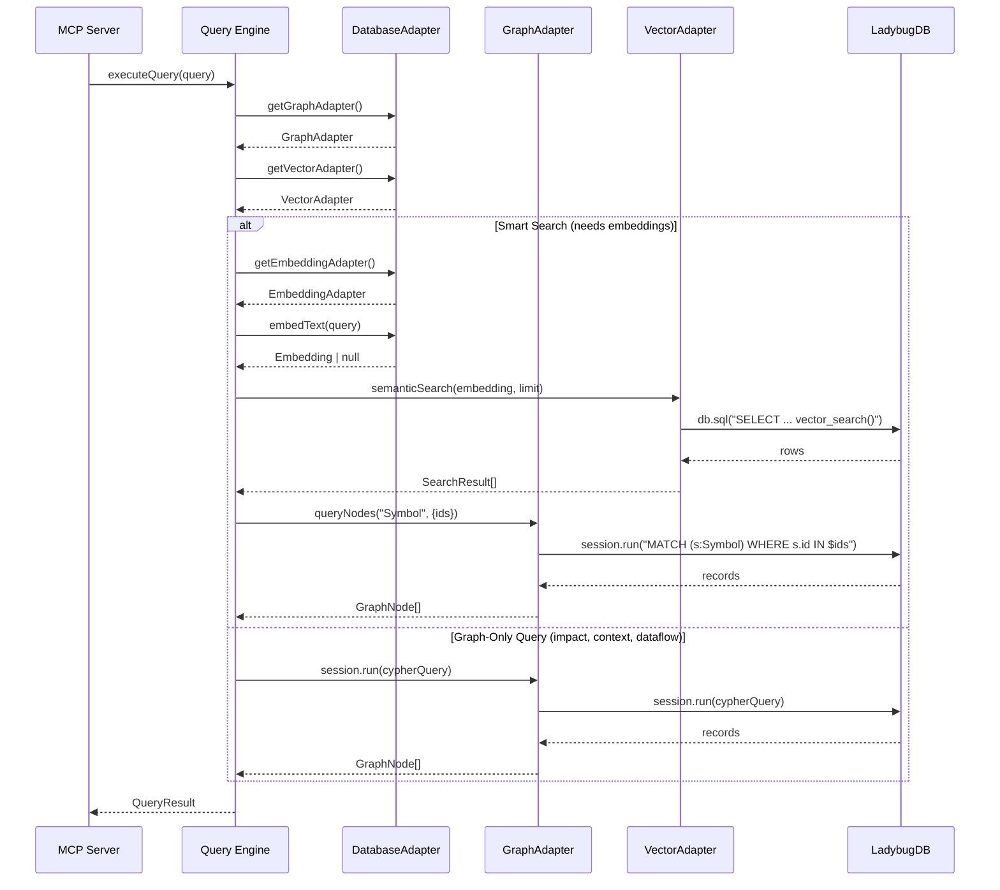
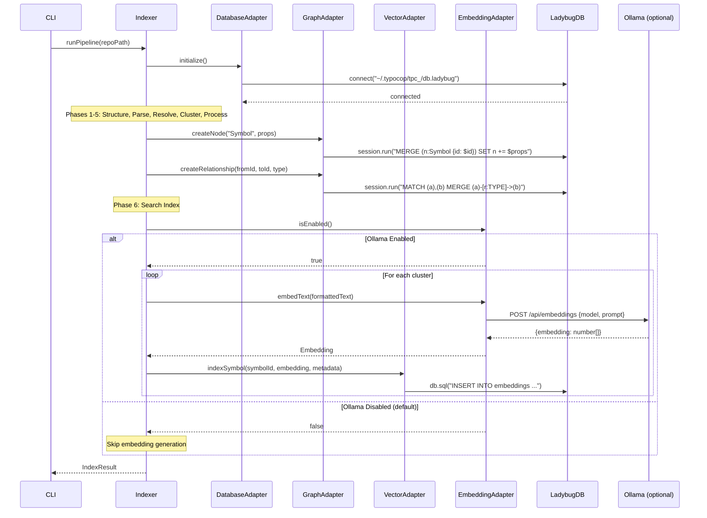
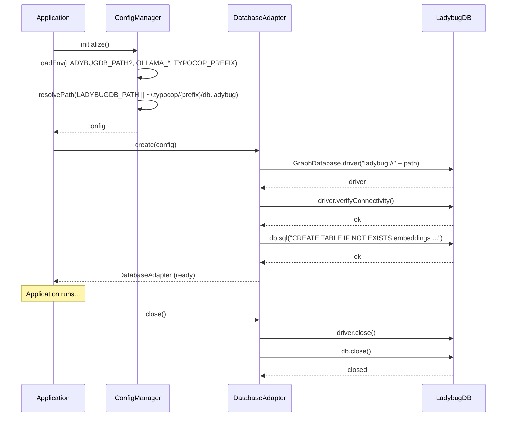

# Design: Sequence Diagrams

## Query Execution Through Adapter Layer

```mermaid
sequenceDiagram
    participant MCP as MCP Server
    participant QE as Query Engine
    participant DA as DatabaseAdapter
    participant GA as GraphAdapter
    participant VA as VectorAdapter
    participant LDB as LadybugDB

    MCP->>QE: executeQuery(query)
    QE->>DA: getGraphAdapter()
    DA-->>QE: GraphAdapter
    QE->>DA: getVectorAdapter()
    DA-->>QE: VectorAdapter

    alt Smart Search (needs embeddings)
        QE->>DA: getEmbeddingAdapter()
        DA-->>QE: EmbeddingAdapter
        QE->>DA: embedText(query)
        DA-->>QE: Embedding | null
        QE->>VA: semanticSearch(embedding, limit)
        VA->>LDB: db.sql("SELECT ... vector_search()")
        LDB-->>VA: rows
        VA-->>QE: SearchResult[]
        QE->>GA: queryNodes("Symbol", {ids})
        GA->>LDB: session.run("MATCH (s:Symbol) WHERE s.id IN $ids")
        LDB-->>GA: records
        GA-->>QE: GraphNode[]
    else Graph-Only Query (impact, context, dataflow)
        QE->>GA: session.run(cypherQuery)
        GA->>LDB: session.run(cypherQuery)
        LDB-->>GA: records
        GA-->>QE: GraphNode[]
    end

    QE-->>MCP: QueryResult
```

## Indexing Pipeline with Optional Ollama Embeddings

```mermaid
sequenceDiagram
    participant CLI as CLI
    participant IDX as Indexer
    participant DA as DatabaseAdapter
    participant GA as GraphAdapter
    participant VA as VectorAdapter
    participant EA as EmbeddingAdapter
    participant LDB as LadybugDB
    participant OLL as Ollama (optional)

    CLI->>IDX: runPipeline(repoPath)
    IDX->>DA: initialize()
    DA->>LDB: connect("~/.typocop/tpc_/db.ladybug")
    LDB-->>DA: connected

    Note over IDX: Phases 1-5: Structure, Parse, Resolve, Cluster, Process
    IDX->>GA: createNode("Symbol", props)
    GA->>LDB: session.run("MERGE (n:Symbol {id: $id}) SET n += $props")
    IDX->>GA: createRelationship(fromId, toId, type)
    GA->>LDB: session.run("MATCH (a),(b) MERGE (a)-[r:TYPE]->(b)")

    Note over IDX: Phase 6: Search Index
    IDX->>EA: isEnabled()
    alt Ollama Enabled
        EA-->>IDX: true
        loop For each cluster
            IDX->>EA: embedText(formattedText)
            EA->>OLL: POST /api/embeddings {model, prompt}
            OLL-->>EA: {embedding: number[]}
            EA-->>IDX: Embedding
            IDX->>VA: indexSymbol(symbolId, embedding, metadata)
            VA->>LDB: db.sql("INSERT INTO embeddings ...")
        end
    else Ollama Disabled (default)
        EA-->>IDX: false
        Note over IDX: Skip embedding generation
    end

    IDX-->>CLI: IndexResult
```

## LadybugDB Connection Lifecycle

```mermaid
sequenceDiagram
    participant App as Application
    participant CM as ConfigManager
    participant DA as DatabaseAdapter
    participant LDB as LadybugDB

    App->>CM: initialize()
    CM->>CM: loadEnv(LADYBUGDB_PATH?, OLLAMA_*, TYPOCOP_PREFIX)
    CM->>CM: resolvePath(LADYBUGDB_PATH || ~/.typocop/{prefix}/db.ladybug)
    CM-->>App: config

    App->>DA: create(config)
    DA->>LDB: GraphDatabase.driver("ladybug://" + path)
    LDB-->>DA: driver
    DA->>LDB: driver.verifyConnectivity()
    LDB-->>DA: ok
    DA->>LDB: db.sql("CREATE TABLE IF NOT EXISTS embeddings ...")
    LDB-->>DA: ok
    DA-->>App: DatabaseAdapter (ready)

    Note over App: Application runs...

    App->>DA: close()
    DA->>LDB: driver.close()
    DA->>LDB: db.close()
    LDB-->>DA: closed
```
