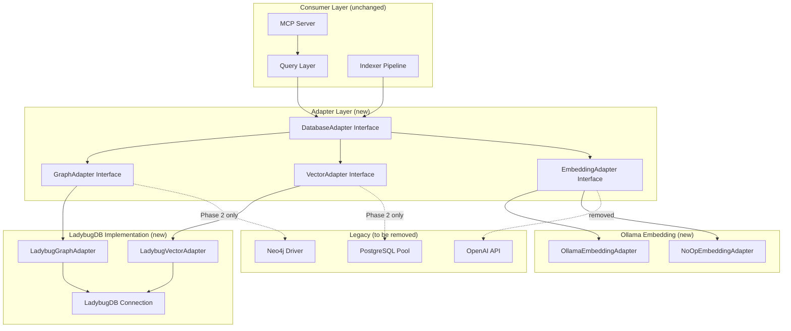

# Design Document: Full Migration to LadybugDB

## Overview

This design covers the full migration of Typocop's storage layer from Neo4j + PostgreSQL + pgvector to LadybugDB — a single embedded database supporting Cypher queries (auto-transpiled to SQL), vector search (LanceDB ANN with HNSW/IVF), SQL analytics (DuckDB engine), full-text search, and ACID transactions. The migration also replaces OpenAI embeddings with optional local Ollama embeddings, removing the external API dependency entirely.

The migration follows a four-phase approach: Preparation (adapter layer + abstractions), Parallel Operation (dual-write verification), Cutover (switch to LadybugDB), and Cleanup (remove old dependencies). Each phase is designed to be independently testable and reversible.

The key architectural change is introducing a `DatabaseAdapter` interface that abstracts all graph, vector, and embedding operations. Both the legacy stack and LadybugDB implement this interface, enabling a clean swap with zero changes to the query layer, indexer pipeline, or MCP server.

## Architecture

## Sequence Diagrams

See [design-sequences.md](./design-sequences.md) for detailed sequence diagrams covering:
- Query execution flow through the adapter layer
- Indexing pipeline with optional Ollama embeddings
- LadybugDB connection lifecycle

## Components and Interfaces

See [design-components.md](./design-components.md) for detailed interface definitions covering:
- `DatabaseAdapter` — unified facade for all database operations
- `GraphAdapter` — graph CRUD operations (Cypher-compatible)
- `VectorAdapter` — vector storage and semantic search
- `EmbeddingAdapter` — pluggable embedding generation (Ollama / NoOp)
- `ConfigurationManager` extensions for Ollama and LadybugDB config

## Data Models

See [design-data-models.md](./design-data-models.md) for:
- Updated `Embedding` type (variable dimensions)
- LadybugDB configuration types
- Ollama configuration types
- Schema mapping from Neo4j/PostgreSQL to LadybugDB

## Algorithmic Pseudocode & Formal Specifications

See [design-algorithms.md](./design-algorithms.md) for:
- Key functions with preconditions, postconditions, and loop invariants
- Migration data transfer algorithm
- Embedding generation with Ollama fallback
- Vector search via LadybugDB

## Correctness Properties

See [design-correctness.md](./design-correctness.md) for:
- Graph integrity preservation properties
- Vector search equivalence properties
- Embedding adapter correctness properties
- Configuration validation properties

## Error Handling

See [design-error-handling.md](./design-error-handling.md) for:
- LadybugDB connection failure handling
- Ollama unavailability graceful degradation
- Migration rollback strategy

## Testing Strategy

See [design-testing.md](./design-testing.md) for:
- Property-based testing with fast-check
- Integration test plan
- Migration verification tests

## Dependencies

| Dependency | Purpose | Replaces |
|---|---|---|
| `ladybugdb` | Embedded graph + vector + SQL database | `neo4j-driver`, `pg`, `pgvector` |
| `ollama` (optional) | Local embedding generation | `openai` |

### Removed Dependencies
- `neo4j-driver` — replaced by LadybugDB Cypher interface
- `pg` — replaced by LadybugDB SQL interface
- `openai` — replaced by optional Ollama
