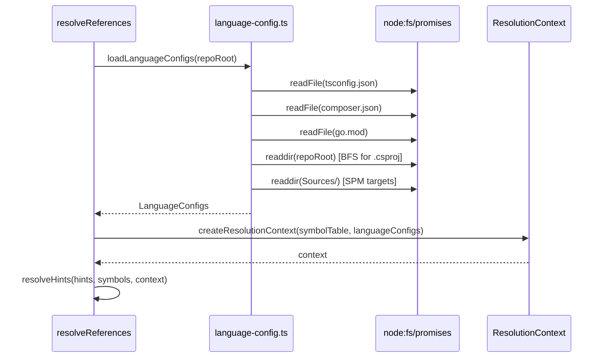

# Design Document: Language Config Loaders

**Related documents:**
- [Data Models & Algorithms](./design-data-models.md)
- [Correctness Properties](./design-correctness.md)

## Overview

This feature implements `src/indexer/language-config.ts` — five async loaders that read
language-specific project config files and return structured data used by Phase 3 import
resolution. Without these loaders, path aliases (`@/`), PSR-4 namespaces, Go module
prefixes, C# root namespaces, and Swift SPM targets all resolve to `unresolved:*` in the
relationship graph.

All loaders are called once at the start of Phase 3 and their results are passed into the
resolution context. Each loader is independent, returns `null` (or `[]`) when the config
file is absent, and never throws — I/O errors are caught and treated as "not found".

## Architecture

```mermaid
graph TD
    P3[Phase 3 — resolveReferences] --> LC[loadLanguageConfigs]
    LC --> LTP[loadTsconfigPaths]
    LC --> LCC[loadComposerConfig]
    LC --> LGM[loadGoModulePath]
    LC --> LCS[loadCSharpProjectConfig]
    LC --> LSP[loadSwiftPackageConfig]

    LTP -->|TsconfigPaths| RC[ResolutionContext]
    LCC -->|ComposerConfig| RC
    LGM -->|GoModuleConfig| RC
    LCS -->|CSharpProjectConfig[]| RC
    LSP -->|SwiftPackageConfig| RC

    RC --> IR[Import Resolution]
```

## Integration with Phase 3



## Components and Interfaces

### `LanguageConfigs` — aggregate result

```typescript
interface LanguageConfigs {
  readonly tsconfig: TsconfigPaths | null;
  readonly composer: ComposerConfig | null;
  readonly goModule: GoModuleConfig | null;
  readonly csharp: readonly CSharpProjectConfig[];
  readonly swift: SwiftPackageConfig | null;
}
```

### `loadLanguageConfigs` — Phase 3 entry point

```typescript
async function loadLanguageConfigs(repoRoot: string): Promise<LanguageConfigs>
```

Runs all five loaders in parallel via `Promise.all`. Never throws — each loader handles
its own errors internally.

### Individual loaders

```typescript
async function loadTsconfigPaths(repoRoot: string): Promise<TsconfigPaths | null>
async function loadComposerConfig(repoRoot: string): Promise<ComposerConfig | null>
async function loadGoModulePath(repoRoot: string): Promise<GoModuleConfig | null>
async function loadCSharpProjectConfig(repoRoot: string): Promise<readonly CSharpProjectConfig[]>
async function loadSwiftPackageConfig(repoRoot: string): Promise<SwiftPackageConfig | null>
```

All are exported for direct use in tests and for future use by language-specific resolvers.

## Error Handling

| Scenario | Behaviour |
|---|---|
| Config file absent | Return `null` / `[]` |
| File read error (permissions, etc.) | Catch, return `null` / `[]` |
| JSON parse error (tsconfig, composer) | Catch, return `null` |
| XML parse error (.csproj) | Skip that project, continue BFS |
| Empty aliases / psr4 map | Return `null` (no useful data) |
| BFS exceeds 100 dirs or depth 5 | Stop scanning, return collected results |

## Dependencies

- `node:fs/promises` — `readFile`, `readdir`
- `node:path` — `join`, `relative`
- No external packages required
