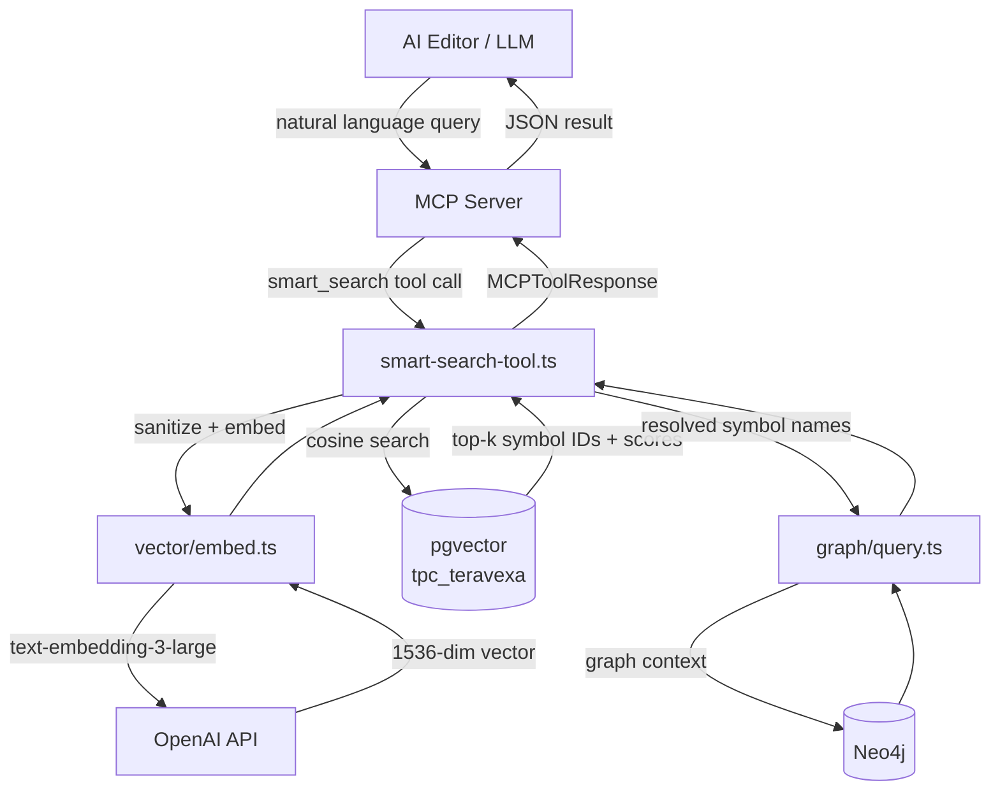
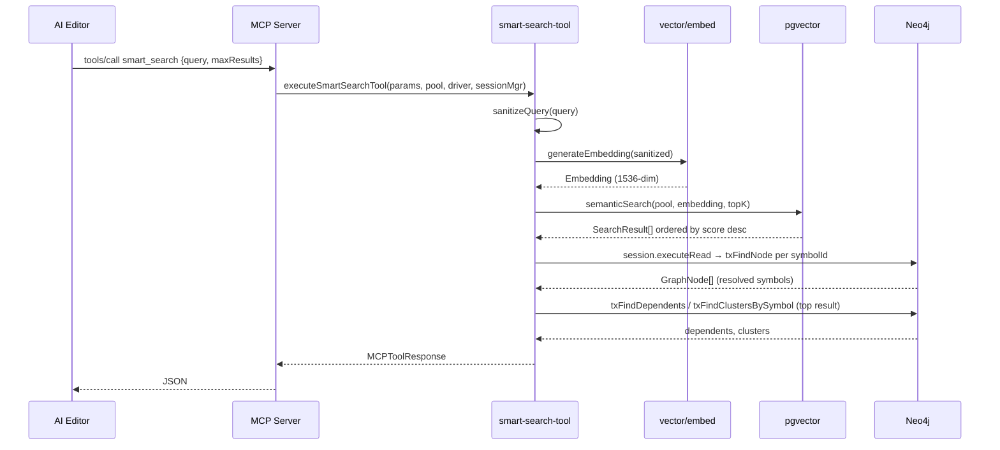

# Design Document: MCP Natural Language Search

**Related documents:**
- [Algorithms & Data Models](./design-algorithms.md)
- [Correctness, Testing & Operations](./design-correctness.md)

## Overview

The MCP server currently requires callers to supply exact symbol names. When an AI asks "what will be the effect of changing ip based limitation?", it guesses names like `ip`, `ipLimit`, or `rateLimit` — none match — and gets empty results. This feature adds a `smart_search` MCP tool that accepts a natural language query, converts it to a vector embedding, finds the closest symbols in pgvector, and feeds the resolved symbol names into the existing graph queries. The 318 embeddings already stored in the `tpc_teravexa` database are immediately usable with no re-indexing required.

The change is additive: the four existing tools are untouched. Only `registration.ts` and `tools.ts` grow, and a new thin module `src/mcp/smart-search-tool.ts` is introduced to keep each file under 250 lines.

## Architecture



## Sequence Diagram



## Components and Interfaces

### New: `src/mcp/smart-search-tool.ts`

**Purpose**: Implements the `smart_search` MCP tool — the only new source file.

**Interface**:
```typescript
export async function executeSmartSearchTool(
  params: Record<string, unknown>,
  vectorPool: Pool,
  driver: Driver,
  sessionManager: SessionManager,
): Promise<MCPToolResponse>
```

**Responsibilities**:
- Validate and sanitize the `query` parameter (Req 22.3)
- Call `generateEmbedding` to produce a 1536-dim vector
- Call `semanticSearch` against pgvector to get top-k `SearchResult[]`
- Open a single Neo4j `session.executeRead` transaction and resolve each `symbolId` via `txFindNode`
- Enrich the top result with `txFindDependents` and `txFindClustersBySymbol`
- Build and return a `MCPToolResponse` with a human-readable `summary`

### Modified: `src/mcp/tools.ts`

Add `case "smart_search"` to the `executeTool` switch, delegating to `executeSmartSearchTool`.

### Modified: `src/mcp/registration.ts`

Add the `smart_search` tool definition to `TOOL_DEFINITIONS`:

```typescript
{
  name: "smart_search",
  description: "Find symbols by natural language query using semantic similarity. Use this when you don't know the exact symbol name.",
  inputSchema: {
    type: "object",
    properties: {
      query: { type: "string", description: "Natural language description" },
      maxResults: { type: "number", description: "Max symbols to return (default: 10)" },
    },
    required: ["query"],
  },
}
```

## Dependencies

No new npm packages required. All dependencies already present:
- `pg` + `src/vector/search.ts` — pgvector cosine search
- `neo4j-driver` + `src/graph/query.ts` — `txFindNode`, `txFindDependents`, `txFindClustersBySymbol`
- `src/vector/embed.ts` — `generateEmbedding`
- `src/mcp/session-manager.ts` — session lifecycle
