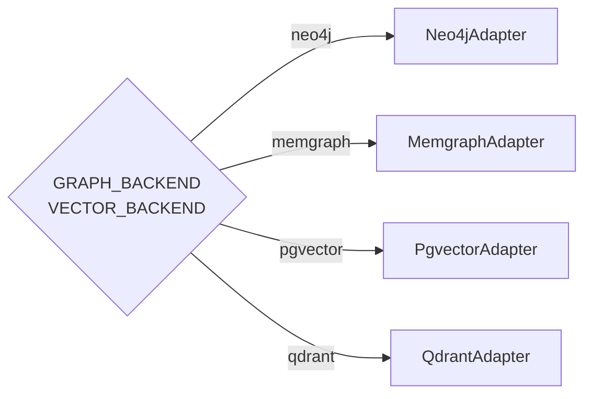
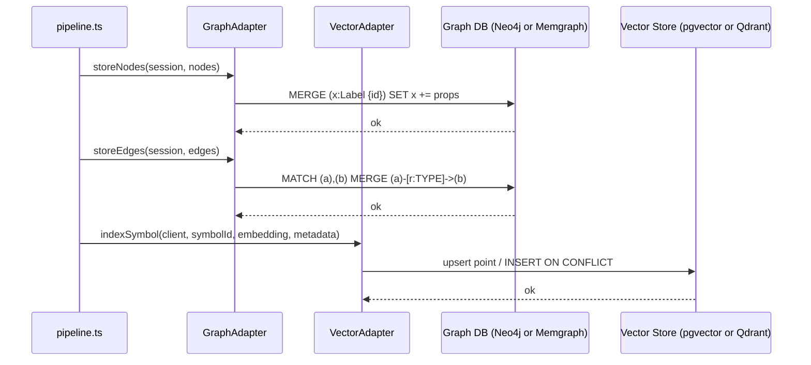
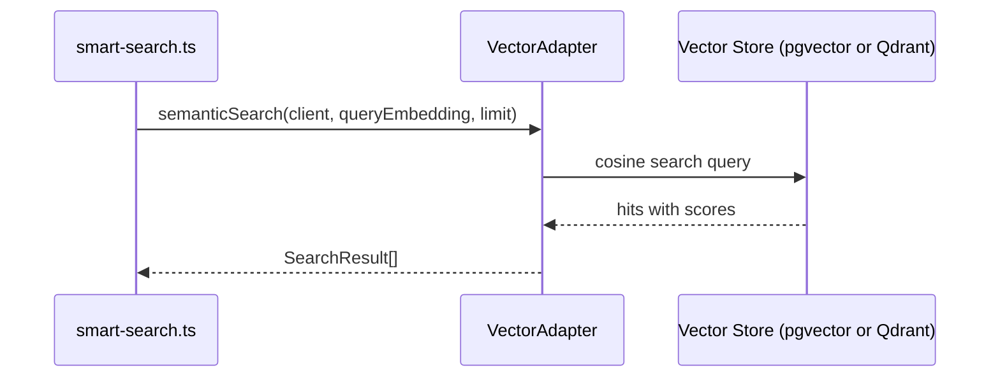

# Design Document: Memgraph + Qdrant Migration

**Related documents:**
- [Components & Adapter Interfaces](./design-components.md)
- [Data Models, Infrastructure & Testing](./design-data-models.md)
- [Correctness Properties](./design-correctness.md)

---

## Overview

Introduce an **adapter pattern** for both the graph and vector storage layers so that Neo4j + pgvector (existing) and Memgraph + Qdrant (new) can coexist and be switched via environment variables — with zero changes to any consumer.

Two adapter interfaces are defined (`GraphAdapter`, `VectorAdapter`). Two concrete implementations exist for each. A factory function reads `GRAPH_BACKEND` / `VECTOR_BACKEND` env vars and returns the correct adapter. All consumers program against the interface only.

---

## Architecture

### Adapter Layer (target state)

```mermaid
graph TD
    CLI[CLI / MCP Server]
    GF[createGraphAdapter\nsrc/graph/adapter-factory.ts]
    VF[createVectorAdapter\nsrc/vector/adapter-factory.ts]
    GA[GraphAdapter interface]
    VA[VectorAdapter interface]
    N4J[Neo4jAdapter\nneo4j-driver → :8687]
    MG[MemgraphAdapter\nneo4j-driver → :7687]
    PG[PgvectorAdapter\npg Pool → :8432]
    QD[QdrantAdapter\n@qdrant/js-client-rest → :6333]

    CLI --> GF
    CLI --> VF
    GF --> GA
    VF --> VA
    GA --> N4J
    GA --> MG
    VA --> PG
    VA --> QD
```

### Backend Selection Flow



---

## Sequence Diagrams

### Indexing Flow (adapter-aware)



### Semantic Search Flow (adapter-aware)



---

## Adapter Pattern Overview

### Why Adapters

The existing codebase has `Pool` (pg) and `Driver` (neo4j-driver) types scattered across consumers. Introducing adapters means:

- Consumers never import from `pg` or `@qdrant/js-client-rest` directly
- Switching backends is a one-line env var change
- Both backends can be tested in isolation with the same test suite
- The Neo4j adapter preserves all existing behavior exactly — zero regression risk

### Key Design Decisions

| Decision | Rationale |
|---|---|
| Keep `neo4j-driver` for both graph adapters | Memgraph is Bolt-compatible; same driver, different URI |
| `Neo4jAdapter` removes `encrypted: false` flag | Memgraph default Bolt is unencrypted; flag is Neo4j-specific |
| `Neo4jAdapter` removes APOC path in `storeNodes` | Memgraph has no APOC; fallback MERGE is the only path needed |
| `VectorAdapter.createClient` returns opaque `VectorClient` | Hides `Pool` vs `QdrantClient` from all consumers |
| Factory reads env vars at startup, not per-call | Adapter is created once and injected; no runtime overhead |

See [Components & Adapter Interfaces](./design-components.md) for full interface definitions and factory implementations.
