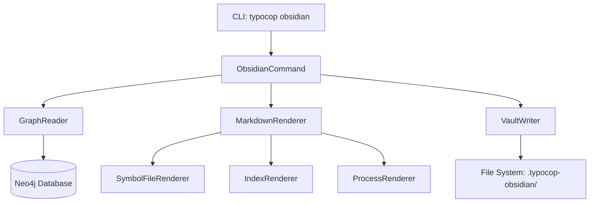
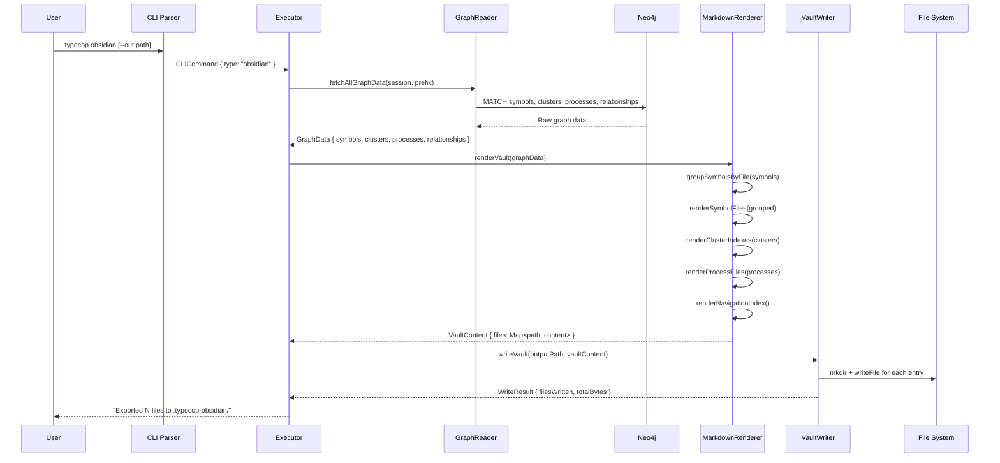
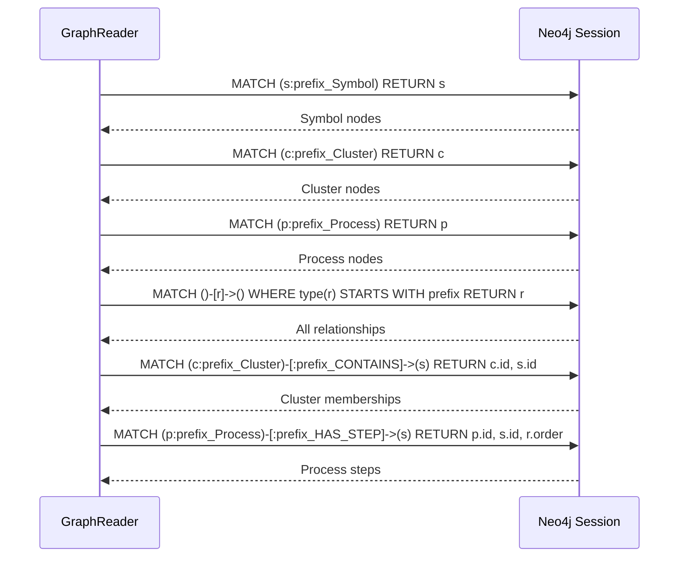

# Design Document: Obsidian Export

**Related documents:**
- [Components & Interfaces](./design-components.md)
- [Data Models & Output Formats](./design-data-models.md)
- [Algorithms](./design-algorithms.md)
- [Correctness & Testing](./design-correctness.md)

## Overview

The `obsidian-export` feature adds a new CLI command (`typocop obsidian`) that reads the precomputed code graph from Neo4j and generates an Obsidian-compatible markdown vault. The vault mirrors the source directory structure — each source file becomes a markdown file containing all symbols from that file, with YAML frontmatter metadata, Obsidian wikilinks for cross-referencing, and Mermaid diagrams for data flow visualization.

The command is read-only against the graph database — it does not re-parse or re-scan source files. It exports everything: all symbols, clusters, processes, and relationships. The output is a self-contained Obsidian vault with index files for navigation.

This feature enables developers to browse their codebase's precomputed intelligence using Obsidian's graph view, backlinks, and search capabilities — providing an offline, visual exploration experience of the code graph.

## Architecture



## Sequence Diagrams

### Main Export Flow



### Graph Data Fetching



## Vault Directory Structure

```
.typocop-obsidian/
├── _index.md                    # Top-level navigation
├── _clusters/
│   ├── _index.md               # Cluster listing
│   ├── authentication.md       # One file per cluster
│   └── ...
├── _processes/
│   ├── _index.md               # Process listing
│   ├── user-login-flow.md      # One file per process (with Mermaid)
│   └── ...
└── src/                         # Mirrors source directory
    ├── cli/
    │   ├── parser.md           # All symbols from src/cli/parser.ts
    │   └── executor.md
    ├── graph/
    │   ├── graph-store.md
    │   └── connection.md
    └── ...
```

## Dependencies

- `neo4j-driver` — existing dependency for graph queries
- `node:fs/promises` — file system operations (mkdir, writeFile, rm)
- `node:path` — path manipulation (join, dirname, resolve)
- No new external dependencies required
