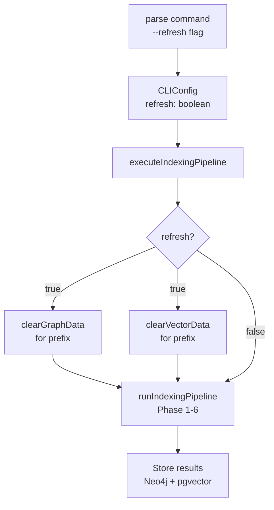

# Design Document: Parse Refresh Parameter

## Overview

The `--refresh` parameter enables users to force a complete rebuild of the knowledge graph and embeddings for an indexed codebase. When enabled, the parse command clears all existing Neo4j graph data and pgvector embeddings associated with the indexed codebase, then rebuilds both from scratch during the parse operation. This is useful for recovering from corrupted data, updating embeddings with new models, or performing a clean re-index after significant codebase changes.

## Architecture



## Components and Interfaces

### CLI Parser Enhancement

**File**: `src/cli/parser.ts`

```typescript
export interface CLIConfig {
  sourcePath: string;
  language: Language;
  outputPath?: string;
  verbose: boolean;
  refresh?: boolean;  // NEW: optional refresh flag
}

export type CLICommand =
  | { type: "parse"; config: CLIConfig }
  | { type: "reindex"; dbPath: string }
  | { type: "status" };
```

**Changes**:
- Add optional `refresh?: boolean` field to `CLIConfig` interface
- Add `.option("-r, --refresh", "Clear and rebuild all graph and embeddings data", false)` to parse command definition
- Pass `refresh` value from parsed options to CLIConfig

### Executor Enhancement

**File**: `src/cli/executor.ts`

```typescript
async function executeIndexingPipeline(
  sourcePath: string,
  language: string,
  verbose: boolean,
  refresh?: boolean  // NEW parameter
): Promise<IndexingStats>
```

**Responsibilities**:
- Accept optional `refresh` parameter from CLIConfig
- If `refresh === true`, call `clearGraphData()` and `clearVectorData()` before indexing
- Pass through to existing indexing pipeline
- Return same IndexingStats as before

### Graph Clearing Function

**File**: `src/graph/store.ts` (new export)

```typescript
export async function clearGraphData(
  session: Session,
  prefix: string
): Promise<void>
```

**Responsibilities**:
- Delete all nodes with labels matching the prefix pattern (e.g., `${prefix}Symbol`, `${prefix}Metadata`)
- Delete all relationships in the graph
- Verify deletion succeeded
- Log operation details if verbose

**Preconditions**:
- `session` is an active Neo4j session
- `prefix` is non-empty string matching configuration prefix

**Postconditions**:
- All prefixed nodes deleted from Neo4j
- All relationships deleted from Neo4j
- Graph is empty and ready for fresh indexing

### Vector Clearing Function

**File**: `src/vector/index-store.ts` (new export)

```typescript
export async function clearVectorData(
  pool: Pool,
  prefix: string
): Promise<void>
```

**Responsibilities**:
- Delete all embeddings from pgvector table for the given prefix
- Verify deletion succeeded
- Log operation details if verbose

**Preconditions**:
- `pool` is an active PostgreSQL connection pool
- `prefix` is non-empty string matching configuration prefix
- pgvector table exists with prefix-based partitioning

**Postconditions**:
- All embeddings for prefix deleted from pgvector
- Vector store is empty and ready for fresh embeddings

## Data Models

### CLIConfig Extension

```typescript
interface CLIConfig {
  readonly sourcePath: string;
  readonly language: Language;
  readonly outputPath?: string;
  readonly verbose: boolean;
  readonly refresh?: boolean;  // NEW: defaults to false
}
```

**Validation Rules**:
- `refresh` is optional boolean, defaults to `false`
- When `refresh === true`, existing data for the prefix is cleared before indexing
- `refresh` has no effect on `reindex` or `status` commands

## Algorithmic Pseudocode

### Parse Command with Refresh

```pascal
PROCEDURE parseWithRefresh(config: CLIConfig)
  INPUT: config with sourcePath, language, verbose, refresh
  OUTPUT: IndexingStats
  
  SEQUENCE
    // Establish database connections
    driver ← createDriver(neo4jConfig)
    pool ← createPool(postgresConfig)
    session ← driver.session()
    
    TRY
      // Clear existing data if refresh requested
      IF config.refresh = true THEN
        CALL clearGraphData(session, prefix)
        CALL clearVectorData(pool, prefix)
        IF config.verbose THEN
          DISPLAY "Cleared existing graph and vector data"
        END IF
      END IF
      
      // Run indexing pipeline (Phases 1-6)
      pipelineConfig ← {
        sourcePath: config.sourcePath,
        language: config.language,
        verbose: config.verbose,
        graphSession: session,
        vectorPool: pool
      }
      
      stats ← runIndexingPipeline(pipelineConfig)
      
      RETURN stats
    FINALLY
      session.close()
      driver.close()
      pool.end()
    END TRY
  END SEQUENCE
END PROCEDURE

PROCEDURE clearGraphData(session, prefix)
  INPUT: session (Neo4j), prefix (string)
  OUTPUT: void
  
  SEQUENCE
    // Delete all relationships first (foreign key constraint)
    result ← session.run("MATCH ()-[r]->() DELETE r")
    relCount ← result.summary.counters.relationshipsDeleted()
    
    // Delete all nodes with prefixed labels
    result ← session.run(
      "MATCH (n) WHERE any(label IN labels(n) WHERE label STARTS WITH $prefix) DELETE n",
      { prefix: prefix }
    )
    nodeCount ← result.summary.counters.nodesDeleted()
    
    IF verbose THEN
      DISPLAY "Deleted " + nodeCount + " nodes and " + relCount + " relationships"
    END IF
  END SEQUENCE
END PROCEDURE

PROCEDURE clearVectorData(pool, prefix)
  INPUT: pool (PostgreSQL), prefix (string)
  OUTPUT: void
  
  SEQUENCE
    client ← pool.connect()
    
    TRY
      // Delete embeddings for this prefix
      result ← client.query(
        "DELETE FROM embeddings WHERE metadata->>'prefix' = $1",
        [prefix]
      )
      
      rowsDeleted ← result.rowCount
      
      IF verbose THEN
        DISPLAY "Deleted " + rowsDeleted + " embeddings from vector store"
      END IF
    FINALLY
      client.release()
    END TRY
  END SEQUENCE
END PROCEDURE
```

## Example Usage

### Command Line

```bash
# Standard parse (incremental/update)
typocop parse -p ./src -l typescript

# Parse with complete refresh (clear and rebuild)
typocop parse -p ./src -l typescript --refresh

# Verbose refresh
typocop parse -p ./src -l typescript --refresh -v
```

### Programmatic

```typescript
import { parseArgs } from "./cli/parser.js";
import { executeCLI } from "./cli/executor.js";

// Parse with refresh flag
const command = parseArgs(["parse", "-p", "./src", "-l", "typescript", "--refresh"]);

// Execute
await executeCLI(command);
// Output: Cleared existing graph and vector data
//         Indexing completed successfully.
//         Statistics: ...
```

## Correctness Properties

### Property 1: Refresh Clears All Data

**Assertion**: When `--refresh` is used, all existing graph nodes and relationships for the prefix are deleted before indexing begins.

```typescript
// Precondition: Graph contains N nodes and R relationships for prefix
// Action: parse --refresh
// Postcondition: Graph contains 0 nodes and 0 relationships for prefix before new indexing
```

### Property 2: Refresh Clears All Embeddings

**Assertion**: When `--refresh` is used, all existing embeddings for the prefix are deleted before indexing begins.

```typescript
// Precondition: Vector store contains E embeddings for prefix
// Action: parse --refresh
// Postcondition: Vector store contains 0 embeddings for prefix before new indexing
```

### Property 3: Refresh Rebuilds Complete Graph

**Assertion**: After refresh completes, the graph contains all symbols, relationships, clusters, and processes from the source code.

```typescript
// Precondition: Source code contains S symbols
// Action: parse --refresh
// Postcondition: Graph contains S symbols with all relationships resolved
```

### Property 4: Refresh Rebuilds Complete Embeddings

**Assertion**: After refresh completes, the vector store contains embeddings for all indexed symbols.

```typescript
// Precondition: Source code contains S symbols
// Action: parse --refresh
// Postcondition: Vector store contains embeddings for all S symbols
```

### Property 5: Non-Refresh Preserves Data

**Assertion**: When `--refresh` is not used, existing graph and embeddings are preserved (incremental update).

```typescript
// Precondition: Graph contains N nodes for prefix
// Action: parse (without --refresh)
// Postcondition: Graph contains >= N nodes (may add new symbols)
```

## Error Handling

### Error Scenario 1: Graph Deletion Fails

**Condition**: Neo4j session fails during `clearGraphData()`
**Response**: Log error, propagate exception, halt pipeline
**Recovery**: User must retry or investigate Neo4j connection

### Error Scenario 2: Vector Deletion Fails

**Condition**: PostgreSQL connection fails during `clearVectorData()`
**Response**: Log error, propagate exception, halt pipeline
**Recovery**: User must retry or investigate PostgreSQL connection

### Error Scenario 3: Partial Deletion

**Condition**: Some nodes/embeddings deleted but operation interrupted
**Response**: Log warning with counts, continue with indexing (idempotent)
**Recovery**: Subsequent refresh will clean up remaining data

## Testing Strategy

### Unit Testing Approach

- Test `clearGraphData()` with mock Neo4j session
- Test `clearVectorData()` with mock PostgreSQL pool
- Test CLIConfig parsing with `--refresh` flag
- Test executor routing with refresh flag

### Property-Based Testing Approach

**Property Test Library**: `fast-check`

- Property 1: Refresh clears all graph data
- Property 2: Refresh clears all vector data
- Property 3: Refresh rebuilds complete graph
- Property 4: Refresh rebuilds complete embeddings
- Property 5: Non-refresh preserves data

### Integration Testing Approach

- Full parse with `--refresh` on sample TypeScript project
- Verify graph is empty before indexing, populated after
- Verify vector store is empty before indexing, populated after
- Verify `--refresh` flag is optional and defaults to false
- Verify incremental parse (without `--refresh`) preserves existing data

## Performance Considerations

- Graph deletion: O(N) where N = number of nodes for prefix
- Vector deletion: O(E) where E = number of embeddings for prefix
- Deletion should complete in < 1s for typical codebases
- Indexing pipeline performance unchanged (same as non-refresh)

## Security Considerations

- Deletion is scoped to prefix — cannot delete data from other prefixes
- Requires valid database credentials (same as normal parse)
- No additional authentication required beyond existing database access
- Deletion is logged for audit trail

## Dependencies

- Neo4j driver (existing)
- PostgreSQL pool (existing)
- Commander.js for CLI parsing (existing)
- Chalk for colored output (existing)
