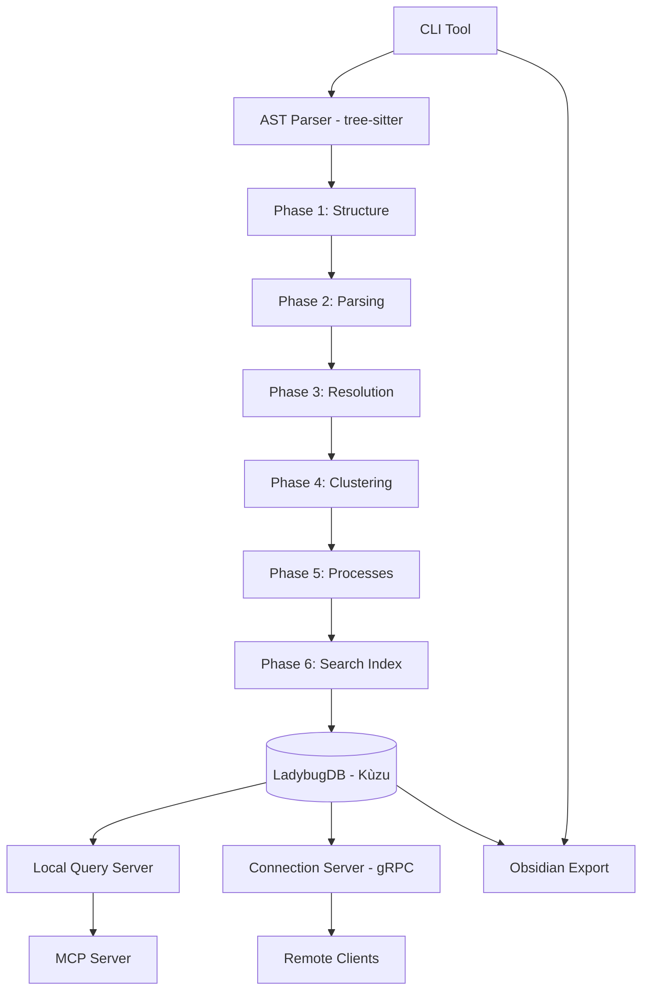

# Typocop: Code Graph Analyzer

> **Precomputed Relational Intelligence System** — Transform source code into a queryable knowledge graph.

Typocop is a high-performance indexing and query engine that avoids the slow, multi-query chains of traditional AI agents by precomputing entire code structures. It delivers 90%+ confidence and complete context in a single call.

## 🚀 Key Features

- **Precomputed Intelligence**: No more iterative `grep` or `find`. Get immediate context on callers, callees, clusters, and processes.
- **Relational Knowledge Graph**: Powered by LadybugDB (embedded Kùzu) and AST parsing (via tree-sitter) for deep symbol resolution.
- **Hybrid Search**: Semantic search with LadybugDB vector storage combined with keyword indexing.
- **Multi-Phase Indexing**: A robust 6-phase pipeline that walks, parses, resolves, clusters, traces, and indexes your code.
- **Polyglot Support**: Native parsing for 12 languages including TypeScript, PHP (Magento 2 / Laravel), Python (FastAPI / Django), Java (Spring Boot), Go, Rust, and more.
- **MCP Integration**: First-class Model Context Protocol (MCP) server exposing **11 read-only tools** — context, dependency/impact, tracing, dead-code, complexity hotspots, API-contract drift, rename preview, change blast-radius, and a **`verify_claim` grounding tool** that returns verdict + confidence + evidence so agents stop acting on false assumptions. Works with Kiro, Claude, Cursor, Windsurf, and Antigravity.
- **Obsidian Export**: Export your knowledge graph as an interactive markdown vault with visual diagrams and bidirectional links.
- **Remote Database Access**: Distributed architecture with gRPC connection server for multi-client access to the same knowledge graph.

## 🏗️ Architecture



**Key components:**

- **CLI Tool** — Command-line interface for parsing, querying, and exporting
- **AST Parser** — Tree-sitter based parsing for 12 languages
- **6-Phase Indexer** — Transforms source code into a relational knowledge graph
- **LadybugDB** — Embedded Kùzu graph database with vector storage
- **Query Server** — Local query execution engine
- **Connection Server** — gRPC server for remote database access
- **MCP Server** — Model Context Protocol integration for AI editors
- **Obsidian Export** — Knowledge graph visualization as markdown vault

## 🔌 MCP Tools

The MCP server exposes **11 read-only tools** (none mutate your code or the graph). Each returns a structured result plus a mandatory human-readable `summary`. See [`src/apps/mcp-server/README.md`](src/apps/mcp-server/README.md) for full parameters, response shape, and examples.

| Tool | What it answers |
|------|-----------------|
| `get_symbol_context` | 360° context for a symbol (callers, callees, clusters, processes); optional token-budgeted slicing |
| `smart_search` | Find symbols by natural-language query (semantic/vector similarity) |
| `impact_analysis` | Blast radius of a symbol — direct **and transitive** dependents, affected flows, risk, per-node role/edge/hop |
| `trace` | Shortest call/containment path between two symbols (per-hop chain) |
| `trace_data_flow` | Data flow from an API entry point through services to DB models |
| `find_dead_code` | Uncalled, non-exported, non-entry-point candidates (verify before deleting) |
| `find_hotspots` | Most complex symbols (cyclomatic / cognitive / max loop depth) |
| `shape_check` | API contract drift — graph-wide, or scoped to one `route` (drift + blast radius) |
| `rename` | **Preview** a coordinated rename (edge-backed edits + low-confidence regex); never writes |
| `detect_changes` | Blast radius of uncommitted/git changes (CRITICAL for auth/payment/etc.) |
| `verify_claim` | **Grounding / anti-hallucination** — verify a usage / edge / reachability claim → verdict + confidence + evidence; unprovable (dynamic dispatch / DI) → honest `uncertain`, never a false confirm/refute; a refute carries the true answer |

## 🛠️ Usage

### Installation

```bash
pnpm install
pnpm build
```

### Prerequisites

Before running the indexer, ensure you have:

1. **Node.js** 20.0.0 or higher
2. **Embeddings provider** (optional — for semantic search)
   - **HuggingFace** (recommended, lightweight, no external service required)
   - **Ollama** (local embeddings service)
3. **Connection Server** (optional — for remote database access)
   - Enables distributed indexing and querying across multiple clients

### Embedding Configuration

Typocop supports semantic search through embeddings. By default, embeddings are disabled (`EMBEDDING_PROVIDER=none`).

#### Quick Setup: HuggingFace Embeddings

To enable HuggingFace embeddings with automatic model download:

```bash
pnpm typocop hf
```

This command:
- Updates `.env-typocop` to set `EMBEDDING_PROVIDER=huggingface`
- Downloads and caches the embedding model locally (`mixedbread-ai/mxbai-embed-large-v1`)
- Enables WASM runtime caching for faster offline loads
- Provides feedback on the configuration and cache location

After running this command, re-index your codebase to generate embeddings:

```bash
pnpm typocop parse --path ./src --lang typescript --refresh
```

**Cache Location**: Models are cached at `~/.cache/huggingface/transformers` by default. The cache is persistent across runs, so subsequent indexing operations will use the cached models without re-downloading. You can customize the cache location by setting `HF_HOME` in `.env-typocop`.

#### Manual Configuration: Ollama

If you prefer to use Ollama for local embeddings, use the configuration command:

```bash
# Default (localhost:11434)
pnpm typocop ollama

# Custom Ollama server URL
pnpm typocop ollama --url http://192.168.1.100:11434
```

This command:
- Updates `.env-typocop` to set `EMBEDDING_PROVIDER=ollama`
- Enables Ollama (`OLLAMA_ENABLED=true`)
- Sets the Ollama server URL
- Verifies the connection to your Ollama server

Ensure Ollama is running before indexing:

```bash
ollama serve
```

Then re-index your codebase:

```bash
pnpm typocop parse --path ./src --lang typescript --refresh
```

#### Disabling Embeddings

To disable semantic search (faster indexing, no model download):

```bash
EMBEDDING_PROVIDER=none
```

### Schema Prefix Configuration

Typocop uses a configurable prefix for all LadybugDB node labels and relationship types. This allows multiple Typocop instances to share the same database infrastructure without data conflicts.

**Environment variable:** `TYPOCOP_PREFIX`

**Default value:** `tpc_`

**Naming rules:**
- Must start with a lowercase letter (`a–z`)
- May contain lowercase letters, digits, and underscores only (`[a-z0-9_]`)
- Maximum 32 characters
- A trailing underscore is auto-appended if missing (e.g. `tpc` → `tpc_`)

**Examples:**

| Value | Effective prefix | Example table |
|-------|-----------------|---------------|
| *(unset)* | `tpc_` | `tpc_embeddings` |
| `tpc_` | `tpc_` | `tpc_embeddings` |
| `myapp_` | `myapp_` | `myapp_embeddings` |
| `prod_` | `prod_` | `prod_embeddings` |
| `dev_` | `dev_` | `dev_embeddings` |

**What it affects:**
- LadybugDB node labels: `{prefix}Symbol`, `{prefix}File`, `{prefix}Cluster`, `{prefix}Process`, `{prefix}Metadata`
- LadybugDB relationship types: `{prefix}CALLS`, `{prefix}IMPORTS`, `{prefix}INHERITS`, `{prefix}IMPLEMENTS`, `{prefix}CONTAINS`, `{prefix}REFERENCES`, `{prefix}DEFINES`
- Vector table names: `{prefix}embeddings`, `{prefix}metadata`

Set it in your `.env-typocop` file or as a system environment variable:

```bash
TYPOCOP_PREFIX=myapp_
```

### Parsing a Codebase

```bash
# General command structure
pnpm typocop parse --path <source_path> --lang <language> [--verbose] [--refresh]

# Example: TypeScript Project
pnpm typocop parse --path ./src --lang typescript --verbose

# Example: Magento 2 Project
pnpm typocop parse --path ./app/code --lang php --verbose

# Example: Python Project
pnpm typocop parse --path ./src --lang python --verbose

# With embeddings enabled (after running `pnpm typocop hf`)
pnpm typocop parse --path ./src --lang typescript --refresh
```

**Graceful Shutdown**: Press `Ctrl+C` at any time to cancel the parse process. The CLI will clean up resources and exit gracefully.

#### Refresh Flag: Complete Rebuild

The `--refresh` flag (short form: `-r`) clears all existing graph and embeddings data before reindexing. This is useful when you need a clean slate.

**Use cases:**
- **Schema changes**: After modifying your codebase structure significantly
- **Bug fixes**: When you suspect stale or corrupted data in the graph
- **Fresh start**: Starting a new analysis from scratch
- **Prefix migration**: When switching to a different database prefix
- **Embeddings update**: After enabling embeddings with `pnpm typocop hf`

**Examples:**

```bash
# Full refresh with verbose output
pnpm typocop parse --path ./src --lang typescript --refresh --verbose

# Short form
pnpm typocop parse --path ./src --lang typescript -r

# Refresh without verbose output
pnpm typocop parse --path ./src --lang typescript --refresh
```

**What happens during refresh:**

1. All LadybugDB nodes and relationships for the current prefix are deleted
2. All vector embeddings for the current prefix are deleted
3. The indexing pipeline runs normally (Phases 1-6)
4. Graph and embeddings are rebuilt from scratch

**Important notes:**

- The `--refresh` flag is **optional** and defaults to `false`
- Only data for the configured prefix is cleared (other prefixes are preserved)
- Clearing happens **before** indexing begins
- The operation is **atomic** from the user's perspective
- Clearing is **idempotent** — safe to run multiple times

### Exporting to Obsidian Vault

Export your indexed knowledge graph as an Obsidian-compatible markdown vault for visual exploration and documentation:

```bash
# Export to default location (./.typocop-obsidian)
pnpm typocop obsidian

# Export to custom location
pnpm typocop obsidian --out ./my-vault

# Export with verbose output
pnpm typocop obsidian --out ./my-vault --verbose
```

**What gets exported:**

- **Symbol files** — One markdown file per symbol with documentation, location, and relationships
- **Cluster files** — Functional communities with member symbols and Mermaid diagrams
- **Process files** — Execution flows with step-by-step data flow diagrams
- **Index files** — Navigation and cross-references between all artifacts
- **Mermaid diagrams** — Visual representations of clusters and processes

**Output structure:**

```
.typocop-obsidian/
├── symbols/
│   ├── MyClass.md
│   ├── myFunction.md
│   └── ...
├── clusters/
│   ├── authentication.md
│   ├── dataAccess.md
│   └── ...
├── processes/
│   ├── user-login-flow.md
│   ├── data-fetch-pipeline.md
│   └── ...
└── index.md
```

**Features:**

- Automatic `.gitignore` entry for the vault directory
- Markdown-compatible Mermaid diagrams for visual exploration
- Bidirectional links between symbols, clusters, and processes
- Full symbol metadata (location, visibility, modifiers, documentation)
- Confidence scores and relationship metadata

### Supported Languages

TypeScript, JavaScript, Python, PHP, Java, Go, Rust, C, C++, C#, Ruby, Swift

### Checking Status

```bash
pnpm typocop status
```

### Connection Server (Remote Database Access)

Typocop supports a distributed architecture where the database runs as a separate gRPC server, enabling multiple clients to connect and query the same knowledge graph remotely.

#### Starting the Connection Server

```bash
# Start the connection server (listens on localhost:50051 by default)
pnpm typocop db-server

# Custom port
pnpm typocop db-server --port 50052

# Custom database path
pnpm typocop db-server --db ~/.typocop/custom/db.ladybug

# With verbose logging
pnpm typocop db-server --verbose
```

**Server features:**

- **gRPC-based communication** — Efficient binary protocol for graph queries and vector operations
- **Connection pooling** — Manages concurrent client connections with configurable limits
- **Priority scheduling** — Prioritizes critical queries over background operations
- **Health checks** — Built-in health monitoring and graceful shutdown
- **Metrics collection** — Real-time performance metrics and request statistics
- **Multi-prefix support** — Isolate multiple knowledge graphs on the same server

#### Connecting Remote Clients

Configure your client to connect to a remote connection server:

```bash
# Set environment variables
export TYPOCOP_DB_HOST=192.168.1.100
export TYPOCOP_DB_PORT=50051
export TYPOCOP_DB_MODE=remote

# Run queries against the remote database
pnpm typocop parse --path ./src --lang typescript
pnpm typocop obsidian --out ./vault
```

**Connection configuration:**

```bash
# .env-typocop
TYPOCOP_DB_MODE=remote              # "local" or "remote"
TYPOCOP_DB_HOST=localhost           # Server hostname/IP
TYPOCOP_DB_PORT=50051               # Server port
TYPOCOP_DB_TIMEOUT=30000            # Connection timeout (ms)
TYPOCOP_DB_MAX_RETRIES=3            # Retry attempts
```

### Reindexing

```bash
pnpm typocop reindex --db ~/.typocop/tpc_/db.ladybug
```

## 📊 Six-Phase Indexing Pipeline

The indexing pipeline (`src/indexer/pipeline.ts`) orchestrates all phases:

1. **Phase 1: Structure** — Walk file tree and map folder/file relationships
2. **Phase 2: Parsing** — Extract symbols from ASTs using tree-sitter
3. **Phase 3: Resolution** — Resolve imports, calls, and inheritance across files
4. **Phase 4: Clustering** — Group related symbols into functional communities (Louvain algorithm)
5. **Phase 5: Processes** — Trace execution flows from entry points through call chains
6. **Phase 6: Search** — Build hybrid indexes (vector + keyword) for fast retrieval

Each phase builds on the previous, with results stored in LadybugDB (graph structure and semantic search).

## ✅ Correctness Principles

Typocop follows strict correctness properties validated through property-based testing (`fast-check`):

- **Symbol Uniqueness**: Guaranteed unique identifiers across the entire graph.
- **Cluster Confidence**: Mathematical bounds [0.0, 1.0] for community detection.
- **Process Sequence Check**: Sequential ordering with no gaps in execution traces.
- **High Confidence Completeness**: Results with 0.90+ confidence must return verified existing symbols.

## 📄 License

ISC License. See `LICENSE` (to be added) for more details.

## 📚 Documentation

- [Architecture Overview](docs/ARCHITECTURE.md) - System design and pipeline orchestration
- [Design Specification](.kiro/specs/code-graph-analyzer/design.md) - Detailed system architecture
- [Requirements](.kiro/specs/code-graph-analyzer/requirements.md) - Functional requirements (EARS notation)
- [Implementation Tasks](.kiro/specs/code-graph-analyzer/tasks.md) - Development roadmap and progress

## Google Antigravity Prompt
```
# Role
You are an elite TypeScript engineer executing a strict, spec-driven development.

# Context Files (Read First)
Before taking any action, you must ingest this context to understand the strict project boundaries:
- `@.agents/rules/kiro-builder.md` — The Project Constitution. You must strictly obey its hierarchy and commandments.
- `@.kiro/specs/code-graph-analyzer/requirements.md` — Source of truth for Requirements (EARS notation).
- `@.kiro/specs/code-graph-analyzer/design.md` — Source of truth for Architectural constraints.
- `@.kiro/specs/code-graph-analyzer/tasks-02-indexing.md` — The task list and sequence of execution.
- `@package-manager.md`, `@kiro-steering.md` — Tooling and general engineering guidelines.
- `src/` — The current codebase implementation.

# Execution Plan

## Phase 1: Audit & Task Sync (No Implementation)
Your first objective is strictly limited to synchronizing the task tracker with the codebase reality.
1. Scan every task and sub-task in `@tasks-02-indexing.md`.
2. Verify against `src/` to see if a complete, correct implementation exists.
3. Validate completeness against `requirements.md` and `design.md`.
4. Modify `@tasks-02-indexing.md` to reflect the audit:
   - `[x]` = 100% implemented AND passes all constitution commandments.
   - `[ ]` = Not implemented, partial, or fails the EARS/Architectural quality bar.

## Phase 2: Implement Task 7
Once the audit is complete and the markdown file is synced, proceed to code execution.

**Target Scope:**
- `7. Implement Phase 3: Reference resolution`
- `7.1 Implement import resolution`
- `7.2 Implement call resolution`
- `7.3 Implement inheritance and interface resolution`
- `7.4 Write property tests for relationship resolution`

**Implementation Constraints:**
1. **EARS Compliance & Architecture:** Your logic MUST satisfy the "WHEN/THE SYSTEM SHALL" conditions defined in `requirements.md`. You are absolutely **forbidden** from introducing patterns not defined in `design.md`.
2. **Strict Mode Scope:** As per the constitution, do NOT edit files outside the Active Spec Path / global config, and do NOT touch code outside the immediate scope of Task 7.
3. **Skill Utilization:** If the task description mentions specific Agent Skills (e.g., `tdd-workflow`, `lint-and-validate`), you **MUST** utilize those skills before marking the task complete.
4. **Testing:** Write unit/integration tests alongside your implementation, adhering to the project's testing strategy context.
```