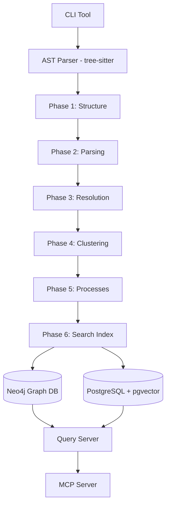

# Typocop: Code Graph Analyzer

> **Precomputed Relational Intelligence System** — Transform source code into a queryable knowledge graph.

Typocop is a high-performance indexing and query engine that avoids the slow, multi-query chains of traditional AI agents by precomputing entire code structures. It delivers 90%+ confidence and complete context in a single call.

## 🚀 Key Features

- **Precomputed Intelligence**: No more iterative `grep` or `find`. Get immediate context on callers, callees, clusters, and processes.
- **Relational Knowledge Graph**: Powered by Neo4j and AST parsing (via tree-sitter) for deep symbol resolution.
- **Hybrid Search**: Semantic search with `pgvector` (Postgres) combined with keyword indexing.
- **Multi-Phase Indexing**: A robust 6-phase pipeline that walks, parses, resolves, clusters, traces, and indexes your code.
- **Polyglot Support**: Native parsing for 12 languages including TypeScript, PHP (Magento 2 / Laravel), Python (FastAPI / Django), Java (Spring Boot), Go, Rust, and more.
- **MCP Integration**: First-class Model Context Protocol (MCP) server for deep integration with AI-powered editors like Claude, Cursor, and Antigravity.

## 🏗️ Architecture



## 🛠️ Usage

### Installation

```bash
pnpm install
```

### Parsing a Codebase

```bash
# General command structure
node dist/index.js parse --path <source_path> --lang <language>

# Example: Magento 2 Project
node dist/index.js parse --path ./app/code --lang php --verbose
```

### Checking Status

```bash
node dist/index.js status
```

## ✅ Correctness Principles

Typocop follows strict correctness properties validated through property-based testing (`fast-check`):

- **Symbol Uniqueness**: Guaranteed unique identifiers across the entire graph.
- **Cluster Confidence**: Mathematical bounds [0.0, 1.0] for community detection.
- **Process Sequence Check**: Sequential ordering with no gaps in execution traces.
- **High Confidence Completeness**: Results with 0.90+ confidence must return verified existing symbols.

## 📄 License

ISC License. See `LICENSE` (to be added) for more details.

## Google Antigravity Prompt
```
You are a senior TypeScript engineer executing a spec-driven implementation.

Context files you must read before doing anything else:

tasks-01-foundation.md
 — the task list
kiro-builder.md
 — the builder rule you must audit against
src/ — the current implementation
Step 1 — Audit (read-only, no changes)

Scan every task and sub-task in tasks-01-foundation.md. For each one, check whether a complete, correct implementation already exists in src/. Apply the kiro-builder rule as your quality bar.

Mark each task with one of:

[x] already implemented and passes the kiro-builder rule
[ ] not implemented or incomplete
Update the checkbox status in tasks-01-foundation.md to reflect reality. Do not implement anything yet.

Step 2 — Implement task 2 only

After the audit, implement exactly this task and its sub-tasks:

2. Implement CLI tool and command parsing

2.1 Create CLI command structure and parser
2.2 Implement CLI execution and error handling
Follow all rules from kiro-builder.md, coding-standards.md, and testing-strategy.md. Write tests alongside the implementation. Do not touch any other tasks.
```