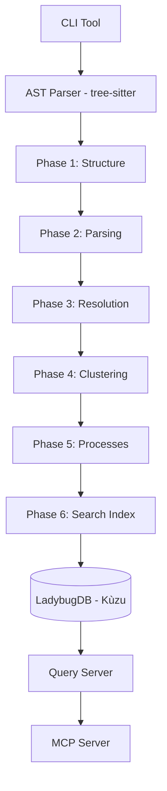

# Typocop: Code Graph Analyzer

> **Precomputed Relational Intelligence System** — Transform source code into a queryable knowledge graph.

Typocop is a high-performance indexing and query engine that avoids the slow, multi-query chains of traditional AI agents by precomputing entire code structures. It delivers 90%+ confidence and complete context in a single call.

## 🚀 Key Features

- **Precomputed Intelligence**: No more iterative `grep` or `find`. Get immediate context on callers, callees, clusters, and processes.
- **Relational Knowledge Graph**: Powered by LadybugDB (embedded Kùzu) and AST parsing (via tree-sitter) for deep symbol resolution.
- **Hybrid Search**: Semantic search with LadybugDB vector storage combined with keyword indexing.
- **Multi-Phase Indexing**: A robust 6-phase pipeline that walks, parses, resolves, clusters, traces, and indexes your code.
- **Polyglot Support**: Native parsing for 12 languages including TypeScript, PHP (Magento 2 / Laravel), Python (FastAPI / Django), Java (Spring Boot), Go, Rust, and more.
- **MCP Integration**: First-class Model Context Protocol (MCP) server for deep integration with AI-powered editors like Kiro, Claude, Cursor, and Windsurf.

## 🏗️ Architecture



## 🛠️ Usage

### Installation

```bash
pnpm install
pnpm build
```

### Prerequisites

Before running the indexer, ensure you have:

1. **Ollama** running locally (optional — for semantic embeddings)

Set environment variables in `.env-typocop`:
```bash
TYPOCOP_PREFIX=tpc_

# Ollama local embeddings (optional — disabled by default)
OLLAMA_ENABLED=true
OLLAMA_URL=http://localhost:11434
OLLAMA_MODEL=mxbai-embed-large
OLLAMA_DIMENSIONS=1024
```

### Schema Prefix Configuration

Typocop uses a configurable prefix for all LadybugDB node labels and relationship types. This allows multiple Typocop instances to share the same database infrastructure without data conflicts.

**Environment variable:** `TYPOCOP_PREFIX`

**Default value:** `tpc_`

**Naming rules:**
- Must start with a lowercase letter (`a–z`)
- May contain lowercase letters, digits, and underscores only (`[a-z0-9_]`)
- Maximum 32 characters
- A trailing underscore is auto-appended if missing (e.g. `tpc` → `tpc_`)

**Examples:**

| Value | Effective prefix | Example table |
|-------|-----------------|---------------|
| *(unset)* | `tpc_` | `tpc_embeddings` |
| `tpc_` | `tpc_` | `tpc_embeddings` |
| `myapp_` | `myapp_` | `myapp_embeddings` |
| `prod_` | `prod_` | `prod_embeddings` |
| `dev_` | `dev_` | `dev_embeddings` |

**What it affects:**
- LadybugDB node labels: `{prefix}Symbol`, `{prefix}File`, `{prefix}Cluster`, `{prefix}Process`, `{prefix}Metadata`
- LadybugDB relationship types: `{prefix}CALLS`, `{prefix}IMPORTS`, `{prefix}INHERITS`, `{prefix}IMPLEMENTS`, `{prefix}CONTAINS`, `{prefix}REFERENCES`, `{prefix}DEFINES`
- Vector table names: `{prefix}embeddings`, `{prefix}metadata`

Set it in your `.env-typocop` file or as a system environment variable:

```bash
TYPOCOP_PREFIX=myapp_
```

### Parsing a Codebase

```bash
# General command structure
node dist/cli/index.js parse --path <source_path> --lang <language> [--verbose] [--refresh]

# Example: TypeScript Project
node dist/cli/index.js parse --path ./src --lang typescript --verbose

# Example: Magento 2 Project
node dist/cli/index.js parse --path ./app/code --lang php --verbose

# Example: Python Project
node dist/cli/index.js parse --path ./src --lang python --verbose
```

#### Refresh Flag: Complete Rebuild

The `--refresh` flag (short form: `-r`) clears all existing graph and embeddings data before reindexing. This is useful when you need a clean slate.

**Use cases:**
- **Schema changes**: After modifying your codebase structure significantly
- **Bug fixes**: When you suspect stale or corrupted data in the graph
- **Fresh start**: Starting a new analysis from scratch
- **Prefix migration**: When switching to a different database prefix

**Examples:**

```bash
# Full refresh with verbose output
node dist/cli/index.js parse --path ./src --lang typescript --refresh --verbose

# Short form
node dist/cli/index.js parse --path ./src --lang typescript -r

# Refresh without verbose output
node dist/cli/index.js parse --path ./src --lang typescript --refresh
```

**What happens during refresh:**

1. All LadybugDB nodes and relationships for the current prefix are deleted
2. All vector embeddings for the current prefix are deleted
3. The indexing pipeline runs normally (Phases 1-6)
4. Graph and embeddings are rebuilt from scratch

**Important notes:**

- The `--refresh` flag is **optional** and defaults to `false`
- Only data for the configured prefix is cleared (other prefixes are preserved)
- Clearing happens **before** indexing begins
- The operation is **atomic** from the user's perspective
- Clearing is **idempotent** — safe to run multiple times

### Supported Languages

TypeScript, JavaScript, Python, PHP, Java, Go, Rust, C, C++, C#, Ruby, Swift

### Checking Status

```bash
node dist/cli/index.js status
```

### Reindexing

```bash
node dist/cli/index.js reindex
```

## 📊 Six-Phase Indexing Pipeline

The indexing pipeline (`src/indexer/pipeline.ts`) orchestrates all phases:

1. **Phase 1: Structure** — Walk file tree and map folder/file relationships
2. **Phase 2: Parsing** — Extract symbols from ASTs using tree-sitter
3. **Phase 3: Resolution** — Resolve imports, calls, and inheritance across files
4. **Phase 4: Clustering** — Group related symbols into functional communities (Louvain algorithm)
5. **Phase 5: Processes** — Trace execution flows from entry points through call chains
6. **Phase 6: Search** — Build hybrid indexes (vector + keyword) for fast retrieval

Each phase builds on the previous, with results stored in LadybugDB (graph structure and semantic search).

## ✅ Correctness Principles

Typocop follows strict correctness properties validated through property-based testing (`fast-check`):

- **Symbol Uniqueness**: Guaranteed unique identifiers across the entire graph.
- **Cluster Confidence**: Mathematical bounds [0.0, 1.0] for community detection.
- **Process Sequence Check**: Sequential ordering with no gaps in execution traces.
- **High Confidence Completeness**: Results with 0.90+ confidence must return verified existing symbols.

## 📄 License

ISC License. See `LICENSE` (to be added) for more details.

## 📚 Documentation

- [Architecture Overview](docs/ARCHITECTURE.md) - System design and pipeline orchestration
- [Design Specification](.kiro/specs/code-graph-analyzer/design.md) - Detailed system architecture
- [Requirements](.kiro/specs/code-graph-analyzer/requirements.md) - Functional requirements (EARS notation)
- [Implementation Tasks](.kiro/specs/code-graph-analyzer/tasks.md) - Development roadmap and progress

## Google Antigravity Prompt
```
# Role
You are an elite TypeScript engineer executing a strict, spec-driven development.

# Context Files (Read First)
Before taking any action, you must ingest this context to understand the strict project boundaries:
- `@.agents/rules/kiro-builder.md` — The Project Constitution. You must strictly obey its hierarchy and commandments.
- `@.kiro/specs/code-graph-analyzer/requirements.md` — Source of truth for Requirements (EARS notation).
- `@.kiro/specs/code-graph-analyzer/design.md` — Source of truth for Architectural constraints.
- `@.kiro/specs/code-graph-analyzer/tasks-02-indexing.md` — The task list and sequence of execution.
- `@package-manager.md`, `@kiro-steering.md` — Tooling and general engineering guidelines.
- `src/` — The current codebase implementation.

# Execution Plan

## Phase 1: Audit & Task Sync (No Implementation)
Your first objective is strictly limited to synchronizing the task tracker with the codebase reality.
1. Scan every task and sub-task in `@tasks-02-indexing.md`.
2. Verify against `src/` to see if a complete, correct implementation exists.
3. Validate completeness against `requirements.md` and `design.md`.
4. Modify `@tasks-02-indexing.md` to reflect the audit:
   - `[x]` = 100% implemented AND passes all constitution commandments.
   - `[ ]` = Not implemented, partial, or fails the EARS/Architectural quality bar.

## Phase 2: Implement Task 7
Once the audit is complete and the markdown file is synced, proceed to code execution.

**Target Scope:**
- `7. Implement Phase 3: Reference resolution`
- `7.1 Implement import resolution`
- `7.2 Implement call resolution`
- `7.3 Implement inheritance and interface resolution`
- `7.4 Write property tests for relationship resolution`

**Implementation Constraints:**
1. **EARS Compliance & Architecture:** Your logic MUST satisfy the "WHEN/THE SYSTEM SHALL" conditions defined in `requirements.md`. You are absolutely **forbidden** from introducing patterns not defined in `design.md`.
2. **Strict Mode Scope:** As per the constitution, do NOT edit files outside the Active Spec Path / global config, and do NOT touch code outside the immediate scope of Task 7.
3. **Skill Utilization:** If the task description mentions specific Agent Skills (e.g., `tdd-workflow`, `lint-and-validate`), you **MUST** utilize those skills before marking the task complete.
4. **Testing:** Write unit/integration tests alongside your implementation, adhering to the project's testing strategy context.
```