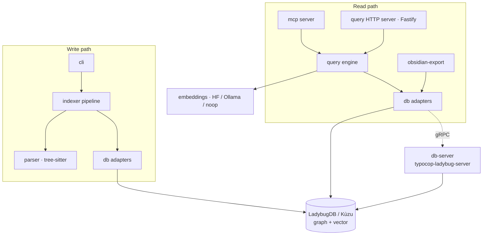
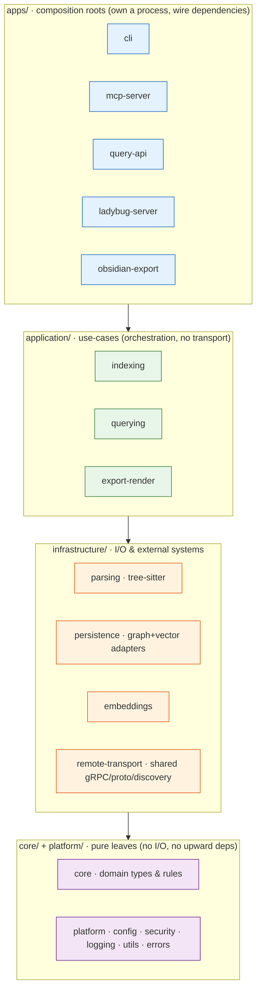

# Typocop — Codebase Analysis & Refactoring Proposal

> **Status:** Proposal · **Date:** 2026-06-13 · **Scope:** `src/` (≈17.7K LOC source, ≈21.3K LOC tests, 244 `.ts` files across 14 modules)
>
> This document analyzes the current structure, identifies concrete architectural problems (with file/line evidence), and proposes a **layered "clean architecture"** target with an incremental, test-guarded migration plan.

---

## 1. Executive Summary

Typocop is in good shape internally — it has centralized domain types, a clean `DatabaseAdapter` port/adapter abstraction, well-factored indexer phases, and strong test coverage (property-based + integration). The problems are **structural / boundary** problems, not logic problems:

| # | Problem | Evidence | Impact |
|---|---------|----------|--------|
| 1 | **3 dependency cycles** between modules | §4.1 | Hard to reason about, test in isolation, or extract |
| 2 | **No layering** — entry points, domain logic, and infrastructure sit at the same level | §4.2 | Read-side accidentally couples to write-side (tree-sitter) |
| 3 | **Dead module** `src/enrichment/` (~80% unused) creates a false `query → indexer` edge | §4.3 | Misleading coupling; ~250 dead LOC |
| 4 | **Triplicated** gRPC proto-loader + **triplicated** env/argv bootstrap | §4.4 | Drift risk, 3 copies to maintain |
| 5 | **Global mutable singleton** `configurationManager` reached across 4 layers | §4.5 | Hidden dependency, harder testing |
| 6 | **Test scaffolding lives in `src/`** (`grpc-test-mocks.ts`, `*.test-support.ts`, `arbitraries.ts`) | §4.6 | Ships in build graph; pollutes module boundaries |
| 7 | **Name collision** `src/enrichment/` vs `src/indexer/clustering/enrichment.ts` | §4.3 | Confusing |
| 8 | **Stale docs** — `docs/ARCHITECTURE.md` still describes Neo4j + PostgreSQL/pgvector | §4.7 | Misleads new contributors |
| 9 | **Working-tree clutter** — `legacy-parser/`, `.db-storages/` (Postgres/Neo4j era), `dist/`, `*.tgz` | §4.8 | Confusing (note: untracked, so low-risk) |

The proposal (§5–§8) introduces **four layers** — `core` → `platform`/`infrastructure` → `application` → `apps` — with dependencies pointing strictly downward, breaks all three cycles, extracts a shared `remote-transport` module, and removes the dead code. A **phased plan (§7)** lands the high-value, low-risk fixes first (no file moves) before the larger reorganization.

---

## 2. Current Architecture (as-built)

Typocop ships **three executables** (`package.json` `bin`):

- `typocop` → `dist/cli/main.js` — CLI: `parse` / `reindex` / `status` / `obsidian`
- `typocop-mcp` → `dist/mcp/main.js` — Model Context Protocol server for AI editors
- `typocop-ladybug-server` → `dist/db-server/main.js` — gRPC host for remote DB access

Data flows in two directions around a single graph+vector store (embedded **LadybugDB / Kùzu**, accessible either in-process or over gRPC):



### Current module inventory

| Module | Files | LOC | Role |
|--------|------:|----:|------|
| `src/db/` | 45 | 7,103 | Persistence: graph/vector/embedding adapters, connection pool, remote gRPC client, autostart |
| `src/indexer/` | 42 | 8,753 | 6-phase write pipeline (`structure`→`parsing`→`resolution`→`clustering`→`processes`→`search`) |
| `src/query/` | 31 | 4,586 | Read engine: smart-search, impact-analysis, context-retrieval, pre-commit, data-flow + Fastify HTTP server |
| `src/db-server/` | 27 | 3,508 | gRPC connection-server host (`router`, `scheduler`, `services/`, `metrics`, `discovery`) |
| `src/parser/` | 23 | 2,954 | tree-sitter init, `queries.ts` (510 LOC), `extract-symbols`, `frameworks/` (11 framework plugins) |
| `src/mcp/` | 18 | 2,898 | MCP server: `registration`, `tools`, `smart-search-tool`, `handler`, `auth`, `validation` |
| `src/cli/` | 11 | 2,203 | commander dispatch: `main`→`main-full`/`obsidian-main`, `parser`, `executor` (442 LOC) |
| `src/config/` | 10 | 1,875 | `configuration-manager` (419 LOC) singleton, env→config, prefix validation |
| `src/obsidian-export/` | 9 | 1,454 | graph → Obsidian markdown vault (`renderer`, `graph-reader`, `vault-writer`) |
| `src/security/` | 7 | 920 | path validation, sanitization, privacy gate |
| `src/enrichment/` | 5 | 408 | intent classification, side-effects (**mostly dead — see §4.3**) |
| `src/utils/` | 4 | 739 | ignore rules, limits |
| `src/types/` | 3 | 437 | **canonical domain types** + fast-check arbitraries |
| `src/__tests__/` | 1 | 87 | integration wiring test |

### What's already good (preserve these)

- ✅ **Centralized domain types** — `src/types/index.ts` is the single source of truth (`Symbol`, `Relationship`, `Cluster`, `Process`, `Query*`, `Embedding`, …) with an explicit *"All types live here — never redefine inline"* contract.
- ✅ **Clean port/adapter abstraction** — `src/db/types.ts` defines `DatabaseAdapter` / `GraphAdapter` / `VectorAdapter` / `EmbeddingAdapter`; local (`Ladybug*`) and remote (`Remote*`) implementations both satisfy them. This is textbook hexagonal.
- ✅ **Well-factored indexer phases** — each phase is its own subfolder with an `index.ts` barrel and a clean input→output contract; `pipeline.ts` just wires them.
- ✅ **`db-server/services/` split** — `admin` / `graph` / `health` / `vector` services are cleanly separated and built via factory functions.
- ✅ **Strong test coverage** — 105 test files, ~1.2:1 test:source ratio, including `*.pbt.test.ts` property tests (fast-check) and `*.integration.test.ts`.

---

## 3. Method

Findings below were derived by: building the inter-module import matrix (grep of `from "../<module>/"` across non-test files), tracing each suspected cycle to specific `file:line` imports, counting external usages of suspected-dead symbols, and locating duplicated logic by signature (`resolveProtoPackage`, env-bootstrap). Every claim cites its evidence.

---

## 4. Problems (with evidence)

### 4.1 Dependency cycles

Three real, bidirectional cycles exist in non-test source:

**Cycle A — `db` ↔ `db-server`** *(the most important)*
```
src/db/autostart.ts:9          import { writeDiscoveryFile } from "../db-server/discovery.js";
src/db/autostart.ts:10         import { ServerStartupTimeoutError, ServerUnavailableError } from "../db-server/errors.js";
src/db/autostart.ts:11         import type { DiscoveryFile } from "../db-server/types.js";
src/db/autostart-runtime.ts:11 import type { DiscoveryFile } from "../db-server/types.js";
        ↕
src/db-server/router.ts:3      import { LadybugGraphAdapter } from "../db/ladybug-graph-adapter.js";
src/db-server/runtime.ts:3     import { createEmbeddedConnection, ... } from "../db/index.js";
```
The **client** (`db`, to autostart the server and read its discovery file) depends on the **server**, and the server depends on the client's local adapters to host the DB. The shared pieces — `DiscoveryFile` type, discovery-file I/O, server error types, and the gRPC proto/transport — belong in neither.

**Cycle B — `cli` ↔ `obsidian-export`**
```
src/obsidian-export/index.ts:5   import type { ObsidianExportConfig } from "../cli/parser.js";
        ↕
src/cli/executor.ts:12           import { executeObsidianExport } from "../obsidian-export/index.js";
src/cli/obsidian-main.ts:11      import { executeObsidianExport } from "../obsidian-export/index.js";
```
A config *type* (`ObsidianExportConfig`) lives in the CLI's arg-parser, but the feature module needs it — so the feature imports back up into the CLI.

**Cycle C — `types` → `indexer`**
```
src/types/arbitraries.ts:137  import type { FileNode } from "../indexer/structure/index.js";
```
The *foundational* types package reaches up into a *high-level* module. Caused by test-data generators (`arbitraries.ts`) living inside `src/types/`.

### 4.2 No layering / read-side ↔ write-side entanglement

All 14 modules sit flat under `src/` at one level. Entry points (`cli`, `mcp`), application logic (`indexer`, `query`), and infrastructure (`db`, `db-server`, `parser`) are peers, so nothing prevents an interface module from importing another interface module, or a "lower" module from importing a "higher" one. The import matrix (non-test) is:

```
cli              → config db indexer obsidian-export parser types
mcp              → config db query security types
query            → config db enrichment security types utils
indexer          → db parser security types utils
parser           → types utils
db               → config db-server security types
db-server        → config db types
obsidian-export  → cli config db
enrichment       → indexer types
```

There is no declared direction, so the only thing keeping the read path (`mcp`/`query`) from dragging in tree-sitter is that `query` imports `enrichment/intent.js` *directly* rather than the `enrichment` barrel (which would pull in `indexer`). That is fragile — see §4.3.

### 4.3 Dead module: `src/enrichment/`

`src/enrichment/index.ts` is a facade that re-exports `classifyIntent`, `analyzeSideEffects`, `inferTypes`, and wraps `enrichCluster` by delegating to `src/indexer/clustering/enrichment.ts`. External (non-test, non-self) usage counts:

| Symbol | Defined in | External uses |
|--------|-----------|--------------:|
| `classifyIntent` | `enrichment/intent.ts` | **1** (`query/parse-intent.ts:6`) |
| `enrichCluster` (facade) | `enrichment/index.ts` | **0** (the live one is `indexer/clustering/enrichment.ts`, used by `indexer/clustering/index.ts`) |
| `enrichSymbol` | `enrichment/index.ts` | **0** |
| `classifyQueryIntent` | `enrichment/index.ts` | **0** |
| `analyzeSideEffects` | `enrichment/side-effects.ts` | **0** |
| `inferTypes` | `enrichment/side-effects.ts` | **0** |

So: the only live thing in the entire module is `classifyIntent` (used by `query`); everything else is dead. The `enrichment/index.ts` facade is what statically imports `indexer/clustering/enrichment.js`, manufacturing the `enrichment → indexer` edge — but **nothing imports that facade**. Additionally the name collides with `src/indexer/clustering/enrichment.ts`.

### 4.4 Duplicated infrastructure

**Proto loader — 3 copies.** `resolveProtoPackage()` and the `../../proto/ladybug_connection.proto` path resolution are independently re-implemented in:
```
src/db/remote-grpc.ts:9, :94, :109
src/db/autostart-runtime.ts:15, :175, :184
src/db-server/server.ts:24, :47, :188
```

**Env/argv bootstrap — 3 copies.** Each executable hand-rolls its own `-e`/`--env` parsing + `.env-typocop` default + dotenv import:
```
src/cli/main-full.ts:24-53
src/mcp/main.ts:6-33
src/db-server/main.ts  (variant: ARG_TO_ENV mapping, sets LADYBUG_RUNTIME_MODE)
```

### 4.5 Global mutable singleton config

`configurationManager` (a module-level singleton, `config/configuration-manager.ts` — 419 LOC) is imported and read directly by **6 files across 4 layers**:
```
src/cli/executor.ts · src/cli/main-full.ts · src/cli/obsidian-main.ts
src/obsidian-export/index.ts · src/mcp/server.ts · src/query/server.ts
```
This is a hidden global dependency: any of these can read mutable config without it being passed in, which complicates testing and parallel/embedded use.

### 4.6 Test scaffolding inside `src/`

Non-test source files that exist only to support tests, but live in `src/` and are part of module boundaries / the build graph:
```
src/db-server/grpc-test-mocks.ts            (236 LOC)
src/db-server/connection-server.test-support.ts
src/types/arbitraries.ts                    (fast-check generators — also causes Cycle C)
```

### 4.7 Stale documentation

`docs/ARCHITECTURE.md` describes a **Neo4j graph DB + PostgreSQL/pgvector** two-database design (lines 26–31, 85–94) and "OpenAI text-embedding-3-large 1536-dim" embeddings. The actual system uses **embedded LadybugDB/Kùzu** for both graph and vectors with pluggable HF/Ollama/noop embeddings. The doc predates the LadybugDB migration and now actively misleads.

### 4.8 Working-tree clutter (low-risk)

`legacy-parser/`, `.db-storages/` (contains `postgres/` + `neo4j/` server state from the pre-LadybugDB era), `dist/`, and `typocop-0.1.0.tgz` sit in the working tree. **All are untracked** (`git ls-files` shows 0 tracked), so this is hygiene rather than a code problem — but the Postgres/Neo4j leftovers reinforce the stale-docs confusion and should be removed from working copies.

---

## 5. Proposed Target Architecture

A **four-layer architecture** where dependencies point strictly downward. Each layer may depend only on layers below it; **sibling modules within a layer do not import each other** (shared needs move down a layer).



### Dependency rules (the contract a linter enforces — §8)

| Layer | May import from | Must NOT import from |
|-------|-----------------|----------------------|
| `core/` | (nothing) | everything else |
| `platform/` | `core` | infrastructure, application, apps |
| `infrastructure/` | `core`, `platform` | application, apps, **sibling infra modules** |
| `application/` | `core`, `platform`, `infrastructure` | apps, **sibling application modules** |
| `apps/` | all layers below | other `apps/*` |

### Proposed `src/` tree

```
src/
├─ core/                         # was src/types/  — pure domain, the leaf
│  ├─ domain.ts                  #   Symbol, Relationship, Cluster, Process, Query*, Embedding…
│  ├─ file-node.ts               #   FileNode (moved out of indexer/structure — see Cycle C)
│  └─ index.ts
│
├─ platform/                     # cross-cutting, depends only on core
│  ├─ config/                    #   was src/config/  (+ ObsidianExportConfig moved here)
│  ├─ security/                  #   was src/security/
│  ├─ logging/                   #   was src/db-server/logger.ts + ad-hoc console.error helpers
│  ├─ bootstrap.ts               #   ONE env/argv loader shared by all three executables (§4.4)
│  └─ utils/                     #   was src/utils/
│
├─ infrastructure/
│  ├─ parsing/                   # was src/parser/  (tree-sitter, queries, extract-symbols, frameworks/, diagnostics)
│  ├─ persistence/               # was src/db/ local side: ladybug-*-adapter, connection-pool, pool-*, file-lock, database-adapter
│  ├─ embeddings/                # was src/db/{huggingface,ollama,noop}-embedding-adapter.ts
│  └─ remote-transport/          # NEW — shared gRPC/proto, breaks Cycle A:
│     ├─ proto-loader.ts         #   the single resolveProtoPackage + proto path (was triplicated)
│     ├─ discovery.ts            #   DiscoveryFile type + read/write (was db-server/discovery + db/autostart bits)
│     ├─ errors.ts               #   ServerUnavailable / StartupTimeout etc. (was db-server/errors)
│     ├─ client.ts               #   was db/remote-grpc + remote-rpc-client
│     └─ remote-adapters/        #   RemoteGraph/Vector/DatabaseAdapter (was db/remote-*-adapter)
│
├─ application/
│  ├─ indexing/                  # was src/indexer/ (pipeline + phases) — already clean internally
│  │  └─ clustering/enrichment.ts#   keep here (the live enrichCluster); folder rename optional
│  ├─ querying/                  # was src/query/ MINUS server.ts; + intent.ts moved in from enrichment
│  └─ export-render/             # was src/obsidian-export/ MINUS process wiring (renderer/graph-reader/vault-writer)
│
└─ apps/                         # composition roots — thin, own a process
   ├─ cli/                       # was src/cli/ (parser/executor) — wires indexing + querying + export
   ├─ mcp-server/                # was src/mcp/
   ├─ query-api/                 # was src/query/server.ts (Fastify) — now its own app
   ├─ ladybug-server/            # was src/db-server/ (router, scheduler, services/, metrics, runtime, main)
   └─ obsidian/                  # was src/cli/obsidian-main.ts — thin entry

bin/                             # (optional) thin shims that import apps/*/main
tests/
└─ support/                      # arbitraries.ts, grpc-test-mocks.ts, *.test-support.ts (moved out of src/)
```

### How the target breaks each cycle

- **Cycle A (`db`↔`db-server`)** → both now depend on `infrastructure/remote-transport` (proto loader, `DiscoveryFile`, discovery I/O, server error types). `apps/ladybug-server` depends on `infrastructure/persistence` + `remote-transport`; `infrastructure/persistence`'s remote adapters depend on `remote-transport` only. Neither imports the other. **Cycle gone.**
- **Cycle B (`cli`↔`obsidian-export`)** → `ObsidianExportConfig` moves to `platform/config`. `apps/cli` → `application/export-render` (downward only). **Cycle gone.**
- **Cycle C (`types`→`indexer`)** → `FileNode` moves to `core/file-node.ts`; `arbitraries.ts` moves to `tests/support/`. `core` imports nothing. **Cycle gone.**
- **Dead `enrichment`** → delete `side-effects.ts` + the unused facade; move `intent.ts` into `application/querying`. The `query → indexer` phantom edge disappears, and the read path is provably free of tree-sitter.

---

## 6. Module mapping (old → new)

| Current | Target | Notes |
|---------|--------|-------|
| `src/types/` | `core/` | rename concept to "domain"; move `FileNode` in, move `arbitraries.ts` out to `tests/support/` |
| `src/config/` | `platform/config/` | add `ObsidianExportConfig`; consider passing config as a value instead of the global singleton (§4.5) |
| `src/security/` | `platform/security/` | unchanged internally |
| `src/utils/` | `platform/utils/` | unchanged |
| *(new)* | `platform/bootstrap.ts` | dedupe the 3 env/argv loaders (§4.4) |
| `src/parser/` | `infrastructure/parsing/` | unchanged internally (already cohesive) |
| `src/db/` (local: `ladybug-*`, pool, connection, `file-lock`, `database-adapter`) | `infrastructure/persistence/` | |
| `src/db/{huggingface,ollama,noop}-embedding-adapter.ts` | `infrastructure/embeddings/` | groups the pluggable embedding providers |
| `src/db/remote-*` + `remote-grpc` + `remote-rpc-client` + `autostart*` | `infrastructure/remote-transport/` | + extracted `proto-loader`, `discovery`, `errors` from `db-server` |
| `src/indexer/` | `application/indexing/` | already clean; keep phase subfolders |
| `src/query/` (minus `server.ts`) | `application/querying/` | + `intent.ts` from `enrichment` |
| `src/query/server.ts` | `apps/query-api/` | the Fastify HTTP app |
| `src/obsidian-export/` (renderers) | `application/export-render/` | |
| `src/cli/` | `apps/cli/` | composition root |
| `src/cli/obsidian-main.ts` | `apps/obsidian/` | thin entry |
| `src/mcp/` | `apps/mcp-server/` | composition root |
| `src/db-server/` (router/scheduler/services/metrics/runtime/main) | `apps/ladybug-server/` | proto/discovery/errors extracted down to `remote-transport` |
| `src/enrichment/intent.ts` | `application/querying/intent.ts` | only live file |
| `src/enrichment/{index,side-effects,config}.ts` | **deleted** | dead code (§4.3) |
| `src/db-server/grpc-test-mocks.ts`, `*.test-support.ts`, `src/types/arbitraries.ts` | `tests/support/` | test-only |

---

## 7. Migration plan (phased, test-guarded)

Each phase ends green (`pnpm typecheck && pnpm test`). Order is chosen so the **high-value, low-risk, no-file-move** work lands first.

### Phase 0 — Hygiene & docs (no code moves) · *low risk*
1. Remove working-tree clutter: `legacy-parser/`, `.db-storages/`, `dist/`, `*.tgz` (all untracked; confirm `.gitignore` covers them).
2. Rewrite `docs/ARCHITECTURE.md` to reflect LadybugDB/Kùzu reality (delete Neo4j/Postgres). Link this proposal.

### Phase 1 — Delete dead code · *low risk*
1. Delete `src/enrichment/index.ts`, `side-effects.ts`, `config.ts`.
2. Move `classifyIntent` (`intent.ts`) into `src/query/` (its only consumer); update `query/parse-intent.ts:6`.
3. Delete `src/enrichment/`. Removes the phantom `query → indexer` edge. (~250 LOC deleted.)

### Phase 2 — Break cycles in place · *low–medium risk* (still no big reorg)
1. **Cycle C:** move `FileNode` to a `core`-level location; relocate `arbitraries.ts`, `grpc-test-mocks.ts`, `*.test-support.ts` to `tests/support/`.
2. **Cycle B:** move `ObsidianExportConfig` out of `cli/parser.ts` into config/types; update both sides.
3. **Cycle A:** create `remote-transport` (even before the folder reorg, as a new module): extract `resolveProtoPackage` + proto path (de-triplicate, §4.4), `DiscoveryFile`, discovery I/O, and server error types into it; point `db` and `db-server` at it. Verify no remaining `db ↔ db-server` imports.

### Phase 3 — De-duplicate bootstrap · *low risk*
1. Add `platform/bootstrap.ts` with one `loadEnv(argv)` used by all three `main.ts` files.

### Phase 4 — Introduce layers (mechanical moves) · *medium risk, large diff*
1. Add tsconfig path aliases (`@core/*`, `@platform/*`, `@infra/*`, `@app/*`) **first** so imports become layer-explicit and moves are find-replace-able.
2. `git mv` modules into `core/ platform/ infrastructure/ application/ apps/` per §6, one layer per commit, running tests after each. Update `package.json` `bin` paths.
3. Split `query/server.ts` → `apps/query-api/`; split `db-server` proto bits already done in Phase 2.

### Phase 5 — Enforce & harden · *low risk*
1. Wire the dependency linter (§8) into CI; fail on any upward or sibling import.
2. (Optional, follow-up) Reduce reliance on the global `configurationManager` by threading a `Config` value through composition roots (§4.5).

> **Sequencing note:** Phases 0–3 deliver ~90% of the architectural value (cycles broken, dead code gone, duplication removed) with **little or no file movement**, so they can ship independently and incrementally. Phase 4 is the only large diff and can be deferred or done module-by-module.

---

## 8. Enforcing the architecture

Add **`dependency-cruiser`** (or `eslint-plugin-boundaries`) with rules mirroring the §5 table, e.g.:

```js
// .dependency-cruiser.cjs (sketch)
forbidden: [
  { name: 'no-cycles', severity: 'error', from: {}, to: { circular: true } },
  { name: 'core-is-leaf', severity: 'error',
    from: { path: '^src/core' }, to: { pathNot: '^src/core' } },
  { name: 'platform-only-core', severity: 'error',
    from: { path: '^src/platform' }, to: { path: '^src/(infrastructure|application|apps)' } },
  { name: 'infra-no-up', severity: 'error',
    from: { path: '^src/infrastructure' }, to: { path: '^src/(application|apps)' } },
  { name: 'app-no-up', severity: 'error',
    from: { path: '^src/application' }, to: { path: '^src/apps' } },
  { name: 'apps-no-sibling', severity: 'error',
    from: { path: '^src/apps/([^/]+)' }, to: { path: '^src/apps/(?!$1)' } },
]
```

Run it in CI (`pnpm depcruise src`). Combined with the path aliases from Phase 4, this makes the layering self-documenting and prevents regressions.

---

## 9. Appendix — metrics snapshot

- **Source:** 139 non-test files, 17,652 LOC. **Tests:** 105 files, 21,338 LOC (≈1.21:1).
- **Largest source files** (refactor/SRP candidates): `parser/queries.ts` (510), `cli/executor.ts` (442), `config/configuration-manager.ts` (419), `indexer/resolution/index.ts` (398), `query/pre-commit-check.ts` (310), `db/ladybug-graph-adapter.ts` (288), `query/impact-analysis.ts` (272).
- **Cycles:** 3 (all addressed in Phase 2). **Dead modules:** 1 (`enrichment`, Phase 1). **Triplicated code:** proto loader, env bootstrap (Phases 2–3).

---

*Generated from a structural analysis of the `feature/refactor-code-base` branch. All `file:line` references reflect that branch's state on 2026-06-13.*
