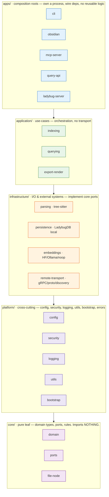
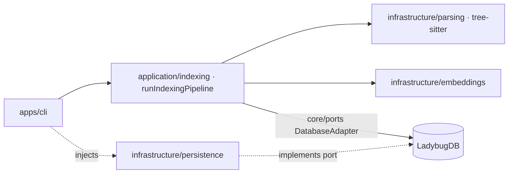
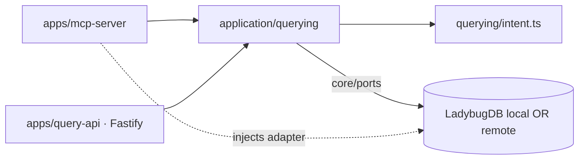
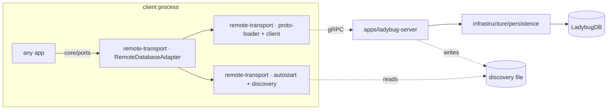

# Typocop — Architecture (current & post-refactor target)

> **Status:** Current (as-built) + Target (post-refactor) — **implementation-ready** · **Date:** 2026-06-13 · **Branch:** `feature/refactor-code-base` · **Supersedes:** `docs/ARCHITECTURE.md`
>
> One reference for both **where Typocop is today** (Part I) and **where the refactor takes it** (Part II).
> Part I replaces the stale `docs/ARCHITECTURE.md` (which described a pre-migration **Neo4j + PostgreSQL/pgvector + OpenAI 1536-dim** design); per the repo convention (`.agents/rules/refactoring-docs.md`) that file is left in place for history. Part II is the end-state of the migration plan in `docs/refactoring/REFACTORING-PROPOSAL.md` §7, specified down to every file and dependency edge.

**How to read this:**
- **Part I — Current architecture (as-built).** Executables, the single embedded LadybugDB store, the 6-phase indexing pipeline. The "where we are" baseline.
- **Part II — Target architecture (post-refactor).** The five-layer model, per-module spec, the exhaustive old→new file map, and the linter rules that enforce it. The "where we're going."

---
---

# Part I — Current architecture (as-built, LadybugDB era)

Typocop uses a single **embedded LadybugDB (Kùzu-backed)** engine for *both* graph and vector storage, with **pluggable embedding providers** (HuggingFace in-process / Ollama / none). The old two-database split (Neo4j + pgvector) is gone.

## I.1 Executables

Typocop ships three binaries (`package.json` `bin`):

| Binary | Entry | Role |
|--------|-------|------|
| `typocop` | `dist/cli/main.js` | CLI: `parse` / `reindex` / `status` / `obsidian` (write path + utilities) |
| `typocop-mcp` | `dist/mcp/main.js` | Model Context Protocol server for AI editors (read path) |
| `typocop-ladybug-server` | `dist/db-server/main.js` | gRPC host exposing the embedded DB for remote/shared access |

## I.2 System components

```
        WRITE PATH                                  READ PATH
┌──────────────────────┐                  ┌──────────────────────────┐
│  CLI (typocop)       │                  │  MCP server (typocop-mcp) │
│  parse / reindex     │                  │  query engine (Fastify    │
└──────────┬───────────┘                  │  HTTP API) · obsidian     │
           │                              └────────────┬─────────────┘
           ▼                                           │
┌──────────────────────────────────┐                  │
│       Indexing Pipeline          │                  │
│       (src/indexer/pipeline.ts)  │                  │
│  1 Structure  → walk file tree   │                  │
│  2 Parsing    → tree-sitter      │                  │
│  3 Resolution → resolve refs     │                  │
│  4 Clustering → Louvain          │                  │
│  5 Processes  → trace flows      │                  │
│  6 Search     → build indexes    │                  │
└──────────────┬───────────────────┘                  │
               │                                       │
               ▼                                       ▼
        ┌───────────────────────────────────────────────────┐
        │   LadybugDB (Kùzu) — embedded graph + vector store  │
        │   • graph: Symbol / Cluster / Process nodes + edges │
        │   • vectors: symbol & cluster embeddings            │
        └───────────────────────────────────────────────────┘
               ▲  in-process              ▲  gRPC (remote)
               │                          │
        local adapters             typocop-ladybug-server
        (LadybugGraph/Vector)      (db-server: router, services,
                                    scheduler, discovery)
                       │
                       ▼
        ┌──────────────────────────────────────┐
        │ Embeddings (pluggable provider):      │
        │  • huggingface (in-process, default)  │
        │  • ollama (HTTP)                      │
        │  • none (noop)                        │
        └──────────────────────────────────────┘
```

Both the in-process adapters (`src/db/ladybug-graph-adapter.ts`, `ladybug-vector-adapter.ts`)
and the remote adapters (`remote-graph-adapter.ts`, `remote-vector-adapter.ts`,
`remote-database-adapter.ts` over gRPC via `remote-grpc.ts` / `remote-rpc-client.ts`) satisfy the
same `DatabaseAdapter` / `GraphAdapter` / `VectorAdapter` ports in `src/db/types.ts`. Callers are
agnostic to whether the store is embedded or remote.

## I.3 Storage layer (LadybugDB / Kùzu)

A single embedded engine holds everything — there is no separate graph DB and no separate vector DB:

**Graph:**
- `Symbol` nodes (labeled by kind: function, class, method, …)
- `Cluster` nodes (functional communities from Louvain)
- `Process` nodes (execution flows)
- Relationships: `CALLS`, `IMPORTS`, `INHERITS`, `IMPLEMENTS`, `BELONGS_TO`, `PART_OF`

**Vectors (same engine):**
- Symbol embeddings + cluster embeddings for semantic / hybrid search
- Dimensions are **provider-dependent**, not fixed at 1536

**Embeddings (`src/config/types.ts#EmbeddingProvider = "huggingface" | "ollama" | "none"`):**
- `huggingface` — in-process, default model `mixedbread-ai/mxbai-embed-large-v1`
- `ollama` — HTTP API (default `http://localhost:11434`, model `mxbai-embed-large`)
- `none` — noop adapter (structure-only indexing, no semantic search)

**Remote access:** `typocop-ladybug-server` hosts the embedded DB behind gRPC so multiple clients
can share one store. The client side can autostart the server and locate it via a discovery file
(`src/db/autostart.ts`, `src/db-server/discovery.ts`).

## I.4 Indexing pipeline

`runIndexingPipeline` (`src/indexer/pipeline.ts`) is the main orchestrator:

1. **Accepts configuration** — source path, language, and a `DatabaseAdapter` (embedded or remote).
2. **Executes phases sequentially** with early exit on empty results.
3. **Logs progress** when verbose mode is enabled.
4. **Stores results** into the single LadybugDB store (graph nodes/edges + embeddings).
5. **Returns statistics** — symbol count, relationship count, skipped files.

### Phase dependencies

```
Phase 1 (Structure)
  └─> FileNode[]
      └─> Phase 2 (Parsing)
          └─> Symbol[]
              └─> Phase 3 (Resolution)
                  └─> Relationship[]
                      ├─> Phase 4 (Clustering)
                      │   └─> Cluster[]
                      │       └─> Phase 6 (Search)
                      └─> Phase 5 (Processes)
                          └─> Process[]
                              └─> Phase 6 (Search)
```

## I.5 Current design decisions, error handling & testing

**Single embedded engine (was: two databases).** Graph and vector data live in one LadybugDB/Kùzu store, removing the cross-database consistency burden of the old Neo4j+pgvector design, simplifying deployment (no external DB servers), and making remote access a single gRPC boundary rather than two.

**Port/adapter abstraction.** `src/db/types.ts` defines the `DatabaseAdapter` family; local `Ladybug*` and remote `Remote*` implementations are interchangeable. Embedded vs. remote is a wiring choice at the composition root, not a pipeline concern. *(Part II moves these port interfaces down into `core/ports/`.)*

**Sequential phase execution.** Phases run in order because each depends on the prior phase's complete output; this keeps memory bounded (process and release phase by phase) and makes per-phase testing/debugging simple.

**Early exit on empty results.** If a phase produces zero results, the pipeline returns early with empty collections — avoiding wasted downstream computation and store operations on empty datasets.

**Connection management at the composition root.** The pipeline receives a ready `DatabaseAdapter` rather than constructing connections internally, enabling connection reuse, lifecycle control by the caller, and easy testing with fakes.

**Error handling.** (1) Phase failures halt the pipeline — a thrown error stops execution immediately. (2) Empty results are valid — zero symbols/relationships is not an error. (3) Store errors propagate — connection/query failures throw to the caller. (4) Parsing errors are tracked — individual file failures are recorded in `skippedFiles`.

**Testing.** Unit tests per phase with fakes; integration tests on sample codebases (`src/__tests__/`); property tests (`*.pbt.test.ts` / `*.property.test.ts`, fast-check); adapter tests for both `Ladybug*` and `Remote*`, plus gRPC autostart/discovery. See `src/indexer/pipeline.test.ts` and the per-phase `*.test.ts` files.

---
---

# Part II — Target architecture (post-refactor)

## 1. How to read Part II

- **§2–§3** — the model: principles, the five layers, the dependency contract.
- **§4** — the spec: every target module's purpose, contents, public surface, and allowed dependencies.
- **§5–§6** — cross-cutting concerns and the data flows that ride across the layers.
- **§7–§8** — how the refactor removes all three cycles + the dead module, and where enrichment lands.
- **§9** — the exhaustive old→new file map (every current source file placed).
- **§10–§11** — how the architecture is *enforced* (linter, import rewrites, CI) and the build/runtime shape.
- **§12** — open decisions.
- **§13–§16** — **implementation readiness:** build/tooling constraints, the prerequisite dependency-inversion refactor, the PR-sized migration plan, and the risk register.
- **Appendix** — the full target tree.

---

## 2. Architecture principles

1. **Layered, dependencies point down.** Five layers: `core` → `platform` → `infrastructure` → `application` → `apps`. A layer may import only from layers strictly below it.
2. **No sibling imports inside a layer.** Two infrastructure modules never import each other; two application modules never import each other; two apps never import each other. Shared needs move *down* a layer.
3. **Dependency inversion via ports in `core`.** The adapter *interfaces* (`DatabaseAdapter`, `GraphAdapter`, `VectorAdapter`, `EmbeddingAdapter`) live in `core/ports/`. The application talks to those contracts; infrastructure *implements* them. The application never imports a concrete adapter — composition roots inject one.
4. **One composition root per process.** Each `apps/*` owns exactly one executable, wires concrete dependencies, and contains no reusable domain logic. Everything reusable lives below `apps/`.
5. **Privacy by construction.** Any path that sends text off-process (embeddings, LLM enrichment) must pass `platform/security`'s gate (`verifyEmbeddingText` / `verifyEnrichmentPrompt`) — names/kinds/signatures only, never source bodies. This is preserved and made a layer rule.
6. **Test scaffolding lives in `tests/`, not `src/`.** Arbitraries, gRPC mocks, and `*.test-support` files leave the build graph.
7. **No duplicated infrastructure.** One proto loader, one env/argv bootstrap, one logger — each defined once in the lowest layer that needs it.

---

## 3. The five layers



### Dependency contract (enforced by the linter — §10)

| Layer | May import from | Must NOT import |
|-------|-----------------|-----------------|
| `core/` | **(nothing)** | everything |
| `platform/` | `core` | `infrastructure`, `application`, `apps` |
| `infrastructure/` | `core`, `platform` | `application`, `apps`, **sibling infra modules** |
| `application/` | `core`, `platform`, `infrastructure` | `apps`, **sibling application modules** |
| `apps/` | all layers below | **other `apps/*`** |

> **The one allowance:** `infrastructure/remote-transport` is the *shared* infra module that both `infrastructure/persistence`'s remote adapters and `apps/ladybug-server` depend on — it sits below both and imports neither, so it is not a sibling-import violation.
>
> **Embeddings are injected, never imported across infra.** `persistence` and `remote-transport` both need an `EmbeddingAdapter`, but they depend on the **`core/ports` interface only** — the concrete HF/Ollama/noop adapter is built at the composition root and passed in. (Today `database-adapter.ts` and `remote-database-adapter.ts` statically `import` the concrete classes, which would be a forbidden `infra → sibling infra` edge; that coupling is inverted as a prerequisite — see **§14**.)

---

## 4. Module specification

### 4.1 `core/` — the pure leaf

Imports nothing. Pure types and rules; no I/O, no framework, no upward reference.

| Target file | Purpose | From |
|-------------|---------|------|
| `core/domain.ts` | Canonical domain types: `Symbol`, `Relationship`, `Cluster`, `Process`, `ProcessStep`, `DataFlowEdge`, `Query`, `QueryResult`, `QueryIntent`, `RiskLevel`, `Embedding`, `SearchResult`, `MCPToolResponse`, `Language`, `SymbolKind`, … (the single source of truth — *never redefine inline*). | `src/types/index.ts` |
| `core/file-node.ts` | `FileNode` — moved **out** of `indexer/structure` so the foundational layer no longer depends on a high-level module (breaks Cycle C). | `src/indexer/structure/index.ts` (type only) |
| `core/ports/persistence.ts` | The hexagonal **ports**: `DatabaseAdapter`, `GraphAdapter`, `VectorAdapter`, `EmbeddingAdapter`, plus `GraphNode`, `GraphRelationship`, and the `prop()` accessor. The contracts the application depends on. | `src/db/types.ts` |
| `core/enrichment.ts` | `SideEffectProfile`, `TypeInfo` and the optional enrichment fields on `MCPToolResponse` (only if enrichment is revived — §8). | new |
| `core/index.ts` | Barrel. | new |

**Public surface:** all domain types + ports. **Depends on:** nothing.

### 4.2 `platform/` — cross-cutting foundations

Depends only on `core`. Everything that more than one higher module needs but that isn't a domain type or an external-system adapter.

| Target module | Contents | From | Notes |
|---------------|----------|------|-------|
| `platform/config/` | `configuration-manager.ts`, `types.ts`, `prefix-validator.ts`, `errors.ts`, `index.ts` | `src/config/*` | **+ `ObsidianExportConfig`** moved here from `cli/parser.ts` (breaks Cycle B). Long-term: expose `FullConfig` as an injectable value, not only the global singleton (§5.1). |
| `platform/security/` | `privacy.ts`, `sanitize.ts`, `validate-path.ts`, `index.ts` | `src/security/*` | Unchanged internally. The privacy gate (`verifyEmbeddingText`, `verifyEnrichmentPrompt`, `containsSourceCode`) becomes a hard layer rule. |
| `platform/logging/` | `logger.ts` (+ a small console helper) | `src/db-server/logger.ts` | Promoted out of `db-server` so every layer logs the same way. |
| `platform/utils/` | `ignore.ts`, `limits.ts` | `src/utils/*` | Unchanged. |
| `platform/bootstrap.ts` | **One** `loadEnv(argv)` — the `-e/--env` parsing, `.env-typocop` default, dotenv import, and `ARG_TO_ENV` mapping — used by all three executables. | new (de-triplicates `cli/main-full.ts`, `mcp/main.ts`, `db-server/main.ts`) | §4.4 of the proposal. |

**Depends on:** `core`. **Must not import:** infrastructure/application/apps.

### 4.3 `infrastructure/` — I/O & external systems (implement `core` ports)

Depends on `core` + `platform`. Each module is an adapter to one external system. Sibling infra modules do not import each other (except all may import `remote-transport`, which sits below them).

#### `infrastructure/parsing/` — tree-sitter (was `src/parser/`)
- **Contents:** `init.ts`, `language.ts`, `parse-file.ts`, `ast-node.ts`, `extract-symbols.ts`, `queries.ts`, `diagnostic-{collector,formatter,logger}.ts`, `frameworks/` (django, express, fastapi, fastify, laravel, magento2, nestjs, orm, spring-boot, framework-support, index).
- **Public surface:** `initParser`, `parseFile`, `extractSymbols`, framework registry.
- **Depends on:** `core` (domain + `FileNode`), `platform` (utils, logging). Already cohesive — moves wholesale.

#### `infrastructure/persistence/` — embedded LadybugDB (was the local half of `src/db/`)
- **Contents:** `database-adapter.ts` (`LadybugDatabaseAdapter`, `createDatabaseAdapter`), `ladybug-graph-adapter.ts`, `ladybug-vector-adapter.ts`, `connection.ts`, `connection-pool.ts`, `pool-registry.ts`, `pool-helpers.ts`, `pool-types.ts`, `file-lock.ts`, `errors.ts`, `index.ts`.
- **Implements:** `core/ports` (`DatabaseAdapter`/`GraphAdapter`/`VectorAdapter`).
- **Depends on:** `core` (ports + domain), `platform`, **`remote-transport`** (the shared connection/autostart seam — note `createDatabaseAdapter` reaches it via a **dynamic** `import("./autostart.js")`). Receives its `EmbeddingAdapter` **injected** (not imported from `embeddings` — §14). Does **not** import `apps/ladybug-server`.

#### `infrastructure/embeddings/` — pluggable providers (was the embedding files in `src/db/`)
- **Contents:** `huggingface-embedding-adapter.ts`, `ollama-embedding-adapter.ts`, `noop-embedding-adapter.ts`, `index.ts` (factory keyed by `EmbeddingProvider`).
- **Implements:** `core/ports` `EmbeddingAdapter`.
- **Depends on:** `core`, `platform/config` (provider selection), `platform/security` (privacy gate before any text leaves the process).

#### `infrastructure/remote-transport/` — shared gRPC/proto/discovery (**NEW** — breaks Cycle A)
The pieces that today force `db ↔ db-server` to import each other. Both sides now depend *down* on this.
- **Contents:**
  - `proto-loader.ts` — the single `resolveProtoPackage()` + `ladybug_connection.proto` path (was triplicated across `db/remote-grpc.ts`, `db/autostart-runtime.ts`, `db-server/server.ts`).
  - `discovery.ts` — `DiscoveryFile` type + read/write (was `db-server/discovery.ts` + bits of `db/autostart*.ts`).
  - `errors.ts` — `ServerStartupTimeoutError`, `ServerUnavailableError`, … (was `db-server/errors.ts`).
  - `client.ts` — was `db/remote-grpc.ts` + `db/remote-rpc-client.ts`.
  - `autostart.ts`, `autostart-runtime.ts` — server autostart + discovery-file wait.
  - `remote-adapters/` — `RemoteDatabaseAdapter`, `RemoteGraphAdapter`, `RemoteVectorAdapter` (implement `core/ports`).
  - `grpc-shim.d.ts` — ambient gRPC type shim (was `src/grpc-shim.d.ts`).
- **Depends on:** `core` (ports), `platform`. Imports neither `persistence`, `apps/ladybug-server`, **nor `embeddings`** — `RemoteDatabaseAdapter`'s `EmbeddingAdapter` is injected (§14).

### 4.4 `application/` — use-cases (orchestration, no transport)

Depends on `core` + `platform` + `infrastructure` (via ports where possible). No HTTP/gRPC/CLI here — that's `apps`. Sibling application modules do not import each other.

#### `application/indexing/` — the 6-phase write pipeline (was `src/indexer/`)
- **Contents:** `pipeline.ts` (`runIndexingPipeline`, `storeInDatabases`), `language-config.ts`, and the phase folders `structure/`, `parsing/`†, `resolution/` (`symbol-table`, `named-binding`, `resolution-context`, `external-packages`, `index`), `clustering/` (`louvain`, `graph`, `semantic-classifier`, `enrichment` — the **live** cluster-naming one, `index`), `processes/` (`trace`, `entry-points`, `data-flow`, `index`), `search/` (`keywords`, `format`, `index`).
- **Depends on:** `core`, `platform`, `infrastructure/parsing`, and `core/ports` for persistence/embeddings (concrete adapter injected by the app). †`indexing/parsing/` is the *phase that invokes* `infrastructure/parsing` — recommend renaming to `phase-parsing/` to remove the name clash.
- **Public surface:** `runIndexingPipeline`, phase functions.

#### `application/querying/` — the read engine (was `src/query/` minus `server.ts`)
- **Contents:** `parse-intent.ts`, `execute-query.ts`, `format-response.ts`, `impact-analysis.ts`, `context-retrieval.ts`, `data-flow-trace.ts`, `pre-commit-check.ts`, `smart-search.ts`, `symbol-resolver.ts`, `preprocess.ts`, `confidence.ts`, `levenshtein.ts`, `graph-helpers.ts`, `process-helpers.ts`, `framework-layers.ts`, `framework-layer-map.ts`, **+ `intent.ts`** (moved in from `enrichment` — its only consumer is `parse-intent.ts`).
- **Depends on:** `core` (+ ports), `platform`. **No tree-sitter** — provably free of the write side once `intent.ts` is local and the `enrichment` facade is gone.
- **Public surface:** `parseQueryIntent`, `executeQuery`, `formatResponse`, `executeImpactAnalysis`, `executeContextRetrieval`, `executeDataFlowTrace`, `preprocessQuery`.

#### `application/export-render/` — graph → Obsidian vault (was `src/obsidian-export/`)
- **Contents:** `graph-reader.ts`, `renderer.ts`, `render-symbol.ts`, `render-cluster-process.ts`, `vault-writer.ts`, `index.ts` (`executeObsidianExport`).
- **Depends on:** `core` (+ ports), `platform/config` (`ObsidianExportConfig` now lives there, not in `cli`). The back-edge into `cli` is gone (Cycle B).
- **Public surface:** `executeObsidianExport`, `fetchAllGraphData`, `renderVault`, `writeVault`.

### 4.5 `apps/` — composition roots (one per process)

Each wires concrete adapters (inject persistence/embeddings/remote into the application use-cases) and owns one binary. No app imports another app.

| App | Binary | Contents | From | Wires |
|-----|--------|----------|------|-------|
| `apps/cli/` | `typocop` | `main.ts`, `main-full.ts`, `parser.ts`, `executor.ts`, `index.ts` | `src/cli/*` (minus `obsidian-main`) | `indexing` + `querying` + `export-render`; uses `platform/bootstrap` |
| `apps/obsidian/` | (via `typocop obsidian`) | `obsidian-main.ts` | `src/cli/obsidian-main.ts` | `export-render` |
| `apps/mcp-server/` | `typocop-mcp` | `main.ts`, `server.ts`, `registration.ts`, `handler.ts`, `tools.ts`, `smart-search-tool.ts`, `auth.ts`, `validation.ts`, `types.ts`, `index.ts` | `src/mcp/*` | `querying`; uses `platform/bootstrap` |
| `apps/query-api/` | (HTTP) | `server.ts` (Fastify) + thin `main.ts` | `src/query/server.ts` | `querying` |
| `apps/ladybug-server/` | `typocop-ladybug-server` | `main.ts`, `router.ts`, `runtime.ts`, `scheduler.ts`, `server.ts`, `metrics.ts`, `types.ts` (server-internal: `RequestMetadata`, `ScheduledRequest`, `SchedulerStats`, `ServerMetrics`), `services/{admin,graph,health,vector}.ts` | `src/db-server/*` (minus `discovery`/`errors`/`logger` and the shared `DiscoveryFile`/`ErrorDetail`, which dropped to `remote-transport`/`platform`) | `persistence` + `remote-transport`; uses `platform/bootstrap` |

---

## 5. Cross-cutting concerns

### 5.1 Configuration
`platform/config` holds `ConfigurationManager` + `FullConfig`. **Target direction:** composition roots resolve a `FullConfig` value once and inject it downward, instead of six call-sites reaching the global `configurationManager` singleton (today: `cli/executor`, `cli/main-full`, `cli/obsidian-main`, `obsidian-export/index`, `mcp/server`, `query/server`). The singleton may remain as a convenience default, but no module *below* `apps` should read it directly. `ObsidianExportConfig` now lives here (not in `cli`).

### 5.2 Security / privacy
`platform/security` is the single gate. The layer rule: any `infrastructure` module that emits text off-process (`embeddings`, `remote-transport`, LLM enrichment) must call the gate first. This is exactly the contract `indexer/clustering/enrichment.ts` already honors — it becomes universal.

### 5.3 Logging & errors
- **Logging:** one `platform/logging` logger, replacing ad-hoc `console.error` and `db-server/logger.ts`.
- **Error taxonomy:** domain/validation errors stay near their owner (`platform/config/errors.ts`, `infrastructure/persistence/errors.ts`); the *transport* errors that both client and server need (`ServerUnavailableError`, …) live in `infrastructure/remote-transport/errors.ts`.

### 5.4 Bootstrap
`platform/bootstrap.ts#loadEnv(argv)` is the one env/argv loader. Each `apps/*/main.ts` calls it and nothing else duplicates dotenv handling.

---

## 6. Data flows in the target

**Write / index path** (`apps/cli` composition root):


**Read / query path** (`apps/mcp-server` or `apps/query-api`):

The read path imports **no** tree-sitter and **no** `application/indexing` — the phantom `query → indexer` edge is gone.

**Remote / shared-DB path:**

Both the client adapters and the server depend **down** on `remote-transport`; neither imports the other (Cycle A gone).

---

## 7. How the refactor closes the structural debt

| Problem (proposal §4) | Resolution in this target |
|-----------------------|---------------------------|
| **Cycle A** `db ↔ db-server` | Shared proto loader, `DiscoveryFile`, discovery I/O, transport errors → `infrastructure/remote-transport`. `persistence` and `apps/ladybug-server` both depend down on it; neither imports the other. |
| **Cycle B** `cli ↔ obsidian-export` | `ObsidianExportConfig` → `platform/config`. `apps/cli` → `application/export-render` (downward only). |
| **Cycle C** `types → indexer` | `FileNode` → `core/file-node.ts`; `arbitraries.ts` → `tests/support/`. `core` imports nothing. |
| **No layering** | Five layers + a linter that fails on any upward or sibling import (§10). |
| **Dead `enrichment`** | Facade + dead wrappers deleted; `intent.ts` → `application/querying`; the rest either deleted or revived per §8. The `query → indexer` phantom edge disappears. |
| **Triplicated proto / env** | One `remote-transport/proto-loader.ts`; one `platform/bootstrap.ts`. |
| **Global config singleton** | Config injected from composition roots; no sub-`apps` module reads the singleton (§5.1). |
| **Test scaffolding in `src/`** | `arbitraries.ts`, `grpc-test-mocks.ts`, `*.test-support.ts` → `tests/support/`. |
| **Ports buried in infra** | `DatabaseAdapter` family → `core/ports`; infra implements, application depends on the contract (dependency inversion). |

---

## 8. Enrichment in the target (contingent — see decision)

There are **two** "enrichments": the **live** cluster-naming one (`indexer/clustering/enrichment.ts`) stays in `application/indexing/clustering/`. The **dormant** `src/enrichment/` module resolves one of two ways:

- **Option A — Revive & wire in.** Keep `intent.ts` (→ `application/querying`), delete only the redundant facades (`enrichCluster`/`enrichSymbol`/`classifyQueryIntent`), and grow `analyzeSideEffects` + `inferTypes` into a real index-time enrichment that: computes a `SideEffectProfile`/`TypeInfo` (types in `core/enrichment.ts`), persists them as `Symbol` node props in `application/indexing`, surfaces them in `apps/mcp-server`'s response, and feeds `querying`'s risk scoring. This is the only place where the target *grows* a module rather than just moving one.
- **Option B — Delete (proposal §7 Phase 1).** Keep only `intent.ts`; delete `index.ts`/`side-effects.ts`/`config.ts`. ~250 LOC gone, `core/enrichment.ts` not created.

Either way the **phantom `query → indexer` edge is removed** and the layering holds. This doc specifies the placement for both; the choice is the one open product decision (§12).

---

## 9. Exhaustive old → new file map

> Every current non-test source file is placed. `→ ✂` = deleted. `→ tests/` = leaves the build graph.

**`src/types/` → `core/`**
| Old | New |
|-----|-----|
| `types/index.ts` | `core/domain.ts` (+ `core/index.ts` barrel) |
| `types/arbitraries.ts` | `tests/support/arbitraries.ts` |

**`src/utils/` → `platform/utils/`** — `ignore.ts`, `limits.ts` (unchanged paths under `platform/utils/`).

**`src/security/` → `platform/security/`** — `index.ts`, `privacy.ts`, `sanitize.ts`, `validate-path.ts`.

**`src/config/` → `platform/config/`** — `configuration-manager.ts`, `errors.ts`, `index.ts`, `prefix-validator.ts`, `types.ts` (+ `ObsidianExportConfig`).

**`src/parser/` → `infrastructure/parsing/`** — all 20 files: `ast-node`, `diagnostic-{collector,formatter,logger}`, `extract-symbols`, `init`, `language`, `parse-file`, `queries`, `frameworks/{django,express,fastapi,fastify,framework-support,index,laravel,magento2,nestjs,orm,spring-boot}`.

**`src/db/` → split three ways**
| Old | New |
|-----|-----|
| `db/types.ts` | `core/ports/persistence.ts` |
| `db/database-adapter.ts`, `ladybug-graph-adapter.ts`, `ladybug-vector-adapter.ts`, `connection.ts`, `connection-pool.ts`, `pool-registry.ts`, `pool-helpers.ts`, `pool-types.ts`, `file-lock.ts`, `errors.ts`, `index.ts` | `infrastructure/persistence/` |
| `db/huggingface-embedding-adapter.ts`, `ollama-embedding-adapter.ts`, `noop-embedding-adapter.ts` | `infrastructure/embeddings/` |
| `db/remote-database-adapter.ts`, `remote-graph-adapter.ts`, `remote-vector-adapter.ts` | `infrastructure/remote-transport/remote-adapters/` |
| `db/remote-grpc.ts`, `remote-rpc-client.ts` | `infrastructure/remote-transport/client.ts` |
| `db/autostart.ts`, `autostart-runtime.ts` | `infrastructure/remote-transport/` |

**`src/db-server/` → `apps/ladybug-server/` (+ extractions down)**
| Old | New |
|-----|-----|
| `db-server/{main,router,runtime,scheduler,server,metrics}.ts`, `services/{admin,graph,health,vector}.ts` | `apps/ladybug-server/` |
| `db-server/types.ts` | split: `DiscoveryFile`,`ErrorDetail` → `remote-transport`; server-internal types stay in `apps/ladybug-server/types.ts` |
| `db-server/discovery.ts`, `errors.ts` | `infrastructure/remote-transport/` |
| `db-server/logger.ts` | `platform/logging/logger.ts` |
| `db-server/grpc-test-mocks.ts`, `connection-server.test-support.ts` | `tests/support/` |
| *(new)* | `infrastructure/remote-transport/proto-loader.ts` (de-triplicated) |

**`src/indexer/` → `application/indexing/`** — all 22 files (phase folders preserved; `parsing/` → `phase-parsing/` recommended). `FileNode` extracted from `structure/index.ts` → `core/file-node.ts`.

**`src/query/` → split**
| Old | New |
|-----|-----|
| `query/server.ts` | `apps/query-api/server.ts` |
| all other 17 `query/*.ts` | `application/querying/` |

**`src/mcp/` → `apps/mcp-server/`** — all 10 files: `auth`, `handler`, `index`, `main`, `registration`, `server`, `smart-search-tool`, `tools`, `types`, `validation`.

**`src/obsidian-export/` → `application/export-render/`** — `graph-reader`, `renderer`, `render-symbol`, `render-cluster-process`, `vault-writer`, `index`.

**`src/cli/` → split**
| Old | New |
|-----|-----|
| `cli/obsidian-main.ts` | `apps/obsidian/` |
| `cli/{main,main-full,parser,executor,index}.ts` | `apps/cli/` (env bootstrap → `platform/bootstrap`; `ObsidianExportConfig` → `platform/config`) |

**`src/enrichment/` → revive or delete (§8)**
| Old | New (Option A) | New (Option B) |
|-----|----------------|----------------|
| `enrichment/intent.ts` | `application/querying/intent.ts` | `application/querying/intent.ts` |
| `enrichment/side-effects.ts` | `application/indexing/.../side-effects.ts` (hardened) | ✂ |
| `enrichment/config.ts` | toggles folded into `platform/config` | ✂ |
| `enrichment/index.ts` | ✂ (facade) | ✂ |

**Root** — `src/index.ts` → top-level package barrel (re-exports the public API from `core`/`apps`); `src/grpc-shim.d.ts` → `infrastructure/remote-transport/`. `src/__tests__/` integration test → `tests/integration/`.

---

## 10. Enforcing the architecture

### Import-rewrite mechanism — relative imports + codemod (NOT `tsconfig` path aliases)
The build is plain `tsc` on `NodeNext` ESM (`"type": "module"`, explicit `.js` import specifiers, no bundler). **TypeScript `paths` aliases do not survive emit** — `tsc` leaves `@core/...` literally in `dist/**/*.js`, and Node's ESM resolver throws `ERR_MODULE_NOT_FOUND` at runtime (typecheck passes — the failure is runtime-only). So do the moves with **relative imports rewritten by a `ts-morph` codemod**: it moves a file *and* updates every referencing import (including `.js` extensions and co-located tests) in one pass. If layer-explicit aliases are wanted for ergonomics, add them **only** with `tsc-alias` (post-build rewrite) or Node `imports` subpaths (`package.json#imports`) — never bare `paths`. *(See §13.1.)*

### `dependency-cruiser`
Install (`pnpm add -D dependency-cruiser`), add `.dependency-cruiser.cjs`, run `pnpm depcruise src` in CI:
```js
/** @type {import('dependency-cruiser').IConfiguration} */
module.exports = {
  options: {
    tsPreCompilationDeps: true,                 // see type-only imports too
    tsConfig: { fileName: "tsconfig.json" },    // resolve NodeNext + .js specifiers
    doNotFollow: { path: "node_modules" },
    // dynamic import("./autostart.js") (the persistence→remote-transport seam) is followed by default
  },
  forbidden: [
    { name: 'no-cycles',          severity: 'error', from: {}, to: { circular: true } },
    { name: 'core-is-leaf',       severity: 'error', from: { path: '^src/core/' },           to: { pathNot: '^src/core/' } },
    { name: 'platform-only-core', severity: 'error', from: { path: '^src/platform/' },       to: { path: '^src/(infrastructure|application|apps)/' } },
    { name: 'infra-no-up',        severity: 'error', from: { path: '^src/infrastructure/' }, to: { path: '^src/(application|apps)/' } },
    { name: 'infra-no-sibling',   severity: 'error', from: { path: '^src/infrastructure/(?!remote-transport/)([^/]+)/' }, to: { path: '^src/infrastructure/(?!remote-transport/)(?!$1/)[^/]+/' } },
    { name: 'app-no-up',          severity: 'error', from: { path: '^src/application/' },     to: { path: '^src/apps/' } },
    { name: 'app-no-sibling',     severity: 'error', from: { path: '^src/application/([^/]+)/' }, to: { path: '^src/application/(?!$1/)[^/]+/' } },
    { name: 'apps-no-sibling',    severity: 'error', from: { path: '^src/apps/([^/]+)/' },    to: { path: '^src/apps/(?!$1/)[^/]+/' } },
    { name: 'no-orphans',         severity: 'warn',  from: { orphan: true, pathNot: '\\.d\\.ts$' }, to: {} },
  ],
};
```
`dependency-cruiser` substitutes the `from.path` capture (`$1`) into the `to` pattern, so the sibling rules read literally as "module X may not import a *different* sibling." During the migration, run with a **`--known-violations` baseline** (a snapshot of the pre-existing cycles/violations) so only *new* breaches fail CI; shrink the baseline each PR until it is empty (§15, PRs 0→9). Combined with the relative-import codemod, the layering is self-documenting and regressions fail CI.

---

## 11. Build & runtime shape

- **`package.json` `bin`** repoints to the new app entries: `typocop`→`dist/apps/cli/main.js`, `typocop-mcp`→`dist/apps/mcp-server/main.js`, `typocop-ladybug-server`→`dist/apps/ladybug-server/main.js`. (Optional thin `bin/` shims that `import('../dist/apps/<x>/main.js')` keep the published surface stable.)
- **`tests/`** — top-level, outside `src/`: `tests/support/` (arbitraries, gRPC mocks, `*.test-support`), `tests/integration/`. Co-located `*.test.ts` may stay beside their unit under `src/`, but support code does not.
- **`proto/`** — unchanged location; referenced only via `remote-transport/proto-loader.ts`.
- **Privacy/security tests** — the gate (`platform/security`) keeps its property tests; embeddings/remote/enrichment paths assert they pass the gate.

---

## 12. Open decisions

1. **Enrichment: revive (Option A) vs delete (Option B)** — §8. The only product-shaped choice; everything else is mechanical. *Default if unanswered: Option B (delete) for the first refactor pass, with `core/enrichment.ts` + wiring as a fast-follow.*
2. **Config: how far to push singleton → injected value** (§5.1) — full injection touches 6 call-sites; can be staged after the moves land.
3. **`indexing/parsing` phase folder rename** to `phase-parsing` to avoid clashing with `infrastructure/parsing` — cosmetic but reduces confusion.
4. **Carry enrichment on `Symbol` vs a parallel `Map`** — only relevant under Option A.

---

## 13. Implementation readiness — build & tooling constraints

The project is **pure ESM on `NodeNext`, built with plain `tsc`** (`package.json`: `"type": "module"`, `build: "tsc"`, `main: dist/index.js`; sources import with explicit `.js` extensions; `tsconfig`: `module/moduleResolution: NodeNext`, `rootDir: ./src`, no `baseUrl`/`paths`). Three consequences:

**13.1 Path aliases won't work at runtime → use relative imports + a codemod.** `tsc` does not rewrite `paths` aliases in emitted JS, so `dist` would contain unresolvable `@core/...` specifiers (§10). Do the moves with relative `./…/x.js` imports rewritten by a **`ts-morph`** (or `jscodeshift`) codemod — it relocates files and fixes every referencing import in one pass. Aliases, if desired for ergonomics, require `tsc-alias` or Node `imports` subpaths in addition.

**13.2 Moving test-support out of `src/` drops it from `tsc --noEmit`.** `typecheck` includes only `src/**/*.ts`; `vitest.config.ts` *already* includes `tests/**/*.test.ts`. After moving `arbitraries.ts` / `grpc-test-mocks.ts` / `*.test-support.ts` to `tests/support/`, add a **`tsconfig.tests.json`** (`extends` base, `include: ["src/**/*.ts","tests/**/*.ts"]`, `noEmit`) and a `typecheck:tests` script so test code stays type-checked in CI. (Note: those support files are *not* `*.test.ts`, so they are in the build graph today — confirming proposal §4.6.)

**13.3 Entry-point wiring is hardcoded to the old layout — move it with the apps:**
- `package.json` `bin`: `dist/cli/main.js`, `dist/mcp/main.js`, `dist/db-server/main.js` → `dist/apps/cli/main.js`, `dist/apps/mcp-server/main.js`, `dist/apps/ladybug-server/main.js`.
- `package.json` `postbuild` (`chmod +x …`) — the same three paths.
- `main: dist/index.js`; `src/index.ts` imports `./cli/index.js` → `./apps/cli/index.js`.
- **Proto path is `import.meta.url`-relative:** `new URL("../../proto/ladybug_connection.proto", import.meta.url)` (triplicated in `db/remote-grpc.ts`, `db/autostart-runtime.ts`, `db-server/server.ts`). The consolidated `remote-transport/proto-loader.ts` sits at a different `dist` depth, so the `../../` prefix must be re-derived (or resolved from the package root) or the `.proto` won't load — typecheck won't catch this.

## 14. Prerequisite refactor — invert embedding-adapter construction (do this first)

**Gap (confirmed in code):** both `db/database-adapter.ts` (→ `persistence`) and `db/remote-database-adapter.ts` (→ `remote-transport`) **statically import the concrete embedding adapters** (`HuggingFaceEmbeddingAdapter`, `OllamaEmbeddingAdapter`, `NoOpEmbeddingAdapter`). In the target that is `infrastructure/{persistence,remote-transport} → infrastructure/embeddings` — a **sibling-infra import the rules (§3) and the linter (§10 `infra-no-sibling`) forbid.**

**Fix (dependency inversion, behavior-preserving, before any file move):** both adapters take an `EmbeddingAdapter` (the `core/ports` interface) via constructor/factory parameter; the **provider-selection switch** (`provider → new HF/Ollama/NoOp`) moves up to the composition roots (`apps/*`), optionally via a small `infrastructure/embeddings` factory the app calls and injects down. Afterward `persistence` and `remote-transport` reference only `core/ports`, never `embeddings`. Land it as its own PR with tests green (§15, PR 4).

> Keep the existing `createDatabaseAdapter` → **dynamic** `import("./autostart.js")` seam (the embedded-vs-remote decision); it is the current cycle-avoidance mechanism and stays valid as a `persistence → remote-transport` edge. Ensure the linter evaluates dynamic imports (§10).

## 15. Migration execution plan (PR-sized, test-guarded, strangler-style)

Every PR ends green on **`pnpm typecheck && pnpm test`** (add `&& pnpm depcruise src` from PR 0 on). Use **re-export shims** — the old path re-exports from the new location — so importers keep compiling during a move and the import rewrite can trail the file move; never a 100-file big-bang. *Blast radius* = current non-test files importing the module (measured), used to scope each PR.

| PR | Scope | Blast radius | Risk | Notes |
|----|-------|-------------:|------|-------|
| **0** | Tooling only: add `dependency-cruiser` + `.dependency-cruiser.cjs` (§10) with a **known-violations baseline**; add `tsconfig.tests.json` + `typecheck:tests` (§13.2); add `depcruise` script. No code moves. | 0 | low | Guardrail before anything moves. |
| **1** | **Dead code:** delete `enrichment/index.ts` (the *only* edge into `indexer/clustering/enrichment` via that barrel — kills the `query→indexer` phantom) + `config.ts`; move `enrichment/intent.ts` → `query/`; repoint `query/parse-intent.ts` (imports `../enrichment/intent.js` **directly** today). | 1 | low | One cycle source gone, no layout change. |
| **2** | **`core/` leaf:** move domain types (`types/index.ts` → `core/domain.ts`), extract `FileNode` (type-only; deps only on `Language`) → `core/file-node.ts`, move ports (`db/types.ts`; deps only `Embedding`/`SearchResult`) → `core/ports/persistence.ts`. Shims at old paths; codemod the imports. | **~111** (`types` 60 + `db/types` 51) | **high (churn)** | Largest rewrite — ts-morph + shims mandatory. `isolatedModules` → barrels/shims must use `export type` for interfaces. |
| **3** | **`platform/`:** move `config/` (+ `ObsidianExportConfig` out of `cli/parser.ts` → **breaks Cycle B**), `security/`, `utils/`, `db-server/logger.ts` → `platform/logging/`; add `platform/bootstrap.ts` (dedupe the 3 env loaders). Enable `core`/`platform` rules. | ~31 | medium | Cycle B closed. |
| **4** | **§14 prerequisite** — invert embedding construction to injected ports. | 2 | medium | Must precede PRs 5–6. |
| **5** | **`infrastructure/remote-transport/` (NEW):** extract `proto-loader` (de-triplicate + fix `import.meta.url` depth §13.3), `discovery`, server `errors`, `client`, `autostart*`, `remote-adapters/`, `grpc-shim.d.ts`; repoint `db` + `db-server`. **Breaks Cycle A.** | ~10 | medium | Confirm no `db↔db-server` static edge via `depcruise` `no-cycles`. |
| **6** | **`infrastructure/` rest:** `parser/` → `parsing/`; split local `db/*` → `persistence/`, embedding adapters → `embeddings/`. Enable `infra-no-up` + `infra-no-sibling`. | parser 2 / db 27 | medium–high | Heaviest split (`db`: 23 test files); shims + codemod. |
| **7** | **`application/`:** `indexer/` → `indexing/` (rename `parsing/` phase → `phase-parsing/`), `query/` (minus `server.ts`) → `querying/`, `obsidian-export/` → `export-render/`. Enable `app-no-up` + `app-no-sibling`. | indexer 3 / query 1 / obsidian 2 | low–medium | Few external importers; churn is mostly internal-relative (moves wholesale). |
| **8** | **`apps/`:** `cli/` → `apps/cli` + `apps/obsidian`; `mcp/` → `apps/mcp-server`; `query/server.ts` → `apps/query-api`; `db-server/` → `apps/ladybug-server`. Update `bin`/`postbuild`/`main`/`src/index.ts` (§13.3). Enable `apps-no-sibling`. | cli 1 / mcp 0 / db-server 2 | medium | Build-wiring PR — **smoke-test all three binaries** after. |
| **9** | **`tests/`:** move `arbitraries.ts`, `grpc-test-mocks.ts`, `*.test-support.ts` → `tests/support/`; `src/__tests__/` → `tests/integration/`. Remove leftover shims; empty the depcruise baseline; enable `no-orphans`. | n/a | low | Final cleanup; the cycles are already gone by here. |

**Per-PR gate:** `pnpm typecheck && pnpm typecheck:tests && pnpm test && pnpm depcruise src`. **Rollback:** each PR is one mechanical move behind shims → `git revert` of that PR, with **no data/schema impact** (source-only; the LadybugDB store is untouched).

## 16. Risk register

| # | Risk | Sev | Mitigation |
|---|------|:---:|------------|
| R1 | §10's original path-alias approach breaks under `tsc`/NodeNext → runtime `ERR_MODULE_NOT_FOUND` (typecheck stays green) | **High** | Relative imports + ts-morph codemod (§13.1); aliases only with `tsc-alias`/`imports`. |
| R2 | `persistence`/`remote-transport` statically import concrete `embeddings` → sibling-infra violation | **High** | Invert to an injected `EmbeddingAdapter` **before** the infra split (§14, PR 4). |
| R3 | ~111-site `core` import rewrite by hand → regressions | **High** | Automated ts-morph move+rewrite; re-export shims; PR green at each commit (§15 PR 2). |
| R4 | Test-support files leave `tsc --noEmit` coverage once in `tests/` | Med | `tsconfig.tests.json` + `typecheck:tests` in CI (§13.2). |
| R5 | `bin`/`postbuild`/`main`/proto path still target old `dist` layout → binaries fail at runtime, not at typecheck | Med | Update all four in PR 8; smoke-test each executable (§13.3). |
| R6 | `db` 3-way split (27 importers, 23 tests, dynamic autostart import) destabilizes | Med | Land late (PR 6) behind shims; preserve the dynamic `import("./autostart.js")` seam. |
| R7 | dependency-cruiser flags pre-existing cycles before they're fixed → CI red blocks progress | Med | Known-violations baseline at PR 0; shrink per PR; empty by PR 9 (§10). |

---

## Appendix — target `src/` tree

```
src/
├─ core/                      # pure leaf — imports nothing
│  ├─ domain.ts               #   Symbol, Relationship, Cluster, Process, Query*, Embedding…
│  ├─ file-node.ts            #   FileNode (out of indexer/structure — Cycle C)
│  ├─ enrichment.ts           #   SideEffectProfile, TypeInfo (Option A only)
│  ├─ ports/
│  │  └─ persistence.ts       #   DatabaseAdapter / GraphAdapter / VectorAdapter / EmbeddingAdapter, GraphNode, prop()
│  └─ index.ts
│
├─ platform/                  # cross-cutting — depends only on core
│  ├─ config/                 #   configuration-manager, types (+ ObsidianExportConfig), prefix-validator, errors, index
│  ├─ security/               #   privacy, sanitize, validate-path, index
│  ├─ logging/                #   logger
│  ├─ utils/                  #   ignore, limits
│  └─ bootstrap.ts            #   the ONE loadEnv(argv)
│
├─ infrastructure/            # I/O & external systems — implement core ports
│  ├─ parsing/                #   tree-sitter: init, parse-file, extract-symbols, queries, ast-node, diagnostics, frameworks/
│  ├─ persistence/            #   LadybugDB local: database-adapter, ladybug-graph/vector-adapter, connection(-pool), pool-*, file-lock, errors, index
│  ├─ embeddings/             #   huggingface / ollama / noop + factory
│  └─ remote-transport/       #   NEW shared gRPC — breaks Cycle A
│     ├─ proto-loader.ts      #     single resolveProtoPackage + proto path
│     ├─ discovery.ts         #     DiscoveryFile + read/write
│     ├─ errors.ts            #     ServerUnavailable / StartupTimeout …
│     ├─ client.ts            #     remote-grpc + remote-rpc-client
│     ├─ autostart.ts · autostart-runtime.ts
│     ├─ grpc-shim.d.ts
│     └─ remote-adapters/     #     RemoteDatabase/Graph/VectorAdapter
│
├─ application/               # use-cases — orchestration, no transport
│  ├─ indexing/               #   pipeline + phases (structure, phase-parsing, resolution, clustering, processes, search)
│  ├─ querying/               #   parse-intent, execute-query, format-response, impact/context/data-flow, smart-search, …, + intent.ts
│  └─ export-render/          #   graph-reader, renderer, render-*, vault-writer, executeObsidianExport
│
└─ apps/                      # composition roots — one process each
   ├─ cli/                    #   typocop
   ├─ obsidian/               #   typocop obsidian entry
   ├─ mcp-server/             #   typocop-mcp
   ├─ query-api/              #   Fastify HTTP
   └─ ladybug-server/         #   typocop-ladybug-server (router, scheduler, services/, metrics, runtime)

tests/
├─ support/                   # arbitraries, grpc-test-mocks, *.test-support
└─ integration/               # was src/__tests__/
```

---

*Part I (current) supersedes `docs/ARCHITECTURE.md`. Part II specifies the end-state of the migration plan in `docs/refactoring/REFACTORING-PROPOSAL.md` §7. All `file:line` references reflect `feature/refactor-code-base` on 2026-06-13.*
