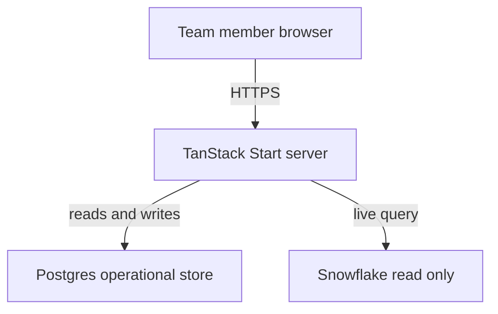
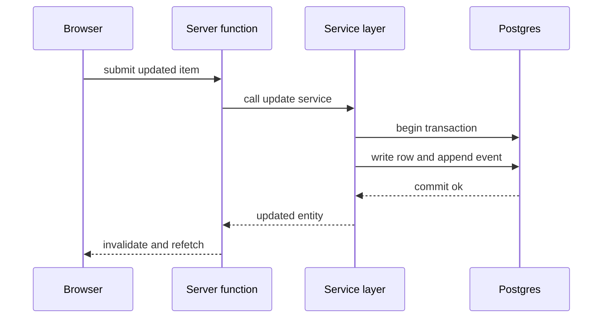

# Exemplar: condensed excerpts from a real ARCHITECTURE.md

Condensed **and anonymized** from a shipped architecture design (a TanStack Start + Postgres +
Snowflake internal app, built as a 7-wave plan) so you can see Template 3 *filled in*.
Illustrative only — the structure in `templates.md` is normative, these technologies/values are
not (names fictionalized; the decisions are real).

Diagrams (§3, §7) are **Mermaid**, written to the cross-renderer compatibility rules in
[`mermaid.md`](mermaid.md) — copy that style for every C4 view and runtime flow, and never fall
back to ASCII here.

---

````markdown
# Portfolio Cockpit — Architecture Design

**Created:** 2026-06-24 · **Status:** Design locked; build in progress (Wave 0 done, Wave 1 in
progress — see README roll-up) · **Stack:** TanStack Start, Prisma + Postgres, Snowflake
(read-only), Tailwind + shadcn/ui, AWS ECS Fargate

> **What this document is.** The architectural reference for the build program — the *shape* of
> the system and *why it holds that shape*. It introduces **no new decisions** — every choice
> traces to the plan's decisions section. Where it goes beyond the plan it does so by
> *consolidating* scattered facts and by *surfacing* second-order architectural consequences the
> task plans imply but don't spell out (§13).
>
> | Document | Answers | Authority for |
> |---|---|---|
> | the spec/decisions doc | *What* & *why* | scope, decisions, API operations |
> | **this file** | *How it's shaped & fits together* | C4 views, module layout, flows, ADRs |
> | the wave files | *How to build it, task by task* | TDD steps, gates, commits |

## 1. Architectural principles (the load-bearing rules)

Everything below is an expression of these rules. If a change would violate one, it is wrong by
construction — stop and reconsider.

1. **One framework-agnostic service layer is the seam.** All business logic and all DB queries
   live in `src/services/*`. They import **no** framework APIs. Every caller — route loaders,
   server functions, REST routes, the MCP adapter — is a *thin wrapper* that validates input and
   delegates. *Consequence:* adding a new caller never duplicates or re-tests logic.
2. **Postgres is the single source of truth, and the server is its only writer.** No client, no
   agent, no warehouse writes operational data except through a service-layer function inside a
   transaction.
3. **Rendering is decided per route (Selective SSR).** Every route declares
   `ssr: true | 'data-only' | false` with a one-line reason.

## 3. Containers (C4 L2)  ← Mermaid, per mermaid.md — labels are letters and spaces only



**Dependency rule:** the browser talks only to the app server; the app server is the single
writer to Postgres and the only reader of Snowflake, always through a service-layer function.
Nothing bypasses the seam.

## 7. Runtime flows  ← (one numbered flow per critical path; name the delivering wave)

### 7.2 Write / mutation path (Wave 2) — transactional + event + invalidation



### 7.3 Login / auth path (Wave 3)

## 11. Architecture Decision Records

Each ADR distils a plan decision into context → decision → rejected alternatives → consequences.

**ADR-002 — A framework-agnostic service layer is the seam.**
*Context:* the same operations must be reachable from loaders, server fns, REST routes, and
(later) MCP. *Decision:* all logic + queries in `services/*` with no framework imports; everything
else is a thin wrapper. *Rejected:* logic in loaders/route handlers (the common framework shape).
*Consequences:* fast framework-free tests against real Postgres; new callers add zero logic; a
discipline cost (wrappers must stay thin — enforced by grep).

**ADR-004 — Live, direct, read-only warehouse reads at request time (no sync, no cache).**
*Context:* KPIs must reflect current warehouse values. *Decision:* a server function runs the
mapped query per request, read-only. *Rejected:* a scheduled sync worker + cache table (more
moving parts, staleness, ops). *Consequences:* always-fresh, minimal infra; per-request warehouse
latency — mitigated if needed by a short in-server TTL cache (a toggle, *not* a scheduled sync).
**Superseded for the dashboard by ADR-013** — that TTL-cache mitigation is now realised as a
Postgres cache table (1-day TTL).
   ← (supersessions/amendments are DATED notes on the original ADR — history is never rewritten)

## 12. Build sequence ↔ architecture coverage

How the layers come online across the waves (full map: README).

| Wave | Architectural slice delivered |
|---|---|
| **0** | Bootable app; config/db/schema/enums; service-layer skeleton; migration + seed; health route. The skeleton of every layer. |
| **1** | Read service layer + read server functions; the routes render live from Postgres (read-only). |
| **2** | Write service layer (transactional, event log) + UI wiring + invalidation. Multi-user shared state. |
| **3** | Auth (session, allowlist resolver, middleware); session-derived actor. Production-ready. |

**Extension seams already designed in:** a short TTL cache in front of the warehouse (ADR-004);
the REST + MCP transport; realtime push if pull-on-navigation proves insufficient.

## 13. Risks & recommended refinements

Second-order consequences the layered design implies; flagged here so they're decided
deliberately, not discovered in production. None changes a decision — they refine *how* one is
implemented.

1. **Migrations at container startup × multiple tasks → race.** With >1 task starting
   concurrently, two migrators can race. *Recommend:* once the service runs >1 task, run
   migrations as a one-shot pre-deploy task or wrap them in an advisory lock.
2. **No realtime cross-session updates.** Others see a write only on their next navigation. This
   is acceptable for 8 users. *Seam if it bites:* an SSE endpoint fed by the event log. Don't
   build it speculatively.

## 14. Glossary

| Term | Meaning here |
|---|---|
| **Service layer** | `src/services/*` — framework-agnostic logic + queries; the testable seam |
| **The seam** | the service layer — the single place logic lives and is tested |
````
