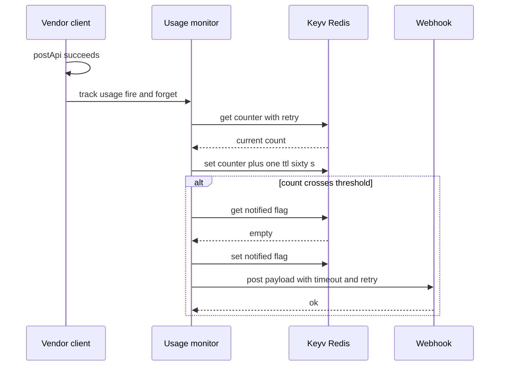

# Exemplar: condensed excerpts from a real feature design document

Condensed **and anonymized** from a shipped feature design (system-wide usage monitoring on an
external API service, delivered as one wave of a larger plan) so you can see Template 4 *filled
in*. Illustrative only — the structure in `templates.md` is normative, these technologies/values
are not (vendor names fictionalized; the mechanism is real).

This design was large enough to **split into three files** (the common Kiro shape): a `design.md`
spine plus `design-<feature>-components.md` and `design-<feature>-correctness.md`. Small features
keep everything in a single `design-<feature>.md` — see the split guidance in `templates.md`.

The Architecture diagram is **Mermaid**, written to the compatibility rules in
[`mermaid.md`](mermaid.md) — labels are letters and spaces only, no `()`/`{}`/`_`/`-`/`/` in
messages. Copy that style; never fall back to ASCII here.

---

**`design-usage-monitor.md`** (the spine)

````markdown
# Design: Usage Monitoring

**Related documents:**
- [Components & Interfaces](./design-usage-monitor-components.md)
- [Data Models & Correctness Properties](./design-usage-monitor-correctness.md)

## Overview

After each successful API call to a monitored endpoint, a fire-and-forget `trackUsage(endpoint)`
increments a Redis counter keyed by endpoint plus minute window. When the counter crosses the
threshold, a single webhook notification fires. All monitoring failures are swallowed so they
never block the API call. (Delivered by **Wave 2**; backlog rows M1–M8.)

## Architecture



## Key Design Decisions

- **Fail-open:** the tracker is always called inside `.catch(() => {})` — Redis or webhook errors
  never surface to callers. *(Trades a lost count under failure for zero caller impact.)*
- **Single notification per window:** a separate `notified:{endpoint}:{window}` flag key (same TTL)
  guarantees one alert per breach.
- **No atomic INCR:** Keyv abstracts Redis; get-then-set is used. A race at the exact threshold is
  acceptable (worst case: two alerts in a burst).

## Error Handling

| Failure | Behaviour |
|---|---|
| Redis get or set fails | Retry up to 3x with backoff; if all fail, log warning and skip |
| Webhook fails or non 2xx | Retry up to 3x with backoff; log each attempt |
| All webhook retries exhausted | Log final error; continue |

## Testing Strategy

Unit tests cover increment, single-fire-per-window, payload fields, and no-throw on Keyv/fetch
failure. Property-based tests (`fast-check`, ≥100 runs) cover the invariants in
[Correctness Properties](./design-usage-monitor-correctness.md). Integration tests verify the
tracker is called after each successful monitored call and that the TTL is set.
````

---

**`design-usage-monitor-components.md`** (split out when Components grows)

````markdown
Part of the [Usage Monitoring Design](./design-usage-monitor.md).

# Components & Interfaces

## File Layout

```
src/
  constants/usage-monitor.ts       ← thresholds, TTL, webhook URL, key helpers
  services/usage-monitor.ts        ← trackUsage() implementation
  services/usage-monitor.test.ts
  services/vendor-api.ts           ← calls trackUsage() after successful postApi
```

## Public API

```typescript
/** Fire-and-forget: never throws. Increments the endpoint counter and, the first
 *  time the count crosses the threshold in the current minute window, sends one webhook. */
export async function trackUsage(endpoint: string): Promise<void>
```

## Internal flow

1. Build `counterKey(endpoint)` and `notifiedKey(endpoint)`.
2. `get` count with retry (default 0 on miss or exhausted retries) → increment → `set` with TTL.
3. If `newCount > THRESHOLD` and the notified flag is unset: set the flag, then `sendWebhook`.
4. Entire body wrapped in try/catch — log warnings, never throw.

## Integration point

After each successful `postApi` call, before `return`: `trackUsage(endpoint).catch(() => {})`.
````

---

**`design-usage-monitor-correctness.md`** (split out when properties grow)

````markdown
Part of the [Usage Monitoring Design](./design-usage-monitor.md).

# Data Models & Correctness Properties

## Data Models

```typescript
interface WebhookPayload {
  readonly endpoint: string;
  readonly count: number;
  readonly timestamp: string;   // ISO 8601
  readonly message: string;
}
```

| Key pattern | Value | TTL |
|---|---|---|
| `usage:{endpoint}:{window}` | count | 60 000 ms |
| `usage:notified:{endpoint}:{window}` | true | 60 000 ms |

## Correctness Properties

*A property is a statement that must hold across all valid executions — the bridge between a
human-readable spec and a machine-verifiable guarantee.*

### Property 1: Counter increments on every successful call
*For any* monitored endpoint and initial count N, one `trackUsage` call yields N+1.
**Validates: M1, M2**

### Property 3: Webhook fires exactly once per threshold crossing
*For any* call sequence crossing the threshold within one window, the webhook POST is sent exactly
once regardless of how many calls follow. **Validates: M4, M5**

### Property 5: Monitoring never throws
*For any* combination of Keyv or fetch failure, `trackUsage` resolves without rejecting.
**Validates: M6, M7, M8**

## Property Reflection

Properties 1 and 2 (increment vs no-increment) together cover the counter invariant; Property 3
subsumes the no-duplicate concern; Property 5 consolidates every fail-open requirement. No
redundancy remains — each property carries unique validation value.
````
